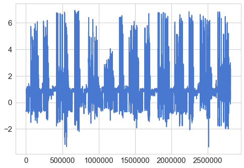
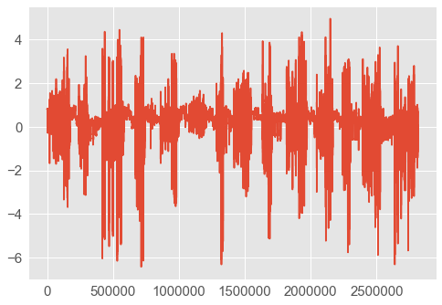
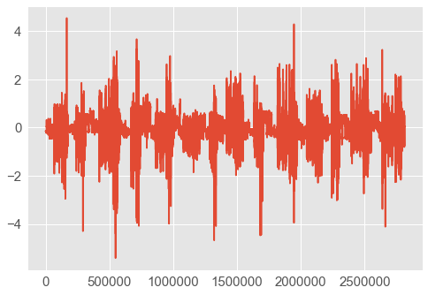
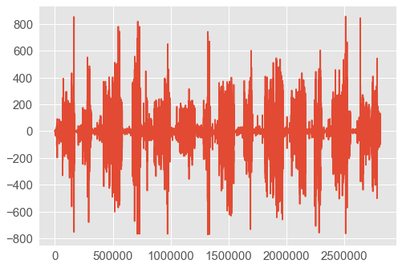
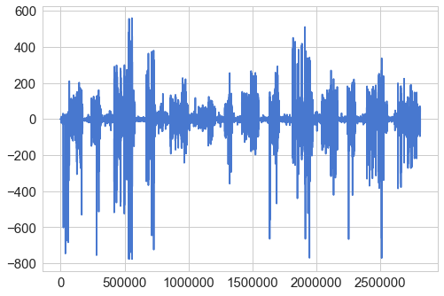
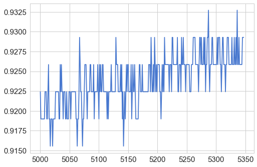
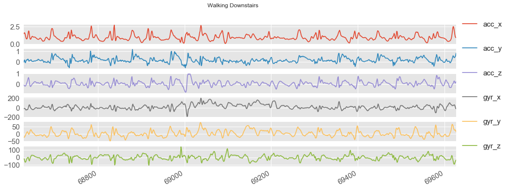

# MobileHCI 2018 tutorial: Machine Learning for Intelligent Mobile User Interfaces using Keras

### Setup: dependencies, versions, getting data


```python
# -*- coding: utf-8 -*-

## By Abdallah El Ali
## MobileHCI 2018 tutorial: Machine Learning for Intelligent Mobile User Interfaces using Keras.

## Some code adapted from: GUILLAUME CHEVALIER https://github.com/guillaume-chevalier/LSTM-Human-Activity-Recognition

import tensorflow as tf
from tensorflow.python.framework import graph_util, graph_io
from tensorflow.python.tools import freeze_graph

from keras.models import Sequential, load_model, model_from_json
from keras.layers import Dense, Conv2D, MaxPooling2D, Flatten, Dropout, LSTM, LSTMCell, Bidirectional, TimeDistributed, InputLayer, ConvLSTM2D
from keras import optimizers
from keras import backend as K

from sklearn import metrics
from sklearn.model_selection import train_test_split, cross_val_score
from scipy import stats
import scipy.io

import pandas as pd
import numpy as np
import matplotlib
import matplotlib.pyplot as plt
import matplotlib.colors as colors
import matplotlib.cm
import seaborn as sns
import pickle
import math
from mpl_toolkits.mplot3d import Axes3D
import pylab
import os
import os.path as osp
import wget
import zipfile
import warnings

warnings.filterwarnings('ignore')
%matplotlib inline
sns.set(style='whitegrid', palette='muted', font_scale=1.5)

# graph = tf.get_default_graph()
K.clear_session()
```


```python
## Convert Jupyter notebook to a README for GitHub repo's main page
!jupyter nbconvert --to markdown mobilehci2018_keras_har_tutorial.ipynb
!mv mobilehci2018_keras_har_tutorial.md README.md
```

    [NbConvertApp] Converting notebook mobilehci2018_keras_har_tutorial.ipynb to markdown
    [NbConvertApp] Support files will be in mobilehci2018_keras_har_tutorial_files/
    [NbConvertApp] Making directory mobilehci2018_keras_har_tutorial_files
    [NbConvertApp] Making directory mobilehci2018_keras_har_tutorial_files
    [NbConvertApp] Making directory mobilehci2018_keras_har_tutorial_files
    [NbConvertApp] Making directory mobilehci2018_keras_har_tutorial_files
    [NbConvertApp] Making directory mobilehci2018_keras_har_tutorial_files
    [NbConvertApp] Making directory mobilehci2018_keras_har_tutorial_files
    [NbConvertApp] Making directory mobilehci2018_keras_har_tutorial_files
    [NbConvertApp] Making directory mobilehci2018_keras_har_tutorial_files
    [NbConvertApp] Making directory mobilehci2018_keras_har_tutorial_files
    [NbConvertApp] Making directory mobilehci2018_keras_har_tutorial_files
    [NbConvertApp] Making directory mobilehci2018_keras_har_tutorial_files
    [NbConvertApp] Making directory mobilehci2018_keras_har_tutorial_files
    [NbConvertApp] Making directory mobilehci2018_keras_har_tutorial_files
    [NbConvertApp] Making directory mobilehci2018_keras_har_tutorial_files
    [NbConvertApp] Making directory mobilehci2018_keras_har_tutorial_files
    [NbConvertApp] Making directory mobilehci2018_keras_har_tutorial_files
    [NbConvertApp] Making directory mobilehci2018_keras_har_tutorial_files
    [NbConvertApp] Making directory mobilehci2018_keras_har_tutorial_files
    [NbConvertApp] Making directory mobilehci2018_keras_har_tutorial_files
    [NbConvertApp] Making directory mobilehci2018_keras_har_tutorial_files
    [NbConvertApp] Making directory mobilehci2018_keras_har_tutorial_files
    [NbConvertApp] Making directory mobilehci2018_keras_har_tutorial_files
    [NbConvertApp] Writing 73972 bytes to mobilehci2018_keras_har_tutorial.md


```python
## Check tensorflow version
!python -W ignore -c 'import tensorflow as tf; print(tf.__version__)'  # for Python 2

# gradle TF build repo
# https://mvnrepository.com/artifact/org.tensorflow/tensorflow-android/1.5.0-rc1
```

    1.9.0


```python
## wget UCD dataset + all .npy files and dump into ./data dir

# !mkdir data
!wget -P ./data "http://abdoelali.com/data/mobilehci2018_tutorial_data.zip"
```

    --2018-08-13 17:26:04--  http://abdoelali.com/data/mobilehci2018_tutorial_data.zip
    Resolving abdoelali.com (abdoelali.com)... 160.153.1.1
    Connecting to abdoelali.com (abdoelali.com)|160.153.1.1|:80... connected.
    HTTP request sent, awaiting response... 200 OK
    Length: 298100126 (284M) [application/zip]
    Saving to: ‘./data/mobilehci2018_tutorial_data.zip’
    
    mobilehci2018_tutor 100%[=====================>] 284.29M   310KB/s   in 18m 27ss
    
    2018-08-13 17:44:32 (263 KB/s) - ‘./data/mobilehci2018_tutorial_data.zip’ saved [298100126/298100126]
    


```python
## unzip and delete files
with zipfile.ZipFile("./data/mobilehci2018_tutorial_data.zip","r") as zipref:
    zipref.extractall("./data/")
os.remove("./data/mobilehci2018_tutorial_data.zip")
```

### Preprocressing


```python
## setting up a random seed for reproducibility
random_seed = 611
np.random.seed(random_seed)

## matplotlib inline
plt.style.use('ggplot')

## defining function for loading our dataset
def readData(filePath):
    # attributes of the dataset
    columnNames = ['user_id','activity','timestamp','x-axis','y-axis','z-axis']
    data = pd.read_csv(filePath,header = None, names=columnNames,na_values=';')
    return data[0:2000]

## defining a function for feature normalization
## (feature - mean)/stdiv
def featureNormalize(dataset):
    mu = np.mean(dataset,axis=0)
    sigma = np.std(dataset,axis=0)
    return (dataset-mu)/sigma

## defining the function to plot a single axis data
def plotAxis(axis,x,y,title):
    axis.plot(x,y)
    axis.set_title(title)
    axis.xaxis.set_visible(False)
    axis.set_ylim([min(y)-np.std(y),max(y)+np.std(y)])
    axis.set_xlim([min(x),max(x)])
    axis.grid(True)

## defining a function to plot the data for a given activity
def plotActivity(activity,data):
    fig,(ax0,ax1,ax2) = plt.subplots(nrows=3, figsize=(15,10),sharex=True)
    plotAxis(ax0,data['timestamp'],data['x-axis'],'x-axis')
    plotAxis(ax1,data['timestamp'],data['y-axis'],'y-axis')
    plotAxis(ax2,data['timestamp'],data['z-axis'],'z-axis')
    plt.subplots_adjust(hspace=0.2)
    fig.suptitle(activity)
    plt.subplots_adjust(top=0.9)
    plt.show()

## defining a window function for segmentation purposes
def windows(data,size):
    start = 0
    while start< data.count():
        yield int(start), int(start + size)
        start+= (size/2)    

## our segmenrtation function to get streams of 90 samples in each timestep 
def segment_signal_ucd(data, window_size = 90):
    segments = np.empty((0,window_size,6))
    labels= np.empty((0))
## print labels

    for (start, end) in windows(data['activity'],window_size):
        x = data['acc_x'][start:end]
        y = data['acc_y'][start:end]
        z = data['acc_z'][start:end]
        p = data['gyr_x'][start:end]
        q = data['gyr_y'][start:end]
        r = data['gyr_z'][start:end]

        if(len(data['activity'][start:end])==window_size):
            segments = np.vstack([segments,np.dstack([x,y,z,p,q,r])])
            if labels is not None:
                labels = np.append(labels,stats.mode(data['activity'][start:end])[0][0])
    return segments, labels
```


```python
## read in the USC-HAD data
DIR = './data/USC-HAD/data/'

# activity = []
# subject = []
# age = []
act_num = []
sensor_readings = []

def read_dir(directory):
    for path, subdirs, files in os.walk(DIR):
        for name in files:
            if name.endswith('.mat'):
                mat = scipy.io.loadmat(os.path.join(path, name))
#                 activity.append(mat['activity'])
#                 subject.extend(mat['subject'])
#                 age.extend(mat['age'])
                sensor_readings.append(mat['sensor_readings'])

                if mat.get('activity_number') is None:
                    act_num.append('11')
                else:
                    act_num.append(mat['activity_number'])
    return act_num, sensor_readings

## UNCOMMENT to handle corrupt datapoint
# act_num[258] = '11'            
act_num, sensor_readings = read_dir(DIR)
```


```python
## Get acc + gyr sensor readings and put in df (dataframe)
acc_x = []
acc_y = []
acc_z = []

gyr_x = []
gyr_y = []
gyr_z = []
act_label = []
df = None

for i in range(840):
    for j in sensor_readings[i]:
        
        acc_x.append(j[0]) # acc_x
        acc_y.append(j[1]) # acc_y
        acc_z.append(j[2]) # acc_z
        gyr_x.append(j[3]) # gyr_x
        gyr_y.append(j[4]) # gyr_y
        gyr_z.append(j[5]) # gyr_z
        act_label.append(act_num[i])
        
df = pd.DataFrame({'acc_x':acc_x,'acc_y':acc_y,'acc_z':acc_z,'gyr_x':gyr_x,'gyr_y':gyr_y,'gyr_z':gyr_z,'activity':act_label})                   
df = df[['acc_x', 'acc_y', 'acc_z', 'gyr_x', 'gyr_y', 'gyr_z','activity']]

df.loc[df['activity'] == '1', 'activity'] = 'Walking Forward'
df.loc[df['activity'] == '2', 'activity'] = 'Walking Left'
df.loc[df['activity'] == '3', 'activity'] = 'Walking Right'
df.loc[df['activity'] == '4', 'activity'] = 'Walking Upstairs'
df.loc[df['activity'] == '5', 'activity'] = 'Walking Downstairs'
df.loc[df['activity'] == '6', 'activity'] = 'Running Forward'
df.loc[df['activity'] == '7', 'activity'] = 'Jumping Up'
df.loc[df['activity'] == '8', 'activity'] = 'Sitting'
df.loc[df['activity'] == '9', 'activity'] = 'Standing'
df.loc[df['activity'] == '10', 'activity'] = 'Sleeping'
df.loc[df['activity'] == '11', 'activity'] = 'Elevator Up'
df.loc[df['activity'] == '12', 'activity'] = 'Elevator Down'

## These are the 12 classes we want to recognize!
df['activity'].unique() 

## print size of dataset
print 'df size ' + str(len(df))
```

    df size 2811490


```python
## use only for collapsing / reducing output classes

# df2 = df

# df2.loc[df2['activity'] == 'Walking Forward', 'activity'] = 'Walking'
# df2.loc[df2['activity'] == 'Walking Left', 'activity'] = 'Walking'
# df2.loc[df2['activity'] == 'Walking Right', 'activity'] = 'Walking'

```


```python
## inspect the dataframe
df[1:10]
```


<div>
<style>
    .dataframe thead tr:only-child th {
        text-align: right;
    }

    .dataframe thead th {
        text-align: left;
    }

    .dataframe tbody tr th {
        vertical-align: top;
    }
</style>
<table border="1" class="dataframe">
  <thead>
    <tr style="text-align: right;">
      <th></th>
      <th>acc_x</th>
      <th>acc_y</th>
      <th>acc_z</th>
      <th>gyr_x</th>
      <th>gyr_y</th>
      <th>gyr_z</th>
      <th>activity</th>
    </tr>
  </thead>
  <tbody>
    <tr>
      <th>1</th>
      <td>-0.657132</td>
      <td>0.805976</td>
      <td>-0.149374</td>
      <td>0.692599</td>
      <td>-0.428895</td>
      <td>-0.506021</td>
      <td>Sleeping</td>
    </tr>
    <tr>
      <th>2</th>
      <td>-0.653698</td>
      <td>0.809595</td>
      <td>-0.153035</td>
      <td>0.288852</td>
      <td>0.375579</td>
      <td>-0.504430</td>
      <td>Sleeping</td>
    </tr>
    <tr>
      <th>3</th>
      <td>-0.650265</td>
      <td>0.809595</td>
      <td>-0.149374</td>
      <td>0.287940</td>
      <td>0.374394</td>
      <td>-0.101278</td>
      <td>Sleeping</td>
    </tr>
    <tr>
      <th>4</th>
      <td>-0.646831</td>
      <td>0.805976</td>
      <td>-0.149374</td>
      <td>0.287031</td>
      <td>0.373212</td>
      <td>-0.502525</td>
      <td>Sleeping</td>
    </tr>
    <tr>
      <th>5</th>
      <td>-0.650265</td>
      <td>0.809595</td>
      <td>-0.149374</td>
      <td>0.286124</td>
      <td>-0.431087</td>
      <td>-0.099380</td>
      <td>Sleeping</td>
    </tr>
    <tr>
      <th>6</th>
      <td>-0.650265</td>
      <td>0.809595</td>
      <td>-0.149374</td>
      <td>0.285221</td>
      <td>0.373394</td>
      <td>-0.500633</td>
      <td>Sleeping</td>
    </tr>
    <tr>
      <th>7</th>
      <td>-0.653698</td>
      <td>0.809595</td>
      <td>-0.149374</td>
      <td>-0.117240</td>
      <td>-0.430905</td>
      <td>-0.499058</td>
      <td>Sleeping</td>
    </tr>
    <tr>
      <th>8</th>
      <td>-0.657132</td>
      <td>0.809595</td>
      <td>-0.149374</td>
      <td>-0.116870</td>
      <td>-0.027984</td>
      <td>-0.095924</td>
      <td>Sleeping</td>
    </tr>
    <tr>
      <th>9</th>
      <td>-0.653698</td>
      <td>0.805976</td>
      <td>-0.153035</td>
      <td>0.285060</td>
      <td>-0.429456</td>
      <td>-0.497187</td>
      <td>Sleeping</td>
    </tr>
  </tbody>
</table>
</div>


### Explore your dataset (through visualization)


```python
## explore your overal accel and gyro values: min, max, mean, and plot over time

''' 
From the UbiComp'12 paper:
"Based on the above considerations, we use an off-the-shelf sensing platform called MotionNode to capture human activity signals 
and build our dataset. MotionNode is a 6-DOF inertial measurement unit (IMU) specifically designed for human motion sensing 
applications (see Figure 2) [2]. Each MotionNode itself is a multi-modal sensor that integrates a 3-axis accelerometer, 
3-axis gyroscope, and a 3-axis mag- netometer. The measurement range is ±6g and ±500dps for each axis of accelerometer and gyroscope 
respectively. Although body limbs and extremities can exhibit up to ±12g in acceleration, points near the torso 
and hip experience no more than ±6g range in acceleration [6]."
'''

## For Android Nexus 5 sensor specs, check: https://www.bosch-sensortec.com/bst/products/all_products/bmi160

## accelerometer 
print 'acc_x'
print min(df['acc_x'])
print max(df['acc_x'])
print np.mean(df['acc_x'])
plt.plot(df['acc_x'])
plt.show()

print 'acc_y'
print min(df['acc_y'])
print max(df['acc_y'])
print np.mean(df['acc_y'])
plt.plot(df['acc_y'])
plt.show()

print 'acc_z'
print min(df['acc_z'])
print max(df['acc_z'])
print np.mean(df['acc_z'])
plt.plot(df['acc_z'])
plt.show()

print 'gyr_x'
print min(df['gyr_x'])
print max(df['gyr_x'])
print np.mean(df['gyr_x'])
plt.plot(df['gyr_x'])
plt.show()

print 'gyr_y'
print min(df['gyr_y'])
print max(df['gyr_y'])
print np.mean(df['gyr_y'])
plt.plot(df['gyr_y'])
plt.show()

print 'gyr_z'
print min(df['gyr_z'])
print max(df['gyr_z'])
print np.mean(df['gyr_z'])
plt.plot(df['gyr_z'])
plt.show()
```

    acc_x
    -3.3526623249053955
    6.931558132171631
    0.782799482324





    acc_y
    -6.417827129364014
    4.949891567230225
    0.201336618765





    acc_z
    -5.416336536407471
    4.539283275604248
    -0.0619099863055





    gyr_x
    -770.8486328125
    856.3609008789062
    -0.413887145396





    gyr_y
    -775.4454345703125
    559.6139526367188
    -0.351748533882





    gyr_z
    -808.1836547851562
    816.5776977539062
    -0.174795881101


```python
## Check mismatch between sensor readings of dataset and Android sensors

android_sit_sample = [0.30177248, 0.2778223, 0.29698244, 0.2921924, 0.2921924, 0.29698244, 0.28740236, 0.2921924, 0.2921924, 0.29698244, 0.30177248, 0.2778223, 0.2921924, 0.2921924, 0.2921924, 0.2921924, 0.2778223, 0.2921924, 0.28740236, 0.3065625, 0.2921924, 0.2682422, 0.26345217, 0.28740236, 0.2921924, 0.28261232, 0.29698244, 0.29698244, 0.28740236, 0.30177248, 0.2921924, 0.28261232, 0.28740236, 0.2682422, 0.28740236, 0.29698244, 0.29698244, 0.28740236, 0.2921924, 0.28740236, 0.28740236, 0.2921924, 0.29698244, 0.28261232, 0.29698244, 0.2921924, 0.2921924, 0.30177248, 0.2921924, 0.28740236, 0.28261232, 0.31135255, 0.29698244, 0.28740236, 0.28740236, 0.2921924, 0.29698244, 0.29698244, 0.29698244, 0.29698244, 0.3065625, 0.2921924, 0.28740236, 0.3065625, 0.28740236, 0.28740236, 0.2921924, 0.2921924, 0.2921924, 0.31135255, 0.30177248, 0.29698244, 0.29698244, 0.29698244, 0.2778223, 0.2778223, 0.2921924, 0.3065625, 0.3065625, 0.28261232, 0.27303225, 0.3065625, 0.31135255, 0.29698244, 0.29698244, 0.3065625, 0.3065625, 0.28740236, 0.28261232, 0.3065625, 0.28261232, 0.29698244, 0.3065625, 0.31135255, 0.28740236, 0.2921924, 0.29698244, 0.2682422, 0.28261232, 0.30177248, 0.29698244, 0.28740236, 0.2921924, 0.29698244, 0.28261232, 0.2778223, 0.29698244, 0.28740236, 0.30177248, 0.28740236, 0.2921924, 0.29698244, 0.30177248, 0.30177248, 0.30177248, 0.30177248, 0.29698244, 0.27303225, 0.28740236, 0.30177248, 0.2921924, 0.27303225, 0.28740236, 0.27303225, 0.28261232, 0.29698244, 0.2921924, 0.29698244, 0.28740236, 0.29698244, 0.28740236, 0.2778223, 0.3065625, 0.29698244, 0.28740236, 0.28740236, 0.28740236, 0.28740236, 0.29698244, 0.2921924, 0.28740236, 0.29698244, 0.29698244, 0.3065625, 0.28740236, 0.28740236, 0.29698244, 0.2921924, 0.30177248, 0.29698244, 0.29698244, 0.29698244, 0.2921924, 0.2921924, 0.2921924, 0.31135255, 0.29698244, 0.29698244, 0.31135255, 0.2921924, 0.2921924, 0.29698244, 0.28740236, 0.29698244, 0.30177248, 0.29698244, 0.30177248, 0.29698244, 0.28261232, 0.2921924, 0.2921924, 0.30177248, 0.29698244, 0.28261232, 0.28740236, 0.28261232, 0.3065625, 0.29698244, 0.28261232, 0.2778223, 0.28740236, 0.29698244, 0.29698244, 0.2921924, 0.30177248, 0.2921924, 0.27303225, 0.28261232, 0.28261232, 0.2921924, 0.28740236, 0.28740236, 0.28740236, 0.30177248, 0.2778223, 0.2778223, 0.28261232, 0.30177248, 0.2921924, 0.31135255, 0.2921924, 0.28740236, 0.28261232, 0.29698244, 0.2778223, 0.28261232, 0.28740236, 0.29698244, 0.32572266, 0.3161426, 0.28261232, 0.29698244, 0.2921924, 0.31135255, 0.3161426, 0.28740236, 0.30177248, 0.2921924, 0.28740236, 0.30177248, 0.3065625, 0.2921924, 0.29698244, 0.28740236, 0.2921924, 0.28740236, 0.28261232, 0.29698244, 0.29698244, 0.2921924, 0.2921924, 0.28740236, 0.29698244, 0.29698244, 0.3065625, 0.2921924, 0.28740236, 0.27303225, 0.2778223, 0.28261232, 0.29698244, 0.2778223, 0.28261232, 0.30177248, 0.2921924, 0.32093263, 0.29698244, 0.29698244, 0.27303225, 0.28261232, 0.30177248, 0.31135255, 0.28261232, 0.33530274, 0.16286133, 0.23471193, 0.26345217, 0.2682422, 0.30177248, 0.28740236, 0.26345217, 0.2921924, 0.2921924, 0.2778223, 0.28740236, 0.28261232, 0.2682422, 0.2778223, 0.27303225, 0.2921924, 0.28261232, 0.2682422, 0.30177248, 0.27303225, 0.28740236, 0.28261232, 0.28261232, 0.2778223, 0.28740236, 0.28740236, 0.2921924, 0.28261232, 0.2682422, 0.2778223, 0.2921924, 0.28261232, 0.28261232, 0.2778223, 0.2778223, 0.2778223, 0.28261232, 0.28261232, 0.2682422, 0.28740236, 0.28261232, 0.26345217, 0.28261232, 0.2778223, 0.28261232, 0.2778223, 0.25387207, 0.2682422, 0.27303225, 0.2682422, 0.2921924, 0.2778223, 0.2921924, 0.28740236, 0.29698244, 0.28740236, 0.26345217, 0.2921924, 0.2778223, 0.2682422, 0.2682422, 0.2778223, 0.29698244, 0.30177248, 0.28261232, 0.29698244, 0.2921924, 0.27303225, 0.28740236, 0.2921924, 0.28261232, 0.29698244, 0.28261232, 0.2778223, 0.28740236, 0.28261232, 0.28740236, 0.28740236, 0.2778223, 0.28740236, 0.2778223, 0.29698244, 0.2778223, 0.2921924, 0.2778223, 0.27303225, 0.25866213, 0.28740236, 0.28261232, 0.28740236, 0.28261232, 0.28740236, 0.30177248, 0.28261232]
len_sample = len(android_sit_sample)
print 'size of sample:' + str(len_sample)

print 'mean android sample acc_x: '+ str(np.mean(android_sit_sample))
plt.plot(android_sit_sample)
plt.show()
# print df[df["activity"] == "Sitting"]["acc_x"]
sit_df_acc_x = df[df["activity"] == "Sitting"]["acc_x"][0:len_sample]
print 'mean dataset acc_x sample: '+ str(np.mean(sit_df_acc_x))
plt.plot(sit_df_acc_x)
plt.show()
```

    size of sample:348
    mean android sample acc_x: 0.28942573997126436


    mean dataset acc_x sample: 0.923923912233





```python
## setup a plots dir
plot_dir = './plots/'

## two functions below to plot your data, and save them to disk
def plot_activity(activity, df,i=0, j=100):
    data = df[df['activity'] == activity][['acc_x', 'acc_y', 'acc_z', 'gyr_x', 'gyr_y', 'gyr_z']][i:j]
    axis = data.plot(subplots=True, figsize=(16, 6), 
                     title=activity)
    for ax in axis:
        ax.legend(loc='lower left', bbox_to_anchor=(1.0, 0.5))
        
    if not os.path.isdir(plot_dir):
        os.makedirs(plot_dir)

    plt.savefig(plot_dir + str(activity) + '.pdf',bbox_inches='tight')
        
def plot_datasets(df,i=0,j=1000):
    plot_activity("Walking Forward", df,i,j)
    plot_activity("Walking Left", df,i,j)
    plot_activity("Walking Right", df,i,j)
    plot_activity("Walking Upstairs", df,i,j)
    plot_activity("Walking Downstairs", df,i,j)
    plot_activity("Running Forward", df,i,j)
    plot_activity("Jumping Up", df,i,j)
    plot_activity("Sitting", df,i,j)
    plot_activity("Standing", df,i,j)
    plot_activity("Sleeping", df,i,j)
    plot_activity("Elevator Up", df,i,j)
    plot_activity("Elevator Down", df,i,j)

## in case you have collapsed categories
# def plot_datasets2(df,i=1000):
#     plot_activity("Walking", df,i)
#     plot_activity("Running", df,i)
#     plot_activity("Jumping Up", df,i)
#     plot_activity("Sitting", df,i)
#     plot_activity("Standing", df,i)
#     plot_activity("Sleeping", df,i)
#     plot_activity("Elevator Up", df,i)
#     plot_activity("Elevator Down", df,i)
    
plot_datasets(df)


```





```python
## check class districtions, and save fig to disk
df['activity'].value_counts().plot(kind='bar', title='Plotting records by activity type', figsize=(10, 4),align='center');
plt.savefig(plot_dir + 'sample_dist.pdf', bbox_inches='tight')
```


```python
print df['activity'].value_counts()
```


    Walking Forward       381400
    Sleeping              375000
    Walking Right         269700
    Walking Left          264600
    Sitting               261500
    Standing              236000
    Walking Upstairs      211800
    Walking Downstairs    197400
    Running Forward       176500
    Elevator Up           165491
    Elevator Down         164999
    Jumping Up            107100
    Name: activity, dtype: int64


### Config your ConvLSTM


```python

## UNCOMMENT for segmenting the signal in overlapping windows of 90 samples with 50% overlap
# segments, labels = segment_signal_ucd(df)

## COMMENT below segments + labels files if you want to segment afresh 

## open a file, where you stored the pickled data
segments = open('./data/segments_90.p', 'rb')
labels = open('./data/labels_90.p','rb')
segments = pickle.load(segments)
labels = pickle.load(labels)

## dump information to that file (UNCOMMENT to save fresh segmentation!)
# pickle.dump(segments, open( "./data/segments_90.p","wb"))
# pickle.dump(labels, open( "./data/labels_90.p","wb"))

## categorically defining the classes of the activities
labels = np.asarray(pd.get_dummies(labels),dtype = np.int8)

## defining parameters for the input and network layers
## we are treating each segmeent or chunk as a 2D image (90 X 3)
numOfRows = segments.shape[1]
numOfColumns = segments.shape[2]
numChannels = 1
numFilters = 128 # number of filters in Conv2D layer

## kernal size of the Conv2D layer
kernalSize1 = 2

## max pooling window size
poolingWindowSz = 2

## number of filters in fully connected layers
numNueronsFCL1 = 128
numNueronsFCL2 = 128

## split ratio for test and validation
trainSplitRatio = 0.8

## number of epochs 
Epochs = 20

## batchsize
batchSize = 10

## number of total clases
numClasses = labels.shape[1]
print labels.shape
print numClasses

## dropout ratio for dropout layer
dropOutRatio = 0.2

## reshaping the data for network input
reshapedSegments = segments.reshape(segments.shape[0], numOfRows, numOfColumns,1)

## splitting in training and testing data
trainSplit = np.random.rand(len(reshapedSegments)) < trainSplitRatio
trainX = reshapedSegments[trainSplit]
testX = reshapedSegments[~trainSplit]
trainX = np.nan_to_num(trainX)
testX = np.nan_to_num(testX)
trainY = labels[trainSplit]
testY = labels[~trainSplit]

print "segments shape:" + str(segments.shape)
print "labels shape:" + str(labels.shape)
print "trainX shape: " + str(trainX.shape)
print "trainY shape: " + str(trainY.shape)
print "testX shape: " + str(testX.shape)
print "testY shape: " + str(testY.shape)

## (observations, timesteps, features (x,y,z), channels)

# k = []

# for i in range(len(labels)):
#     if labels[i][0] == 1: 
#         k.append(labels[i])
# print len(k)

# print labels.shape
```

    (62476, 12)
    12
    segments shape:(62476, 90, 6)
    labels shape:(62476, 12)
    trainX shape: (49988, 90, 6, 1)
    trainY shape: (49988, 12)
    testX shape: (12488, 90, 6, 1)
    testY shape: (12488, 12)


```python
print "segments shape:" + str(segments.shape)
print "labels shape:" + str(labels.shape)
print "trainX shape: " + str(trainX.shape)
print "trainY shape: " + str(trainY.shape)
print "testX shape: " + str(testX.shape)
print "testY shape: " + str(testY.shape)
print "\n"
print "Rows / Timesteps: " + str(numOfRows)
print "Columns / features: " + str(numOfColumns)

## key:
## Conv2D: (observations, timesteps, features (acc + gyro), channels)
## LSTM: (batch size, observations, timesteps, features (acc + gyro), channels)

```

    segments shape:(62476, 90, 6)
    labels shape:(62476, 12)
    trainX shape: (50009, 90, 6, 1)
    trainY shape: (50009, 12)
    testX shape: (12467, 90, 6, 1)
    testY shape: (12467, 12)
    
    
    Rows / Timesteps: 90
    Columns / features: 6


```python
## shape of data to feed frozen model later in Android code
print testX[[1]].shape
```

    (1, 90, 6, 1)


```python
## test reshape for ConvLSTM
print np.expand_dims(testY,1).shape
print trainX.shape

# print trainX.reshape((None,50094, 90, 6, 1))
```

    (12467, 1, 12)
    (50009, 90, 6, 1)


```python
def Conv2D_LSTM_Model():
    model = Sequential()
    print (model.name)
    # adding the first convLSTM layer with 32 filters and 5 by 5 kernal size, using the rectifier as the activation function
    model.add(ConvLSTM2D(numFilters, (kernalSize1,kernalSize1),input_shape=(None, numOfRows, numOfColumns, 1),activation='relu', padding='same',return_sequences=True,name="INPUT"))
    print (model.input_shape)
    print (model.output_shape)
    print (model.name)
    
    ## adding a maxpooling layer
    model.add(TimeDistributed(MaxPooling2D(pool_size=(poolingWindowSz,poolingWindowSz),padding='valid')))
    print (model.output_shape)

    ## adding a dropout layer for the regularization and avoiding over fitting
    model.add(Dropout(dropOutRatio))
    print (model.output_shape)
    
    ## flattening the output in order to apple dense layer
    model.add(TimeDistributed(Flatten()))
    print (model.output_shape)
    
    ## adding first fully connected layer with 256 outputs
    model.add(Dense(numNueronsFCL1, activation='relu'))
    print (model.output_shape)

    ## adding second fully connected layer 128 outputs
    model.add(Dense(numNueronsFCL2, activation='relu'))
    print (model.output_shape)

    ## flattening the output in order to apply the fully connected layer
    model.add(TimeDistributed(Flatten()))
    print (model.output_shape)

    ## adding softmax layer for the classification
    model.add(Dense(numClasses, activation='softmax', name="OUTPUT"))
    print (model.output_shape)
    print (model.name)

    ## Compiling the model to generate a model
    adam = optimizers.Adam(lr = 0.001, decay=1e-6)
    model.compile(loss='categorical_crossentropy', optimizer=adam, metrics=['accuracy'])
    return model
```

### Train your network


```python
## Train the network!
tf.get_default_graph()

model = Conv2D_LSTM_Model()
for layer in model.layers:
    print(layer.name)
print trainX.shape
model.fit(np.expand_dims(trainX,1),np.expand_dims(trainY,1), validation_split=1-trainSplitRatio,epochs=1,batch_size=batchSize,verbose=2)
score = model.evaluate(np.expand_dims(testX,1),np.expand_dims(testY,1),verbose=2)
print("%s: %.2f%%" % (model.metrics_names[1], score[1]*100))
print('Baseline ConvLSTM Error: %.2f%%' %(100-score[1]*100))

## Save your model!
model.save('model_hcd_test.h5')
model.save_weights('model_weights_test.h5')
# np.save('groundTruth_test_lstm.npy',np.expand_dims(testY,1))
# np.save('testData_test_lstm.npy',np.expand_dims(testX,1))

## write to JSON, in case you wanrt to work with that data format later when inspecting your model
with open("./data/model_hcd_test.json", "w") as json_file:
  json_file.write(model.to_json())

```

    sequential_3
    (None, None, 90, 6, 128)
    sequential_3
    (None, None, 45, 3, 128)
    (None, None, 45, 3, 128)
    (None, None, 17280)
    (None, None, 128)
    (None, None, 128)
    (None, None, 128)
    (None, None, 12)
    sequential_3
    INPUT
    time_distributed_7
    dropout_3
    time_distributed_8
    dense_5
    dense_6
    time_distributed_9
    OUTPUT
    (49953, 90, 6, 1)
    Train on 39962 samples, validate on 9991 samples
    Epoch 1/1
     - 1666s - loss: 0.7321 - acc: 0.7314 - val_loss: 0.7805 - val_acc: 0.7287
    acc: 78.38%
    Baseline ConvLSTM Error: 21.62%


```python
print model.name
print (model.input_shape)
```


```python
# trainX = np.expand_dims(trainX,0)
# testX = np.expand_dims(testX,0)

# trainY = np.expand_dims(trainY,0)
# testY = np.expand_dims(testY,0)
```

### Evaluate model, and plot confusion matrix + acc/loss graphs


```python
# %%pixie_debugger
# -*- coding: utf-8 -*-
"""
Evaluate a pretrained model saved as *.h5 using 'testData_X.npy'
and 'groundTruth_X.npy'. Error reported is the cross entropy loss in percentag. Also generates a png file for the confusion matrix.
Based on work by Muhammad Shahnawaz
"""
## defining a function for plotting the confusion matrix
## takes cmNormalized
os.environ['QT_PLUGIN_PATH'] = ''
def plot_cm(cM, labels,title):
    ## normalizing the confusionMatrix for showing the probabilities
    cmNormalized = np.around((cM/cM.astype(np.float).sum(axis=1)[:,None])*100,2)
    ## creating a figure object
    fig = plt.figure()
    ## plotting the confusion matrix
    plt.imshow(cmNormalized,interpolation=None,cmap = plt.cm.Blues)
    ## creating a color bar and setting the limits
    plt.colorbar()
    plt.clim(0,100)
    ## assiging the title, x and y labels
    plt.xlabel('Predicted Values')
    plt.ylabel('Ground Truth')
    plt.title(title + '\n%age confidence')
    ## defining the ticks for the x and y axis
    plt.xticks(range(len(labels)),labels,rotation = 60)
    plt.yticks(range(len(labels)),labels)
    ## number of occurences in the boxes
    width, height = cM.shape
    print('Accuracy for each class is given below.')
    for predicted in range(width):
        for real in range(height):
            color = 'black'
            if(predicted == real):
                color = 'white'
                print(labels[predicted].ljust(12)+ ':', cmNormalized[predicted,real], '%')
            plt.gca().annotate(
                    '{:d}'.format(int(cmNormalized[predicted,real])),xy=(real, predicted),
                    horizontalalignment = 'center',verticalalignment = 'center',color = color)
    ## making sure that the figure is not clipped
    plt.tight_layout()
    ## saving the figure
    fig.savefig(title +'.png')
    
## loading the pretrained model
model = load_model('model_ucd.h5')

## load weights into new model
model.load_weights("model_weights_ucd.h5")
print("Loaded model from disk")

## loading the testData and groundTruth data
test_x = np.load('testData_ucd.npy')
groundTruth = np.load('groundTruth_ucd.npy')

## evaluate loaded model on test data
model.compile(loss='categorical_crossentropy', optimizer='adam', metrics=['accuracy'])
score = model.evaluate(test_x,groundTruth,verbose=2)

## print out values for metrics
print("%s: %.2f%%" % (model.metrics_names[1], score[1]*100))
print('Baseline Error: %.2f%%' %(100-score[1]*100))


## Creating and plotting a confusion matrix

## defining the 12 class labels
labels = ['WalkForward','WalkLeft','WalkRight','WalkUp','WalkDown','RunForward', 'JumpUp', 'Sit', 'Stand', 'Sleep', 'ElevatorUp', 'ElevatorDown']

## predicting the classes
predictions = model.predict(test_x,verbose=2)

## getting the class predicted and class in ground truth for creation of confusion matrix
predictedClass = np.zeros((predictions.shape[0]))
groundTruthClass = np.zeros((groundTruth.shape[0]))

for instance in range (groundTruth.shape[0]):
    predictedClass[instance] = np.argmax(predictions[instance,:])
    groundTruthClass[instance] = np.argmax(groundTruth[instance,:])

cm = metrics.confusion_matrix(groundTruthClass,predictedClass)

print cm

## plotting the confusion matrix
plot_cm(cm, labels,'confusion_matrix_90')

print model.summary()


```

    Loaded model from disk
    acc: 80.12%
    Baseline Error: 19.88%
    [[ 246  342    1    1    9    0  127   10    2    0    0    0]
     [ 186  387    2    0    7    0  126   10    2    0    0    0]
     [   0    0  320   22    0    1    5  114   13    1    1   11]
     [   0    0   35  682    0    0    1   32   15    2    0    9]
     [  11   10    1    0 1097    1   62    1    1    0    0    2]
     [   0    1    0    0    3 1656    0    2    0    1    3    0]
     [  14   22    5    0   12    0  956   11    2    0    0   16]
     [   1    0   16   16    0    0   10  694   61   18    3   23]
     [   0    0    5    0    0    0   15   34 1575   23   15   38]
     [   1    0    1    0    0    0   11   92  188  826   18    7]
     [   0    0    2    0    0    0    8   19  241    1  882   58]
     [   1    0    6   11    1    1   16   80  120    4   45  668]]
    Accuracy for each class is given below.
    ('WalkForward :', 33.33, '%')
    ('WalkLeft    :', 53.75, '%')
    ('WalkRight   :', 65.57, '%')
    ('WalkUp      :', 87.89, '%')
    ('WalkDown    :', 92.5, '%')
    ('RunForward  :', 99.4, '%')
    ('JumpUp      :', 92.1, '%')
    ('Sit         :', 82.42, '%')
    ('Stand       :', 92.38, '%')
    ('Sleep       :', 72.2, '%')
    ('ElevatorUp  :', 72.83, '%')
    ('ElevatorDown:', 70.09, '%')
    _________________________________________________________________
    Layer (type)                 Output Shape              Param #   
    =================================================================
    conv2d_1 (Conv2D)            (None, 89, 5, 128)        640       
    _________________________________________________________________
    max_pooling2d_1 (MaxPooling2 (None, 44, 2, 128)        0         
    _________________________________________________________________
    dropout_1 (Dropout)          (None, 44, 2, 128)        0         
    _________________________________________________________________
    flatten_1 (Flatten)          (None, 11264)             0         
    _________________________________________________________________
    dense_1 (Dense)              (None, 128)               1441920   
    _________________________________________________________________
    dense_2 (Dense)              (None, 128)               16512     
    _________________________________________________________________
    dense_3 (Dense)              (None, 12)                1548      
    =================================================================
    Total params: 1,460,620
    Trainable params: 1,460,620
    Non-trainable params: 0
    _________________________________________________________________
    None


```python
model.compile(loss='categorical_crossentropy', optimizer='adam', metrics=['accuracy'])
# score = model.evaluate(test_x,groundTruth,verbose=2)
history = model.fit(trainX,trainY, validation_split=1-trainSplitRatio,epochs=3,batch_size=batchSize,verbose=2, shuffle=True)

## loading the pretrained model
# history = load_model('model_ucd.h5')

## load weights into new model
# model.load_weights("model_weights_ucd.h5")

# history = model.fit(x_test, y_test, nb_epoch=10, validation_split=0.2, shuffle=True)

model.test_on_batch(test_x, testY)
model.metrics_names


print(history.history.keys())
##  "Accuracy"
plt.plot(history.history['acc'])
plt.plot(history.history['val_acc'])
plt.title('model accuracy')
plt.ylabel('accuracy')
plt.xlabel('epoch')
plt.legend(['train', 'validation'], loc='upper left')
plt.show()

## "Loss"
plt.plot(history.history['loss'])
plt.plot(history.history['val_loss'])
plt.title('model loss')
plt.ylabel('loss')
plt.xlabel('epoch')
plt.legend(['train', 'validation'], loc='upper left')
plt.show()
```


    ---------------------------------------------------------------------------

    NameError                                 Traceback (most recent call last)

    <ipython-input-59-d27f64eb81b7> in <module>()
    ----> 1 model.compile(loss='categorical_crossentropy', optimizer='adam', metrics=['accuracy'])
          2 # score = model.evaluate(test_x,groundTruth,verbose=2)
          3 history = model.fit(trainX,trainY, validation_split=1-trainSplitRatio,epochs=3,batch_size=batchSize,verbose=2, shuffle=True)
          4 
          5 ## loading the pretrained model


    NameError: name 'model' is not defined


```python
# history.history['loss']
print history.model.evaluate(testX,testY,verbose=3)
```

    [1.8351253166976615, 0.35781952472703915]


### Freeze and inspect Keras model graphs


```python
## function to find out input and output names of frozen graphs
def print_graph_nodes(filename):
    g = tf.GraphDef()
    g.ParseFromString(open(filename, 'rb').read())
    print()
    print(filename)
    print("=======================INPUT=========================")
    print([n for n in g.node if n.name.find('input') != -1])
    print("=======================OUTPUT========================")
    print([n for n in g.node if n.name.find('output') != -1])
    print("===================KERAS_LEARNING=====================")
    print([n for n in g.node if n.name.find('keras_learning_phase') != -1])
    print("======================================================")
    print()
```


```python
## Freeze graphs: Method 1

K.clear_session()

## This was created with @warptime's help. Thank you!

saved_model_path = "./tensorflow_pb_models/model_hcd_test.h5"

model = load_model(saved_model_path)
nb_classes = 1 ## The number of output nodes in the model
prefix_output_node_names_of_final_network = 'output_node'

K.set_learning_phase(0)

pred = [None]*nb_classes
pred_node_names = [None]*nb_classes
for i in range(nb_classes):
    pred_node_names[i] = prefix_output_node_names_of_final_network+str(i)
    pred[i] = tf.identity(model.output[i], name=pred_node_names[i])
print('output nodes names are: ', pred_node_names)

sess = K.get_session()
output_fld = 'tensorflow_pb_models/'
if not os.path.isdir(output_fld):
    os.mkdir(output_fld)
output_graph_name = saved_model_path + '.pb'
output_graph_suffix = '_inference'

constant_graph = graph_util.convert_variables_to_constants(sess, sess.graph.as_graph_def(), pred_node_names)
graph_io.write_graph(constant_graph, output_fld, output_graph_name, as_text=False)
print('saved the constant graph (ready for inference) at: ', osp.join(output_fld, output_graph_name))
```

    ('output nodes names are: ', ['output_node0'])
    INFO:tensorflow:Froze 10 variables.
    INFO:tensorflow:Converted 10 variables to const ops.
    ('saved the constant graph (ready for inference) at: ', 'tensorflow_model/model_hcd_test.h5.pb')


```python
## Method 1 inspect output

print_graph_nodes("./tensorflow_pb_models/model_ucd.h5.pb")
# print_graph_nodes("./graph_test/output_graph.pb")
```


```python
## Freeze graphs: Method 2

K.clear_session()

def freeze_session(session, keep_var_names=None, output_names=None, clear_devices=True):
    """
    Freezes the state of a session into a pruned computation graph.

    Creates a new computation graph where variable nodes are replaced by
    constants taking their current value in the session. The new graph will be
    pruned so subgraphs that are not necessary to compute the requested
    outputs are removed.
    @param session The TensorFlow session to be frozen.
    @param keep_var_names A list of variable names that should not be frozen,
                          or None to freeze all the variables in the graph.
    @param output_names Names of the relevant graph outputs.
    @param clear_devices Remove the device directives from the graph for better portability.
    @return The frozen graph definition.
    """
    
    from tensorflow.python.framework.graph_util import convert_variables_to_constants
    graph = session.graph
    with graph.as_default():
        freeze_var_names = list(set(v.op.name for v in tf.global_variables()).difference(keep_var_names or []))
        output_names = output_names or []
        output_names += [v.op.name for v in tf.global_variables()]
        input_graph_def = graph.as_graph_def()
        if clear_devices:
            for node in input_graph_def.node:
                node.device = ""
        frozen_graph = convert_variables_to_constants(session, input_graph_def,
                                                      output_names, freeze_var_names)
        return frozen_graph

## Create, compile and train model...
K.set_learning_phase(0)

# model = "model_ucd.h5"
model = load_model('./tensorflow_pb_models/model_hcd_test.h5')

# tf.reset_default_graph()
frozen_graph = freeze_session(K.get_session(), output_names=[out.op.name for out in model.outputs])
tf.train.write_graph(frozen_graph, "./tensorflow_pb_models/", "ucd_model_test2.pb", as_text=False)
```

    INFO:tensorflow:Froze 42 variables.
    INFO:tensorflow:Converted 42 variables to const ops.


    './tensorflow_model/ucd_model_test2.pb'


```python
## Method 2 inspect output
print_graph_nodes("./tensorflow_pb_models/ucd_model_test2.pb")
```


```python
## Freeze graphs: Method 3 - using freeze_graph.py

K.clear_session()

K.set_learning_phase(0)
model = load_model('model_hcd_test.h5')
print(model.output.op.name)
saver = tf.train.Saver()
saver.save(K.get_session(), '/tmp/keras_model_test.ckpt')
```

    OUTPUT/truediv


    '/tmp/keras_model_test.ckpt'


```python
!python -W ignore /Users/aelali/anaconda/lib/python2.7/site-packages/tensorflow/python/tools/freeze_graph.py --input_meta_graph=/tmp/keras_model_test.ckpt.meta \
--input_checkpoint=/tmp/keras_model_test.ckpt --output_graph=./tensorflow_model/ucd_keras_frozen3_TEST.pb --output_node_names="OUTPUT/truediv" --input_binary=true
```

    /Users/aelali/anaconda/lib/python2.7/site-packages/h5py/__init__.py:36: FutureWarning: Conversion of the second argument of issubdtype from `float` to `np.floating` is deprecated. In future, it will be treated as `np.float64 == np.dtype(float).type`.
      from ._conv import register_converters as _register_converters
    Loaded meta graph file '/tmp/keras_model_test.ckpt.meta
    2018-08-06 19:19:39.195286: I tensorflow/core/platform/cpu_feature_guard.cc:141] Your CPU supports instructions that this TensorFlow binary was not compiled to use: AVX2 FMA


```python
## Method 3 inspect output
print_graph_nodes("./tensorflow_pb_models/ucd_keras_frozen3_test.pb")
```


```python
## Freeze graphs: Method 4

model = load_model('./tensorflow_pb_models/model_hcd_test.h5')
# model.load_weights("model_weights_ucd.h5")
 
## All new operations will be in test mode from now on
K.set_learning_phase(0)
 
## Serialize the model and get its weights, for quick re-building
config = model.get_config()
weights = model.get_weights()
 
## Re-build a model where the learning phase is now hard-coded to 0
new_model = Sequential.from_config(config)
new_model.set_weights(weights)
 
temp_dir = "graph_test"
checkpoint_prefix = os.path.join(temp_dir, "saved_checkpoint")
checkpoint_state_name = "checkpoint_state"
input_graph_name = "input_graph.pb"
output_graph_name = "output_graph.pb"
 
## Temporary save graph to disk without weights included
saver = tf.train.Saver()
checkpoint_path = saver.save(K.get_session(), checkpoint_prefix, global_step=0, latest_filename=checkpoint_state_name)
tf.train.write_graph(K.get_session().graph, temp_dir, input_graph_name)
 
input_graph_path = os.path.join(temp_dir, input_graph_name)
input_saver_def_path = ""
input_binary = False
output_node_names = "OUTPUT/truediv" # model dependent (e.g., Softmax)
restore_op_name = "save/restore_all"
filename_tensor_name = "save/Const:0"
output_graph_path = os.path.join(temp_dir, output_graph_name)
clear_devices = False
 
## Embed weights inside the graph and save to disk
freeze_graph.freeze_graph(input_graph_path, input_saver_def_path,
                          input_binary, checkpoint_path,
                          output_node_names, restore_op_name,
                          filename_tensor_name, output_graph_path,
                          clear_devices, "")
```

    INFO:tensorflow:Restoring parameters from graph_test/saved_checkpoint-0
    INFO:tensorflow:Froze 10 variables.
    INFO:tensorflow:Converted 10 variables to const ops.


### Inspect graphs with TensorBoard 


```python
## Visualize using tensorboard
import webbrowser

# tf.logging.set_verbosity(tf.logging.ERROR)
os.environ['TF_CPP_MIN_LOG_LEVEL'] = '2'

## convert the model to tensorboard viz
!python -W ignore /Users/aelali/anaconda/lib/python2.7/site-packages/tensorflow/python/tools/import_pb_to_tensorboard.py --model_dir ~/Desktop/HAR-CNN-Keras/tensorflow_pb_models/model_ucd.h5.pb --log_dir /tmp/tensorflow_logdir 

## run tensorboard on stated logdir
!tensorboard -W ignore --logdir /tmp/tensorflow_logdir

## go to tensorboard in your browser
# url = 'http://' + 'localhost:6006/'
# webbrowser.open(url)


```

    Model Imported. Visualize by running: tensorboard --logdir=/tmp/tensorflow_logdir
    /Users/aelali/anaconda/lib/python2.7/site-packages/h5py/__init__.py:36: RuntimeWarning: numpy.dtype size changed, may indicate binary incompatibility. Expected 96, got 88
      from ._conv import register_converters as _register_converters
    /Users/aelali/anaconda/lib/python2.7/site-packages/h5py/__init__.py:36: FutureWarning: Conversion of the second argument of issubdtype from `float` to `np.floating` is deprecated. In future, it will be treated as `np.float64 == np.dtype(float).type`.
      from ._conv import register_converters as _register_converters
    /Users/aelali/anaconda/lib/python2.7/site-packages/h5py/__init__.py:45: RuntimeWarning: numpy.dtype size changed, may indicate binary incompatibility. Expected 96, got 88
      from . import h5a, h5d, h5ds, h5f, h5fd, h5g, h5r, h5s, h5t, h5p, h5z
    /Users/aelali/anaconda/lib/python2.7/site-packages/h5py/_hl/group.py:22: RuntimeWarning: numpy.dtype size changed, may indicate binary incompatibility. Expected 96, got 88
      from .. import h5g, h5i, h5o, h5r, h5t, h5l, h5p
    /Users/aelali/anaconda/lib/python2.7/site-packages/scipy/sparse/lil.py:19: RuntimeWarning: numpy.dtype size changed, may indicate binary incompatibility. Expected 96, got 88
      from . import _csparsetools
    /Users/aelali/anaconda/lib/python2.7/site-packages/scipy/sparse/csgraph/__init__.py:165: RuntimeWarning: numpy.dtype size changed, may indicate binary incompatibility. Expected 96, got 88
      from ._shortest_path import shortest_path, floyd_warshall, dijkstra,\
    /Users/aelali/anaconda/lib/python2.7/site-packages/scipy/sparse/csgraph/_validation.py:5: RuntimeWarning: numpy.dtype size changed, may indicate binary incompatibility. Expected 96, got 88
      from ._tools import csgraph_to_dense, csgraph_from_dense,\
    /Users/aelali/anaconda/lib/python2.7/site-packages/scipy/sparse/csgraph/__init__.py:167: RuntimeWarning: numpy.dtype size changed, may indicate binary incompatibility. Expected 96, got 88
      from ._traversal import breadth_first_order, depth_first_order, \
    /Users/aelali/anaconda/lib/python2.7/site-packages/scipy/sparse/csgraph/__init__.py:169: RuntimeWarning: numpy.dtype size changed, may indicate binary incompatibility. Expected 96, got 88
      from ._min_spanning_tree import minimum_spanning_tree
    /Users/aelali/anaconda/lib/python2.7/site-packages/scipy/sparse/csgraph/__init__.py:170: RuntimeWarning: numpy.dtype size changed, may indicate binary incompatibility. Expected 96, got 88
      from ._reordering import reverse_cuthill_mckee, maximum_bipartite_matching, \
    /Users/aelali/anaconda/lib/python2.7/site-packages/scipy/linalg/basic.py:17: RuntimeWarning: numpy.dtype size changed, may indicate binary incompatibility. Expected 96, got 88
      from ._solve_toeplitz import levinson
    /Users/aelali/anaconda/lib/python2.7/site-packages/scipy/linalg/__init__.py:207: RuntimeWarning: numpy.dtype size changed, may indicate binary incompatibility. Expected 96, got 88
      from ._decomp_update import *
    /Users/aelali/anaconda/lib/python2.7/site-packages/scipy/special/__init__.py:640: RuntimeWarning: numpy.dtype size changed, may indicate binary incompatibility. Expected 96, got 88
      from ._ufuncs import *
    /Users/aelali/anaconda/lib/python2.7/site-packages/scipy/special/_ellip_harm.py:7: RuntimeWarning: numpy.dtype size changed, may indicate binary incompatibility. Expected 96, got 88
      from ._ellip_harm_2 import _ellipsoid, _ellipsoid_norm
    /Users/aelali/anaconda/lib/python2.7/site-packages/scipy/interpolate/_bsplines.py:10: RuntimeWarning: numpy.dtype size changed, may indicate binary incompatibility. Expected 96, got 88
      from . import _bspl
    /Users/aelali/anaconda/lib/python2.7/site-packages/scipy/spatial/__init__.py:95: RuntimeWarning: numpy.dtype size changed, may indicate binary incompatibility. Expected 96, got 88
      from .ckdtree import *
    /Users/aelali/anaconda/lib/python2.7/site-packages/scipy/spatial/__init__.py:96: RuntimeWarning: numpy.dtype size changed, may indicate binary incompatibility. Expected 96, got 88
      from .qhull import *
    /Users/aelali/anaconda/lib/python2.7/site-packages/scipy/spatial/_spherical_voronoi.py:18: RuntimeWarning: numpy.dtype size changed, may indicate binary incompatibility. Expected 96, got 88
      from . import _voronoi
    /Users/aelali/anaconda/lib/python2.7/site-packages/scipy/spatial/distance.py:122: RuntimeWarning: numpy.dtype size changed, may indicate binary incompatibility. Expected 96, got 88
      from . import _hausdorff
    /Users/aelali/anaconda/lib/python2.7/site-packages/scipy/ndimage/measurements.py:36: RuntimeWarning: numpy.dtype size changed, may indicate binary incompatibility. Expected 96, got 88
      from . import _ni_label
    /Users/aelali/anaconda/lib/python2.7/site-packages/pandas/_libs/__init__.py:3: RuntimeWarning: numpy.dtype size changed, may indicate binary incompatibility. Expected 96, got 88
      from .tslib import iNaT, NaT, Timestamp, Timedelta, OutOfBoundsDatetime
    /Users/aelali/anaconda/lib/python2.7/site-packages/pandas/__init__.py:26: RuntimeWarning: numpy.dtype size changed, may indicate binary incompatibility. Expected 96, got 88
      from pandas._libs import (hashtable as _hashtable,
    /Users/aelali/anaconda/lib/python2.7/site-packages/pandas/core/dtypes/common.py:6: RuntimeWarning: numpy.dtype size changed, may indicate binary incompatibility. Expected 96, got 88
      from pandas._libs import algos, lib
    /Users/aelali/anaconda/lib/python2.7/site-packages/pandas/core/util/hashing.py:7: RuntimeWarning: numpy.dtype size changed, may indicate binary incompatibility. Expected 96, got 88
      from pandas._libs import hashing, tslib
    /Users/aelali/anaconda/lib/python2.7/site-packages/pandas/core/indexes/base.py:6: RuntimeWarning: numpy.dtype size changed, may indicate binary incompatibility. Expected 96, got 88
      from pandas._libs import (lib, index as libindex, tslib as libts,
    /Users/aelali/anaconda/lib/python2.7/site-packages/pandas/core/indexes/datetimelike.py:28: RuntimeWarning: numpy.dtype size changed, may indicate binary incompatibility. Expected 96, got 88
      from pandas._libs.period import Period
    /Users/aelali/anaconda/lib/python2.7/site-packages/pandas/core/sparse/array.py:32: RuntimeWarning: numpy.dtype size changed, may indicate binary incompatibility. Expected 96, got 88
      import pandas._libs.sparse as splib
    /Users/aelali/anaconda/lib/python2.7/site-packages/pandas/core/window.py:36: RuntimeWarning: numpy.dtype size changed, may indicate binary incompatibility. Expected 96, got 88
      import pandas._libs.window as _window
    /Users/aelali/anaconda/lib/python2.7/site-packages/pandas/core/groupby.py:66: RuntimeWarning: numpy.dtype size changed, may indicate binary incompatibility. Expected 96, got 88
      from pandas._libs import lib, groupby as libgroupby, Timestamp, NaT, iNaT
    /Users/aelali/anaconda/lib/python2.7/site-packages/pandas/core/reshape/reshape.py:30: RuntimeWarning: numpy.dtype size changed, may indicate binary incompatibility. Expected 96, got 88
      from pandas._libs import algos as _algos, reshape as _reshape
    /Users/aelali/anaconda/lib/python2.7/site-packages/pandas/io/parsers.py:43: RuntimeWarning: numpy.dtype size changed, may indicate binary incompatibility. Expected 96, got 88
      import pandas._libs.parsers as parsers
    FATAL Flags parsing error: Unknown command line flag 'W'
    Pass --helpshort or --helpfull to see help on flags.


```python
# !pip install pixiedust
# import pixiedust
# %%pixie_debugger
```

### Test if your frozen model works as intended


```python
def load_graph(frozen_graph_filename):
    ## We load the protobuf file from the disk and parse it to retrieve the unserialized graph_def
    with tf.gfile.GFile(frozen_graph_filename, "rb") as f:
        graph_def = tf.GraphDef()
        graph_def.ParseFromString(f.read())

    ## Then, we import the graph_def into a new Graph and returns it 
    with tf.Graph().as_default() as graph:
        ## The name var will prefix every op/nodes in your graph
        ## Since we load everything in a new graph, this is not needed
        tf.import_graph_def(graph_def, name="prefix")
    return graph
```


```python
## We use our "load_graph" function
graph = load_graph("/Users/aelali/Desktop/HAR-CNN-Keras/tensorflow_pb_models/ucd_keras_frozen3.pb")

## We can verify that we can access the list of operations in the graph
for op in graph.get_operations():
    print(op.name)    
```

    prefix/conv2d_1_input
    prefix/conv2d_1/kernel
    prefix/conv2d_1/kernel/read
    prefix/conv2d_1/bias
    prefix/conv2d_1/bias/read
    prefix/conv2d_1/convolution
    prefix/conv2d_1/BiasAdd
    prefix/conv2d_1/Relu
    prefix/max_pooling2d_1/MaxPool
    prefix/dropout_1/Identity
    prefix/flatten_1/Shape
    prefix/flatten_1/strided_slice/stack
    prefix/flatten_1/strided_slice/stack_1
    prefix/flatten_1/strided_slice/stack_2
    prefix/flatten_1/strided_slice
    prefix/flatten_1/Const
    prefix/flatten_1/Prod
    prefix/flatten_1/stack/0
    prefix/flatten_1/stack
    prefix/flatten_1/Reshape
    prefix/dense_1/kernel
    prefix/dense_1/kernel/read
    prefix/dense_1/bias
    prefix/dense_1/bias/read
    prefix/dense_1/MatMul
    prefix/dense_1/BiasAdd
    prefix/dense_1/Relu
    prefix/dense_2/kernel
    prefix/dense_2/kernel/read
    prefix/dense_2/bias
    prefix/dense_2/bias/read
    prefix/dense_2/MatMul
    prefix/dense_2/BiasAdd
    prefix/dense_2/Relu
    prefix/dense_3/kernel
    prefix/dense_3/kernel/read
    prefix/dense_3/bias
    prefix/dense_3/bias/read
    prefix/dense_3/MatMul
    prefix/dense_3/BiasAdd
    prefix/dense_3/Softmax


```python
# Get the input and output nodes 
x = graph.get_tensor_by_name('prefix/conv2d_1_input:0')
y = graph.get_tensor_by_name('prefix/dense_3/Softmax:0')

## Launch tf session
with tf.Session(graph=graph) as sess:
    ## Note: we don't need to initialize/restore anything
    ## There is no Variables in this graph, only hardcoded constants 
    y_out = sess.run(y, feed_dict={
        x: testX[[500]] # < 45
    })
    
    l = np.round(testY[[500]])
    print "label: " + str(l)
    z = (np.round(y_out)).astype(int)
    print "prediction: " + str(z)
    
    print "prediction correct? " + str(np.array_equal(l,z))
```

    label: [[0 0 0 0 0 0 0 1 0 0 0 0]]
    prediction: [[0 0 0 0 0 0 0 1 0 0 0 0]]
    prediction correct? True

