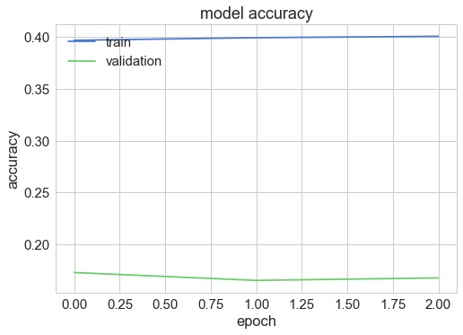

```python
# MobileHCI 2018 tutorial: Machine Learning for Intelligent Mobile User Interfaces using Keras.
```


```python
# -*- coding: utf-8 -*-

## By Abdallah El Ali
## MobileHCI 2018 tutorial: Machine Learning for Intelligent Mobile User Interfaces using Keras.

## Some code adapted from: GUILLAUME CHEVALIER https://github.com/guillaume-chevalier/LSTM-Human-Activity-Recognition

import pandas as pd
import numpy as np
import matplotlib.pyplot as plt
# import matplotlib
from scipy import stats
from keras.models import Sequential
from keras.layers import Dense, Conv2D, MaxPooling2D, Flatten, Dropout, LSTM, LSTMCell, Bidirectional, TimeDistributed, InputLayer, ConvLSTM2D
from keras import optimizers
import os
import scipy.io
import pickle
import math
from mpl_toolkits.mplot3d import Axes3D
from scipy import stats
import tensorflow as tf
import seaborn as sns
import pylab
from sklearn import metrics
from sklearn.model_selection import train_test_split, cross_val_score

from tensorflow.python.framework import graph_util
from tensorflow.python.framework import graph_io
from keras.models import load_model
from keras import backend as K
import os.path as osp
import wget
import zipfile

%matplotlib inline

sns.set(style='whitegrid', palette='muted', font_scale=1.5)

# graph = tf.get_default_graph()
K.clear_session()
```


```python
# LConvert notebook to a README for GitHub repo's main page
!jupyter nbconvert --to markdown Keras_HAR_UCD.ipynb
!mv Keras_HAR_UCD.md README.md
```

    [NbConvertApp] Converting notebook Keras_HAR_UCD.ipynb to markdown
    [NbConvertApp] Support files will be in Keras_HAR_UCD_files/
    [NbConvertApp] Making directory Keras_HAR_UCD_files
    [NbConvertApp] Making directory Keras_HAR_UCD_files
    [NbConvertApp] Making directory Keras_HAR_UCD_files
    [NbConvertApp] Making directory Keras_HAR_UCD_files
    [NbConvertApp] Making directory Keras_HAR_UCD_files
    [NbConvertApp] Making directory Keras_HAR_UCD_files
    [NbConvertApp] Making directory Keras_HAR_UCD_files
    [NbConvertApp] Making directory Keras_HAR_UCD_files
    [NbConvertApp] Making directory Keras_HAR_UCD_files
    [NbConvertApp] Making directory Keras_HAR_UCD_files
    [NbConvertApp] Making directory Keras_HAR_UCD_files
    [NbConvertApp] Making directory Keras_HAR_UCD_files
    [NbConvertApp] Making directory Keras_HAR_UCD_files
    [NbConvertApp] Making directory Keras_HAR_UCD_files
    [NbConvertApp] Making directory Keras_HAR_UCD_files
    [NbConvertApp] Making directory Keras_HAR_UCD_files
    [NbConvertApp] Writing 86894 bytes to Keras_HAR_UCD.md


```python
## wget UCD dataset + all .npy files and dump into ./data dir

# !mkdir data
!wget -P ./data "http://abdoelali.com/data/mobilehci2018_tutorial_data.zip"
```

    --2018-08-13 12:28:53--  http://abdoelali.com/data/mobilehci2018_tutorial_data.zip
    Resolving abdoelali.com (abdoelali.com)... 160.153.1.1
    Connecting to abdoelali.com (abdoelali.com)|160.153.1.1|:80... connected.
    HTTP request sent, awaiting response... 200 OK
    Length: 298100126 (284M) [application/zip]
    Saving to: ‘./data/mobilehci2018_tutorial_data.zip’
    
    18_tutorial_data.zi  13%[=>                    ]  38.31M  3.05MB/s   eta 74s   ^C


```python
## unzip and delete files

with zipfile.ZipFile("./data/mobilehci2018_tutorial_data.zip","r") as zipref:
    zipref.extractall("./data/")
os.remove("./data/mobilehci2018_tutorial_data.zip")
```


```python
# setting up a random seed for reproducibility
random_seed = 611
np.random.seed(random_seed)

# matplotlib inline
plt.style.use('ggplot')
# defining function for loading the dataset

def readData(filePath):
    # attributes of the dataset
    columnNames = ['user_id','activity','timestamp','x-axis','y-axis','z-axis']
    data = pd.read_csv(filePath,header = None, names=columnNames,na_values=';')
    return data[0:2000]
# defining a function for feature normalization
# (feature - mean)/stdiv
def featureNormalize(dataset):
    mu = np.mean(dataset,axis=0)
    sigma = np.std(dataset,axis=0)
    return (dataset-mu)/sigma
# defining the function to plot a single axis data
def plotAxis(axis,x,y,title):
    axis.plot(x,y)
    axis.set_title(title)
    axis.xaxis.set_visible(False)
    axis.set_ylim([min(y)-np.std(y),max(y)+np.std(y)])
    axis.set_xlim([min(x),max(x)])
    axis.grid(True)
# defining a function to plot the data for a given activity
def plotActivity(activity,data):
    fig,(ax0,ax1,ax2) = plt.subplots(nrows=3, figsize=(15,10),sharex=True)
    plotAxis(ax0,data['timestamp'],data['x-axis'],'x-axis')
    plotAxis(ax1,data['timestamp'],data['y-axis'],'y-axis')
    plotAxis(ax2,data['timestamp'],data['z-axis'],'z-axis')
    plt.subplots_adjust(hspace=0.2)
    fig.suptitle(activity)
    plt.subplots_adjust(top=0.9)
    plt.show()
# defining a window function for segmentation purposes
def windows(data,size):
    start = 0
    while start< data.count():
        yield int(start), int(start + size)
        start+= (size/2)
        
        
# # segmenting the time series
# def segment_signal(data, window_size = 90):
#     segments = np.empty((0,window_size,3))
#     labels= np.empty((0))
#     for (start, end) in windows(data['timestamp'],window_size):
#         x = data['x-axis'][start:end]
#         y = data['y-axis'][start:end]
#         z = data['z-axis'][start:end]
#         if(len(data['timestamp'][start:end])==window_size):
#             segments = np.vstack([segments,np.dstack([x,y,z])])
#             labels = np.append(labels,stats.mode(data['activity'][start:end])[0][0])
#     return segments, labels

# segmenting the time series

# acc_x	acc_y	acc_z	gyr_x	gyr_y	gyr_z	

def segment_signal_ucd(data, window_size = 90):
    segments = np.empty((0,window_size,6))
    labels= np.empty((0))
#     print labels
    for (start, end) in windows(data['activity'],window_size):
        x = data['acc_x'][start:end]
        y = data['acc_y'][start:end]
        z = data['acc_z'][start:end]
        p = data['gyr_x'][start:end]
        q = data['gyr_y'][start:end]
        r = data['gyr_z'][start:end]

        if(len(data['activity'][start:end])==window_size):
            segments = np.vstack([segments,np.dstack([x,y,z,p,q,r])])
            if labels is not None:
                labels = np.append(labels,stats.mode(data['activity'][start:end])[0][0])
    return segments, labels
```


```python
DIR = './data/USC-HAD/data/'

# activity = []
# subject = []
# age = []
act_num = []
sensor_readings = []

def read_dir(directory):

    for path, subdirs, files in os.walk(DIR):
        for name in files:
            if name.endswith('.mat'):
                mat = scipy.io.loadmat(os.path.join(path, name))

#                 activity.append(mat['activity'])
#                 subject.extend(mat['subject'])
#                 age.extend(mat['age'])
                sensor_readings.append(mat['sensor_readings'])

                if mat.get('activity_number') is None:
                    act_num.append('11')
                    
                else:
                    act_num.append(mat['activity_number'])
    return act_num, sensor_readings
# handle corrupt datapoint
# act_num[258] = '11'            
act_num, sensor_readings = read_dir(DIR)
```


```python
# 1. Walking Forward
# 2. Walking Left
# 3. Walking Right
# 4. Walking Upstairs
# 5. Walking Downstairs
# 6. Running Forward
# 7. Jumping Up
# 8. Sitting
# 9. Standing
# 10. Sleeping
# 11. Elevator Up
# 12. Elevator Down
```


```python
# Get acc + gyr sensor readings and put in df

acc_x = []
acc_y = []
acc_z = []

gyr_x = []
gyr_y = []
gyr_z = []
act_label = []
df = None

for i in range(840):
    for j in sensor_readings[i]:
        
        acc_x.append(j[0]) # acc_x
        acc_y.append(j[1]) # acc_y
        acc_z.append(j[2]) # acc_z
        gyr_x.append(j[3]) # gyr_x
        gyr_y.append(j[4]) # gyr_y
        gyr_z.append(j[5]) # gyr_z
        act_label.append(act_num[i])
        

df = pd.DataFrame({'acc_x':acc_x,'acc_y':acc_y,'acc_z':acc_z,'gyr_x':gyr_x,'gyr_y':gyr_y,'gyr_z':gyr_z,'activity':act_label})
                           
df = df[['acc_x', 'acc_y', 'acc_z', 'gyr_x', 'gyr_y', 'gyr_z','activity']]

df.loc[df['activity'] == '1', 'activity'] = 'Walking Forward'
df.loc[df['activity'] == '2', 'activity'] = 'Walking Left'
df.loc[df['activity'] == '3', 'activity'] = 'Walking Right'
df.loc[df['activity'] == '4', 'activity'] = 'Walking Upstairs'
df.loc[df['activity'] == '5', 'activity'] = 'Walking Downstairs'
df.loc[df['activity'] == '6', 'activity'] = 'Running Forward'
df.loc[df['activity'] == '7', 'activity'] = 'Jumping Up'
df.loc[df['activity'] == '8', 'activity'] = 'Sitting'
df.loc[df['activity'] == '9', 'activity'] = 'Standing'
df.loc[df['activity'] == '10', 'activity'] = 'Sleeping'
df.loc[df['activity'] == '11', 'activity'] = 'Elevator Up'
df.loc[df['activity'] == '12', 'activity'] = 'Elevator Down'

df['activity'].unique()

```


    array(['Sleeping', 'Sitting', 'Elevator Down', 'Elevator Up', 'Standing',
           'Jumping Up', 'Walking Downstairs', 'Walking Right',
           'Walking Forward', 'Running Forward', 'Walking Upstairs',
           'Walking Left'], dtype=object)


```python
## use only for collapsing / reducing output classes

# df2 = df

# df2.loc[df2['activity'] == 'Walking Forward', 'activity'] = 'Walking'
# df2.loc[df2['activity'] == 'Walking Left', 'activity'] = 'Walking'
# df2.loc[df2['activity'] == 'Walking Right', 'activity'] = 'Walking'

```


```python

print 'df size ' + str(len(df))

```

    df size 2811490


```python
# dataset = readData('./data/actitracker_raw.txt')
# plotting a subset of the data to visualize
# for activity in np.unique(dataset['activity']):
#     subset = dataset[dataset['activity']==activity][:180]
#     plotActivity(activity,subset)


# UNCOMMENT for segmenting the signal in overlapping windows of 90 samples with 50% overlap

# segments, labels = segment_signal_ucd(df)

# COMMENT if you want to segment afresh. 

#open a file, where you stored the pickled data
segments = open('./data/segments_90.p', 'rb')
labels = open('./data/labels_90.p','rb')
# dump information to that file
segments = pickle.load(segments)
labels = pickle.load(labels)

# pickle.dump(segments, open( "./data/segments_90.p","wb"))
# pickle.dump(labels, open( "./data/labels_90.p","wb"))

#categorically defining the classes of the activities
labels = np.asarray(pd.get_dummies(labels),dtype = np.int8)

# defining parameters for the input and network layers
# we are treating each segmeent or chunk as a 2D image (90 X 3)
numOfRows = segments.shape[1]
numOfColumns = segments.shape[2]
numChannels = 1
numFilters = 128 # number of filters in Conv2D layer
# kernal size of the Conv2D layer
kernalSize1 = 2
# max pooling window size
poolingWindowSz = 2
# number of filters in fully connected layers
numNueronsFCL1 = 128
numNueronsFCL2 = 128
# split ratio for test and validation
trainSplitRatio = 0.8
# number of epochs
Epochs = 1
# batchsize
batchSize = 10

# number of total clases
numClasses = labels.shape[1]
print labels.shape

print numClasses
# dropout ratio for dropout layer
dropOutRatio = 0.2
# reshaping the data for network input
reshapedSegments = segments.reshape(segments.shape[0], numOfRows, numOfColumns,1)
# splitting in training and testing data
trainSplit = np.random.rand(len(reshapedSegments)) < trainSplitRatio
trainX = reshapedSegments[trainSplit]
testX = reshapedSegments[~trainSplit]
trainX = np.nan_to_num(trainX)
testX = np.nan_to_num(testX)
trainY = labels[trainSplit]
testY = labels[~trainSplit]

print "segments shape:" + str(segments.shape)
print "labels shape:" + str(labels.shape)
print "trainX shape: " + str(trainX.shape)
print "trainY shape: " + str(trainY.shape)
print "testX shape: " + str(testX.shape)
print "testY shape: " + str(testY.shape)

# (observations, timesteps, features (x,y,z), channels)
```

    (62476, 12)
    12
    segments shape:(62476, 90, 6)
    labels shape:(62476, 12)
    trainX shape: (49973, 90, 6, 1)
    trainY shape: (49973, 12)
    testX shape: (12503, 90, 6, 1)
    testY shape: (12503, 12)


```python
# k = []

# for i in range(len(labels)):
#     if labels[i][0] == 1: 
#         k.append(labels[i])
# print len(k)

# print labels.shape
```

    3674
    (62476, 12)


```python
df[1:10]
```


<div>
<style>
    .dataframe thead tr:only-child th {
        text-align: right;
    }

    .dataframe thead th {
        text-align: left;
    }

    .dataframe tbody tr th {
        vertical-align: top;
    }
</style>
<table border="1" class="dataframe">
  <thead>
    <tr style="text-align: right;">
      <th></th>
      <th>acc_x</th>
      <th>acc_y</th>
      <th>acc_z</th>
      <th>gyr_x</th>
      <th>gyr_y</th>
      <th>gyr_z</th>
      <th>activity</th>
    </tr>
  </thead>
  <tbody>
    <tr>
      <th>1</th>
      <td>-0.657132</td>
      <td>0.805976</td>
      <td>-0.149374</td>
      <td>0.692599</td>
      <td>-0.428895</td>
      <td>-0.506021</td>
      <td>Sleeping</td>
    </tr>
    <tr>
      <th>2</th>
      <td>-0.653698</td>
      <td>0.809595</td>
      <td>-0.153035</td>
      <td>0.288852</td>
      <td>0.375579</td>
      <td>-0.504430</td>
      <td>Sleeping</td>
    </tr>
    <tr>
      <th>3</th>
      <td>-0.650265</td>
      <td>0.809595</td>
      <td>-0.149374</td>
      <td>0.287940</td>
      <td>0.374394</td>
      <td>-0.101278</td>
      <td>Sleeping</td>
    </tr>
    <tr>
      <th>4</th>
      <td>-0.646831</td>
      <td>0.805976</td>
      <td>-0.149374</td>
      <td>0.287031</td>
      <td>0.373212</td>
      <td>-0.502525</td>
      <td>Sleeping</td>
    </tr>
    <tr>
      <th>5</th>
      <td>-0.650265</td>
      <td>0.809595</td>
      <td>-0.149374</td>
      <td>0.286124</td>
      <td>-0.431087</td>
      <td>-0.099380</td>
      <td>Sleeping</td>
    </tr>
    <tr>
      <th>6</th>
      <td>-0.650265</td>
      <td>0.809595</td>
      <td>-0.149374</td>
      <td>0.285221</td>
      <td>0.373394</td>
      <td>-0.500633</td>
      <td>Sleeping</td>
    </tr>
    <tr>
      <th>7</th>
      <td>-0.653698</td>
      <td>0.809595</td>
      <td>-0.149374</td>
      <td>-0.117240</td>
      <td>-0.430905</td>
      <td>-0.499058</td>
      <td>Sleeping</td>
    </tr>
    <tr>
      <th>8</th>
      <td>-0.657132</td>
      <td>0.809595</td>
      <td>-0.149374</td>
      <td>-0.116870</td>
      <td>-0.027984</td>
      <td>-0.095924</td>
      <td>Sleeping</td>
    </tr>
    <tr>
      <th>9</th>
      <td>-0.653698</td>
      <td>0.805976</td>
      <td>-0.153035</td>
      <td>0.285060</td>
      <td>-0.429456</td>
      <td>-0.497187</td>
      <td>Sleeping</td>
    </tr>
  </tbody>
</table>
</div>


```python
print testX.shape
```

    (12467, 90, 6, 1)


```python
# sanity check

print min(df['acc_x'])
print max(df['acc_x'])

print min(df['acc_y'])
print max(df['acc_y'])

print min(df['acc_z'])
print max(df['acc_z'])

print min(df['gyr_z'])
print max(df['gyr_z'])
```

    -3.3526623249053955
    6.931558132171631
    -6.417827129364014
    4.949891567230225
    -5.416336536407471
    4.539283275604248
    -808.1836547851562
    816.5776977539062


```python
plot_dir = './plots/'

def plot_activity(activity, df,i=0, j=100):
    data = df[df['activity'] == activity][['acc_x', 'acc_y', 'acc_z', 'gyr_x', 'gyr_y', 'gyr_z']][i:j]
    axis = data.plot(subplots=True, figsize=(16, 6), 
                     title=activity)
    for ax in axis:
        ax.legend(loc='lower left', bbox_to_anchor=(1.0, 0.5))
        
    if not os.path.isdir(plot_dir):
        os.makedirs(plot_dir)

    plt.savefig(plot_dir + str(activity) + '.pdf',bbox_inches='tight')
        
def plot_datasets(df,i=0,j=1000):
    plot_activity("Walking Forward", df,i,j)
    plot_activity("Walking Left", df,i,j)
    plot_activity("Walking Right", df,i,j)
    plot_activity("Walking Upstairs", df,i,j)
    plot_activity("Walking Downstairs", df,i,j)
    plot_activity("Running Forward", df,i,j)
    plot_activity("Jumping Up", df,i,j)
    plot_activity("Sitting", df,i,j)
    plot_activity("Standing", df,i,j)
    plot_activity("Sleeping", df,i,j)
    plot_activity("Elevator Up", df,i,j)
    plot_activity("Elevator Down", df,i,j)


# def plot_datasets2(df,i=1000):
#     plot_activity("Walking", df,i)
#     plot_activity("Running", df,i)
#     plot_activity("Jumping Up", df,i)
#     plot_activity("Sitting", df,i)
#     plot_activity("Standing", df,i)
#     plot_activity("Sleeping", df,i)
#     plot_activity("Elevator Up", df,i)
#     plot_activity("Elevator Down", df,i)
    
plot_datasets(df)

```


```python
df['activity'].value_counts().plot(kind='bar', title='Plotting records by activity type', figsize=(10, 4),align='center');
plt.savefig(plot_dir + 'sample_dist.pdf', bbox_inches='tight')
```


```python
df['activity'].value_counts()
```


    Walking Forward       381400
    Sleeping              375000
    Walking Right         269700
    Walking Left          264600
    Sitting               261500
    Standing              236000
    Walking Upstairs      211800
    Walking Downstairs    197400
    Running Forward       176500
    Elevator Up           165491
    Elevator Down         164999
    Jumping Up            107100
    Name: activity, dtype: int64


```python
print "segments shape:" + str(segments.shape)
print "labels shape:" + str(labels.shape)
print "trainX shape: " + str(trainX.shape)
print "trainY shape: " + str(trainY.shape)
print "testX shape: " + str(testX.shape)
print "testY shape: " + str(testY.shape)
print "\n"
print "Rows / Timesteps: " + str(numOfRows)
print "Columns / features: " + str(numOfColumns)

# Conv2D: (observations, timesteps, features (acc + gyro), channels)
# LSTM: (batch size, observations, timesteps, features (acc + gyro), channels)

```

    segments shape:(62476, 90, 6)
    labels shape:(62476, 12)
    trainX shape: (49953, 90, 6, 1)
    trainY shape: (49953, 12)
    testX shape: (12523, 90, 6, 1)
    testY shape: (12523, 12)
    
    
    Rows / Timesteps: 90
    Columns / features: 6


```python
print testX[1][1] # shape of data to feed frozen model later
```

    [[  0.23222113]
     [  0.15453091]
     [ -0.21525715]
     [ 56.64781952]
     [-29.01465416]
     [-17.79100418]]


```python
# test reshape for ConvLSTM

print np.expand_dims(testY,1).shape
print trainX.shape

# print trainX.reshape((None,50094, 90, 6, 1))
```

    (12467, 1, 12)
    (50009, 90, 6, 1)


```python
def Conv2D_LSTM_Model():
    model = Sequential()
    print (model.name)
    # adding the first convLSTM layer with 32 filters and 5 by 5 kernal size, using the rectifier as the activation function
    model.add(ConvLSTM2D(numFilters, (kernalSize1,kernalSize1),input_shape=(None, numOfRows, numOfColumns, 1),activation='relu', padding='same',return_sequences=True,name="INPUT"))
    print (model.input_shape)
    print (model.output_shape)
    print (model.name)
    

    # adding a maxpooling layer
    model.add(TimeDistributed(MaxPooling2D(pool_size=(poolingWindowSz,poolingWindowSz),padding='valid')))
    print (model.output_shape)

    # adding a dropout layer for the regularization and avoiding over fitting
    model.add(Dropout(dropOutRatio))
    print (model.output_shape)
    
    # flattening the output in order to apply the fully connected layer
    model.add(TimeDistributed(Flatten()))
    print (model.output_shape)
    
    # adding first fully connected layer with 256 outputs
    model.add(Dense(numNueronsFCL1, activation='relu'))
    print (model.output_shape)

    #adding second fully connected layer 128 outputs
    model.add(Dense(numNueronsFCL2, activation='relu'))
    print (model.output_shape)

    model.add(TimeDistributed(Flatten()))
    print (model.output_shape)

    # adding softmax layer for the classification
    model.add(Dense(numClasses, activation='softmax', name="OUTPUT"))
    print (model.output_shape)
    print (model.name)

    # Compiling the model to generate a model
    adam = optimizers.Adam(lr = 0.001, decay=1e-6)
    model.compile(loss='categorical_crossentropy', optimizer=adam, metrics=['accuracy'])
    return model
```


```python
print (model.input_shape)
```

    (None, 90, 6, 1)


```python
# Train the network!

tf.get_default_graph()

model = Conv2D_LSTM_Model()
for layer in model.layers:
    print(layer.name)
print trainX.shape
model.fit(np.expand_dims(trainX,1),np.expand_dims(trainY,1), validation_split=1-trainSplitRatio,epochs=1,batch_size=batchSize,verbose=2)
score = model.evaluate(np.expand_dims(testX,1),np.expand_dims(testY,1),verbose=2)
print("%s: %.2f%%" % (model.metrics_names[1], score[1]*100))
print('Baseline ConvLSTM Error: %.2f%%' %(100-score[1]*100))

# Save your model!

model.save('model_hcd_test.h5')
model.save_weights('model_weights_test.h5')
# np.save('groundTruth_test_lstm.npy',np.expand_dims(testY,1))
# np.save('testData_test_lstm.npy',np.expand_dims(testX,1))


with open("./data/model_hcd_test.json", "w") as json_file:
  json_file.write(model.to_json())

```

    sequential_3
    (None, None, 90, 6, 128)
    sequential_3
    (None, None, 45, 3, 128)
    (None, None, 45, 3, 128)
    (None, None, 17280)
    (None, None, 128)
    (None, None, 128)
    (None, None, 128)
    (None, None, 12)
    sequential_3
    INPUT
    time_distributed_7
    dropout_3
    time_distributed_8
    dense_5
    dense_6
    time_distributed_9
    OUTPUT
    (49953, 90, 6, 1)
    Train on 39962 samples, validate on 9991 samples
    Epoch 1/1
     - 1666s - loss: 0.7321 - acc: 0.7314 - val_loss: 0.7805 - val_acc: 0.7287
    acc: 78.38%
    Baseline ConvLSTM Error: 21.62%


```python

print model.name

```


```python
# trainX = np.expand_dims(trainX,0)
# testX = np.expand_dims(testX,0)

# trainY = np.expand_dims(trainY,0)
# testY = np.expand_dims(testY,0)
```


```python
# %%pixie_debugger
# -*- coding: utf-8 -*-
"""
Evaluate a pretrained model saved as model.h5 using 'testData.npy'
and 'groundTruth.npy'. Reporterror as the cross entropy loss in percentage and also generated a png file for the confusion matrix.
Based on work by Muhammad Shahnawaz
"""

import matplotlib

# importing the dependencies
from keras.models import load_model, Sequential
from keras import optimizers
from keras.layers import Dense, Conv2D, MaxPooling2D, Flatten, Dropout

import numpy as np
from sklearn import metrics
import os
import matplotlib.pyplot as plt
import matplotlib.colors as colors
import matplotlib.cm


# defining a function for plotting the confusion matrix
# takes cmNormalized
os.environ['QT_PLUGIN_PATH'] = ''
def plot_cm(cM, labels,title):
    # normalizing the confusionMatrix for showing the probabilities
    cmNormalized = np.around((cM/cM.astype(np.float).sum(axis=1)[:,None])*100,2)

    # creating a figure object
    fig = plt.figure()
    # plotting the confusion matrix
    plt.imshow(cmNormalized,interpolation=None,cmap = plt.cm.Blues)
    # creating a color bar and setting the limits
    plt.colorbar()
    plt.clim(0,100)
    # assiging the title, x and y labels
    plt.xlabel('Predicted Values')
    plt.ylabel('Ground Truth')
    plt.title(title + '\n%age confidence')
    # defining the ticks for the x and y axis
    plt.xticks(range(len(labels)),labels,rotation = 60)
    plt.yticks(range(len(labels)),labels)
    # number of occurences in the boxes
    width, height = cM.shape
    print('Accuracy for each class is given below.')
    for predicted in range(width):
        for real in range(height):
            color = 'black'
            if(predicted == real):
                color = 'white'
                print(labels[predicted].ljust(12)+ ':', cmNormalized[predicted,real], '%')
            plt.gca().annotate(
                    '{:d}'.format(int(cmNormalized[predicted,real])),xy=(real, predicted),
                    horizontalalignment = 'center',verticalalignment = 'center',color = color)
    # making sure that the figure is not clipped
    plt.tight_layout()
    # saving the figure
    fig.savefig(title +'.png')
    
# loading the pretrained model
model = load_model('model_ucd.h5')

# load weights into new model
model.load_weights("model_weights_ucd.h5")
print("Loaded model from disk")

#loading the testData and groundTruth data
test_x = np.load('testData_ucd.npy')
groundTruth = np.load('groundTruth_ucd.npy')

# evaluate loaded model on test data

model.compile(loss='categorical_crossentropy', optimizer='adam', metrics=['accuracy'])
score = model.evaluate(test_x,groundTruth,verbose=2)


print("%s: %.2f%%" % (model.metrics_names[1], score[1]*100))
print('Baseline Error: %.2f%%' %(100-score[1]*100))


## Creating and plotting a confusion matrix

# defining the class labels
labels = ['WalkForward','WalkLeft','WalkRight','WalkUp','WalkDown','RunForward', 'JumpUp', 'Sit', 'Stand', 'Sleep', 'ElevatorUp', 'ElevatorDown']
# predicting the classes
predictions = model.predict(test_x,verbose=2)

# getting the class predicted and class in ground truth for creation of confusion matrix
predictedClass = np.zeros((predictions.shape[0]))


groundTruthClass = np.zeros((groundTruth.shape[0]))
for instance in range (groundTruth.shape[0]):
    predictedClass[instance] = np.argmax(predictions[instance,:])
    groundTruthClass[instance] = np.argmax(groundTruth[instance,:])

cm = metrics.confusion_matrix(groundTruthClass,predictedClass)

print cm
# plotting the confusion matrix
plot_cm(cm, labels,'confusion_matrix_90')

print model.summary()


```

    Loaded model from disk
    acc: 80.12%
    Baseline Error: 19.88%
    [[ 246  342    1    1    9    0  127   10    2    0    0    0]
     [ 186  387    2    0    7    0  126   10    2    0    0    0]
     [   0    0  320   22    0    1    5  114   13    1    1   11]
     [   0    0   35  682    0    0    1   32   15    2    0    9]
     [  11   10    1    0 1097    1   62    1    1    0    0    2]
     [   0    1    0    0    3 1656    0    2    0    1    3    0]
     [  14   22    5    0   12    0  956   11    2    0    0   16]
     [   1    0   16   16    0    0   10  694   61   18    3   23]
     [   0    0    5    0    0    0   15   34 1575   23   15   38]
     [   1    0    1    0    0    0   11   92  188  826   18    7]
     [   0    0    2    0    0    0    8   19  241    1  882   58]
     [   1    0    6   11    1    1   16   80  120    4   45  668]]
    Accuracy for each class is given below.
    ('WalkForward :', 33.33, '%')
    ('WalkLeft    :', 53.75, '%')
    ('WalkRight   :', 65.57, '%')
    ('WalkUp      :', 87.89, '%')
    ('WalkDown    :', 92.5, '%')
    ('RunForward  :', 99.4, '%')
    ('JumpUp      :', 92.1, '%')
    ('Sit         :', 82.42, '%')
    ('Stand       :', 92.38, '%')
    ('Sleep       :', 72.2, '%')
    ('ElevatorUp  :', 72.83, '%')
    ('ElevatorDown:', 70.09, '%')
    _________________________________________________________________
    Layer (type)                 Output Shape              Param #   
    =================================================================
    conv2d_1 (Conv2D)            (None, 89, 5, 128)        640       
    _________________________________________________________________
    max_pooling2d_1 (MaxPooling2 (None, 44, 2, 128)        0         
    _________________________________________________________________
    dropout_1 (Dropout)          (None, 44, 2, 128)        0         
    _________________________________________________________________
    flatten_1 (Flatten)          (None, 11264)             0         
    _________________________________________________________________
    dense_1 (Dense)              (None, 128)               1441920   
    _________________________________________________________________
    dense_2 (Dense)              (None, 128)               16512     
    _________________________________________________________________
    dense_3 (Dense)              (None, 12)                1548      
    =================================================================
    Total params: 1,460,620
    Trainable params: 1,460,620
    Non-trainable params: 0
    _________________________________________________________________
    None


```python
model.compile(loss='categorical_crossentropy', optimizer='adam', metrics=['accuracy'])
# score = model.evaluate(test_x,groundTruth,verbose=2)
history = model.fit(trainX,trainY, validation_split=1-trainSplitRatio,epochs=3,batch_size=batchSize,verbose=2, shuffle=True)

# loading the pretrained model
# history = load_model('model_ucd.h5')

# load weights into new model
# model.load_weights("model_weights_ucd.h5")

# history = model.fit(x_test, y_test, nb_epoch=10, validation_split=0.2, shuffle=True)

model.test_on_batch(test_x, testY)
model.metrics_names


print(history.history.keys())
#  "Accuracy"
plt.plot(history.history['acc'])
plt.plot(history.history['val_acc'])
plt.title('model accuracy')
plt.ylabel('accuracy')
plt.xlabel('epoch')
plt.legend(['train', 'validation'], loc='upper left')
plt.show()
# "Loss"
plt.plot(history.history['loss'])
plt.plot(history.history['val_loss'])
plt.title('model loss')
plt.ylabel('loss')
plt.xlabel('epoch')
plt.legend(['train', 'validation'], loc='upper left')
plt.show()
```

    Train on 39962 samples, validate on 9991 samples
    Epoch 1/3
     - 77s - loss: 1.6958 - acc: 0.3971 - val_loss: 2.5329 - val_acc: 0.1729
    Epoch 2/3
     - 83s - loss: 1.6836 - acc: 0.3996 - val_loss: 2.5658 - val_acc: 0.1652
    Epoch 3/3
     - 82s - loss: 1.6791 - acc: 0.4009 - val_loss: 2.5203 - val_acc: 0.1677
    ['acc', 'loss', 'val_acc', 'val_loss']





```python
# history.history['loss']

print history.model.evaluate(testX,testY,verbose=3)

```

    [1.8351253166976615, 0.35781952472703915]


```python
def print_graph_nodes(filename):
    import tensorflow as tf
    g = tf.GraphDef()
    g.ParseFromString(open(filename, 'rb').read())
    print()
    print(filename)
    print("=======================INPUT=========================")
    print([n for n in g.node if n.name.find('input') != -1])
    print("=======================OUTPUT========================")
    print([n for n in g.node if n.name.find('output') != -1])
    print("===================KERAS_LEARNING=====================")
    print([n for n in g.node if n.name.find('keras_learning_phase') != -1])
    print("======================================================")
    print()
```


```python
# Method 1

print_graph_nodes("./tensorflow_pb_models/model_ucd.h5.pb")
# print_graph_nodes("./graph_test/output_graph.pb")
```

    ()
    ./tensorflow_model/model_ucd.h5.pb
    =======================INPUT=========================
    [name: "keras_learning_phase/input"
    op: "Const"
    attr {
      key: "dtype"
      value {
        type: DT_BOOL
      }
    }
    attr {
      key: "value"
      value {
        tensor {
          dtype: DT_BOOL
          tensor_shape {
          }
          bool_val: false
        }
      }
    }
    , name: "conv2d_1_input"
    op: "Placeholder"
    attr {
      key: "dtype"
      value {
        type: DT_FLOAT
      }
    }
    attr {
      key: "shape"
      value {
        shape {
          dim {
            size: -1
          }
          dim {
            size: 90
          }
          dim {
            size: 6
          }
          dim {
            size: 1
          }
        }
      }
    }
    ]
    =======================OUTPUT========================
    [name: "output_node0"
    op: "Identity"
    input: "strided_slice"
    attr {
      key: "T"
      value {
        type: DT_FLOAT
      }
    }
    ]
    ===================KERAS_LEARNING=====================
    [name: "keras_learning_phase/input"
    op: "Const"
    attr {
      key: "dtype"
      value {
        type: DT_BOOL
      }
    }
    attr {
      key: "value"
      value {
        tensor {
          dtype: DT_BOOL
          tensor_shape {
          }
          bool_val: false
        }
      }
    }
    , name: "keras_learning_phase"
    op: "PlaceholderWithDefault"
    input: "keras_learning_phase/input"
    attr {
      key: "dtype"
      value {
        type: DT_BOOL
      }
    }
    attr {
      key: "shape"
      value {
        shape {
        }
      }
    }
    ]
    ======================================================
    ()


```python
# Method 2

print_graph_nodes("./tensorflow_pb_models/ucd_model_test2.pb")
```

    ()
    ./tensorflow_model/model_ucd.h5.pb
    =======================INPUT=========================
    [name: "keras_learning_phase/input"
    op: "Const"
    attr {
      key: "dtype"
      value {
        type: DT_BOOL
      }
    }
    attr {
      key: "value"
      value {
        tensor {
          dtype: DT_BOOL
          tensor_shape {
          }
          bool_val: false
        }
      }
    }
    , name: "conv2d_1_input"
    op: "Placeholder"
    attr {
      key: "dtype"
      value {
        type: DT_FLOAT
      }
    }
    attr {
      key: "shape"
      value {
        shape {
          dim {
            size: -1
          }
          dim {
            size: 90
          }
          dim {
            size: 6
          }
          dim {
            size: 1
          }
        }
      }
    }
    ]
    =======================OUTPUT========================
    [name: "output_node0"
    op: "Identity"
    input: "strided_slice"
    attr {
      key: "T"
      value {
        type: DT_FLOAT
      }
    }
    ]
    ===================KERAS_LEARNING=====================
    [name: "keras_learning_phase/input"
    op: "Const"
    attr {
      key: "dtype"
      value {
        type: DT_BOOL
      }
    }
    attr {
      key: "value"
      value {
        tensor {
          dtype: DT_BOOL
          tensor_shape {
          }
          bool_val: false
        }
      }
    }
    , name: "keras_learning_phase"
    op: "PlaceholderWithDefault"
    input: "keras_learning_phase/input"
    attr {
      key: "dtype"
      value {
        type: DT_BOOL
      }
    }
    attr {
      key: "shape"
      value {
        shape {
        }
      }
    }
    ]
    ======================================================
    ()


```python
# Method 3

print_graph_nodes("./tensorflow_pb_models/ucd_keras_frozen3_test.pb")
```

    ()
    ./tensorflow_model/ucd_keras_frozen3_test.pb
    =======================INPUT=========================
    [name: "INPUT_input"
    op: "Placeholder"
    attr {
      key: "_output_shapes"
      value {
        list {
          shape {
            dim {
              size: -1
            }
            dim {
              size: -1
            }
            dim {
              size: 90
            }
            dim {
              size: 6
            }
            dim {
              size: 1
            }
          }
        }
      }
    }
    attr {
      key: "dtype"
      value {
        type: DT_FLOAT
      }
    }
    attr {
      key: "shape"
      value {
        shape {
          dim {
            size: -1
          }
          dim {
            size: -1
          }
          dim {
            size: 90
          }
          dim {
            size: 6
          }
          dim {
            size: 1
          }
        }
      }
    }
    ]
    =======================OUTPUT========================
    []
    ===================KERAS_LEARNING=====================
    []
    ======================================================
    ()


```python

K.clear_session()

## Method 1

# This was created with @warptime's help. Thank you!

saved_model_path = "./tensorflow_pb_models/model_hcd_test.h5"

model = load_model(saved_model_path)
nb_classes = 1 # The number of output nodes in the model
prefix_output_node_names_of_final_network = 'output_node'

K.set_learning_phase(0)

pred = [None]*nb_classes
pred_node_names = [None]*nb_classes
for i in range(nb_classes):
    pred_node_names[i] = prefix_output_node_names_of_final_network+str(i)
    pred[i] = tf.identity(model.output[i], name=pred_node_names[i])
print('output nodes names are: ', pred_node_names)

sess = K.get_session()
output_fld = 'tensorflow_pb_models/'
if not os.path.isdir(output_fld):
    os.mkdir(output_fld)
output_graph_name = saved_model_path + '.pb'
output_graph_suffix = '_inference'

constant_graph = graph_util.convert_variables_to_constants(sess, sess.graph.as_graph_def(), pred_node_names)
graph_io.write_graph(constant_graph, output_fld, output_graph_name, as_text=False)
print('saved the constant graph (ready for inference) at: ', osp.join(output_fld, output_graph_name))
```

    ('output nodes names are: ', ['output_node0'])
    INFO:tensorflow:Froze 10 variables.
    INFO:tensorflow:Converted 10 variables to const ops.
    ('saved the constant graph (ready for inference) at: ', 'tensorflow_model/model_hcd_test.h5.pb')


```python

K.clear_session()
# Method 2
def freeze_session(session, keep_var_names=None, output_names=None, clear_devices=True):
    """
    Freezes the state of a session into a pruned computation graph.

    Creates a new computation graph where variable nodes are replaced by
    constants taking their current value in the session. The new graph will be
    pruned so subgraphs that are not necessary to compute the requested
    outputs are removed.
    @param session The TensorFlow session to be frozen.
    @param keep_var_names A list of variable names that should not be frozen,
                          or None to freeze all the variables in the graph.
    @param output_names Names of the relevant graph outputs.
    @param clear_devices Remove the device directives from the graph for better portability.
    @return The frozen graph definition.
    """
    
    
    
    from tensorflow.python.framework.graph_util import convert_variables_to_constants
    graph = session.graph
    with graph.as_default():
        freeze_var_names = list(set(v.op.name for v in tf.global_variables()).difference(keep_var_names or []))
        output_names = output_names or []
        output_names += [v.op.name for v in tf.global_variables()]
        input_graph_def = graph.as_graph_def()
        if clear_devices:
            for node in input_graph_def.node:
                node.device = ""
        frozen_graph = convert_variables_to_constants(session, input_graph_def,
                                                      output_names, freeze_var_names)
        return frozen_graph


# Create, compile and train model...

K.set_learning_phase(0)

# model = "model_ucd.h5"
model = load_model('./tensorflow_pb_models/model_hcd_test.h5')

# tf.reset_default_graph()


frozen_graph = freeze_session(K.get_session(), output_names=[out.op.name for out in model.outputs])

tf.train.write_graph(frozen_graph, "./tensorflow_pb_models/", "ucd_model_test2.pb", as_text=False)
```

    INFO:tensorflow:Froze 42 variables.
    INFO:tensorflow:Converted 42 variables to const ops.


    './tensorflow_model/ucd_model_test2.pb'


```python
# for out in model.outputs:
#     print out
```

    Tensor("dense_3_7/Softmax:0", shape=(?, 12), dtype=float32)


```python
K.clear_session()
## Method 3 - using freeze_graph.py

K.set_learning_phase(0)
model = load_model('model_hcd_test.h5')
print(model.output.op.name)
saver = tf.train.Saver()
saver.save(K.get_session(), '/tmp/keras_model_test.ckpt')

```

    OUTPUT/truediv


    '/tmp/keras_model_test.ckpt'


```python
!python /Users/aelali/anaconda/lib/python2.7/site-packages/tensorflow/python/tools/freeze_graph.py --input_meta_graph=/tmp/keras_model_test.ckpt.meta \
--input_checkpoint=/tmp/keras_model_test.ckpt --output_graph=./tensorflow_model/ucd_keras_frozen3_TEST.pb --output_node_names="OUTPUT/truediv" --input_binary=true
```

    /Users/aelali/anaconda/lib/python2.7/site-packages/h5py/__init__.py:36: FutureWarning: Conversion of the second argument of issubdtype from `float` to `np.floating` is deprecated. In future, it will be treated as `np.float64 == np.dtype(float).type`.
      from ._conv import register_converters as _register_converters
    Loaded meta graph file '/tmp/keras_model_test.ckpt.meta
    2018-08-06 19:19:39.195286: I tensorflow/core/platform/cpu_feature_guard.cc:141] Your CPU supports instructions that this TensorFlow binary was not compiled to use: AVX2 FMA


```python
## Method 4

from keras.models import  Sequential, load_model, model_from_json
from keras import backend as K
import tensorflow as tf
from tensorflow.python.tools import freeze_graph
import os

model = load_model('./tensorflow_pb_models/model_hcd_test.h5')
# model.load_weights("model_weights_ucd.h5")
 
# All new operations will be in test mode from now on.
K.set_learning_phase(0)
 
# Serialize the model and get its weights, for quick re-building.
config = model.get_config()
weights = model.get_weights()
 
# Re-build a model where the learning phase is now hard-coded to 0.
new_model = Sequential.from_config(config)
new_model.set_weights(weights)
 
temp_dir = "graph_test"
checkpoint_prefix = os.path.join(temp_dir, "saved_checkpoint")
checkpoint_state_name = "checkpoint_state"
input_graph_name = "input_graph.pb"
output_graph_name = "output_graph.pb"
 
# Temporary save graph to disk without weights included.
saver = tf.train.Saver()
checkpoint_path = saver.save(K.get_session(), checkpoint_prefix, global_step=0, latest_filename=checkpoint_state_name)
tf.train.write_graph(K.get_session().graph, temp_dir, input_graph_name)
 
input_graph_path = os.path.join(temp_dir, input_graph_name)
input_saver_def_path = ""
input_binary = False
output_node_names = "OUTPUT/truediv" # model dependent (e.g., Softmax)
restore_op_name = "save/restore_all"
filename_tensor_name = "save/Const:0"
output_graph_path = os.path.join(temp_dir, output_graph_name)
clear_devices = False
 
# Embed weights inside the graph and save to disk.
freeze_graph.freeze_graph(input_graph_path, input_saver_def_path,
                          input_binary, checkpoint_path,
                          output_node_names, restore_op_name,
                          filename_tensor_name, output_graph_path,
                          clear_devices, "")
```

    INFO:tensorflow:Restoring parameters from graph_test/saved_checkpoint-0
    INFO:tensorflow:Froze 10 variables.
    INFO:tensorflow:Converted 10 variables to const ops.


```python
## Visualize using tensorboard
import webbrowser


# convert the model to tensorboard viz
!python /Users/aelali/anaconda/lib/python2.7/site-packages/tensorflow/python/tools/import_pb_to_tensorboard.py --model_dir ~/Desktop/HAR-CNN-Keras/tensorflow_model/model_ucd.h5.pb --log_dir /tmp/tensorflow_logdir 


# run tensorboard on stated logdir
!tensorboard —logdir=/tmp/tensorflow_logdir

# go to tensorboard in your browser
# url = 'http://' + 'localhost:6006/'
# webbrowser.open(url)


```

    /Users/aelali/anaconda/lib/python2.7/site-packages/h5py/__init__.py:36: RuntimeWarning: numpy.dtype size changed, may indicate binary incompatibility. Expected 96, got 88
      from ._conv import register_converters as _register_converters
    /Users/aelali/anaconda/lib/python2.7/site-packages/h5py/__init__.py:36: FutureWarning: Conversion of the second argument of issubdtype from `float` to `np.floating` is deprecated. In future, it will be treated as `np.float64 == np.dtype(float).type`.
      from ._conv import register_converters as _register_converters
    /Users/aelali/anaconda/lib/python2.7/site-packages/h5py/__init__.py:45: RuntimeWarning: numpy.dtype size changed, may indicate binary incompatibility. Expected 96, got 88
      from . import h5a, h5d, h5ds, h5f, h5fd, h5g, h5r, h5s, h5t, h5p, h5z
    /Users/aelali/anaconda/lib/python2.7/site-packages/h5py/_hl/group.py:22: RuntimeWarning: numpy.dtype size changed, may indicate binary incompatibility. Expected 96, got 88
      from .. import h5g, h5i, h5o, h5r, h5t, h5l, h5p
    /Users/aelali/anaconda/lib/python2.7/site-packages/scipy/sparse/lil.py:19: RuntimeWarning: numpy.dtype size changed, may indicate binary incompatibility. Expected 96, got 88
      from . import _csparsetools
    /Users/aelali/anaconda/lib/python2.7/site-packages/scipy/sparse/csgraph/__init__.py:165: RuntimeWarning: numpy.dtype size changed, may indicate binary incompatibility. Expected 96, got 88
      from ._shortest_path import shortest_path, floyd_warshall, dijkstra,\
    /Users/aelali/anaconda/lib/python2.7/site-packages/scipy/sparse/csgraph/_validation.py:5: RuntimeWarning: numpy.dtype size changed, may indicate binary incompatibility. Expected 96, got 88
      from ._tools import csgraph_to_dense, csgraph_from_dense,\
    /Users/aelali/anaconda/lib/python2.7/site-packages/scipy/sparse/csgraph/__init__.py:167: RuntimeWarning: numpy.dtype size changed, may indicate binary incompatibility. Expected 96, got 88
      from ._traversal import breadth_first_order, depth_first_order, \
    /Users/aelali/anaconda/lib/python2.7/site-packages/scipy/sparse/csgraph/__init__.py:169: RuntimeWarning: numpy.dtype size changed, may indicate binary incompatibility. Expected 96, got 88
      from ._min_spanning_tree import minimum_spanning_tree
    /Users/aelali/anaconda/lib/python2.7/site-packages/scipy/sparse/csgraph/__init__.py:170: RuntimeWarning: numpy.dtype size changed, may indicate binary incompatibility. Expected 96, got 88
      from ._reordering import reverse_cuthill_mckee, maximum_bipartite_matching, \
    /Users/aelali/anaconda/lib/python2.7/site-packages/scipy/linalg/basic.py:17: RuntimeWarning: numpy.dtype size changed, may indicate binary incompatibility. Expected 96, got 88
      from ._solve_toeplitz import levinson
    /Users/aelali/anaconda/lib/python2.7/site-packages/scipy/linalg/__init__.py:207: RuntimeWarning: numpy.dtype size changed, may indicate binary incompatibility. Expected 96, got 88
      from ._decomp_update import *
    /Users/aelali/anaconda/lib/python2.7/site-packages/scipy/special/__init__.py:640: RuntimeWarning: numpy.dtype size changed, may indicate binary incompatibility. Expected 96, got 88
      from ._ufuncs import *
    /Users/aelali/anaconda/lib/python2.7/site-packages/scipy/special/_ellip_harm.py:7: RuntimeWarning: numpy.dtype size changed, may indicate binary incompatibility. Expected 96, got 88
      from ._ellip_harm_2 import _ellipsoid, _ellipsoid_norm
    /Users/aelali/anaconda/lib/python2.7/site-packages/scipy/interpolate/_bsplines.py:10: RuntimeWarning: numpy.dtype size changed, may indicate binary incompatibility. Expected 96, got 88
      from . import _bspl
    /Users/aelali/anaconda/lib/python2.7/site-packages/scipy/spatial/__init__.py:95: RuntimeWarning: numpy.dtype size changed, may indicate binary incompatibility. Expected 96, got 88
      from .ckdtree import *
    /Users/aelali/anaconda/lib/python2.7/site-packages/scipy/spatial/__init__.py:96: RuntimeWarning: numpy.dtype size changed, may indicate binary incompatibility. Expected 96, got 88
      from .qhull import *
    /Users/aelali/anaconda/lib/python2.7/site-packages/scipy/spatial/_spherical_voronoi.py:18: RuntimeWarning: numpy.dtype size changed, may indicate binary incompatibility. Expected 96, got 88
      from . import _voronoi
    /Users/aelali/anaconda/lib/python2.7/site-packages/scipy/spatial/distance.py:122: RuntimeWarning: numpy.dtype size changed, may indicate binary incompatibility. Expected 96, got 88
      from . import _hausdorff
    /Users/aelali/anaconda/lib/python2.7/site-packages/scipy/ndimage/measurements.py:36: RuntimeWarning: numpy.dtype size changed, may indicate binary incompatibility. Expected 96, got 88
      from . import _ni_label
    /Users/aelali/anaconda/lib/python2.7/site-packages/pandas/_libs/__init__.py:3: RuntimeWarning: numpy.dtype size changed, may indicate binary incompatibility. Expected 96, got 88
      from .tslib import iNaT, NaT, Timestamp, Timedelta, OutOfBoundsDatetime
    /Users/aelali/anaconda/lib/python2.7/site-packages/pandas/__init__.py:26: RuntimeWarning: numpy.dtype size changed, may indicate binary incompatibility. Expected 96, got 88
      from pandas._libs import (hashtable as _hashtable,
    /Users/aelali/anaconda/lib/python2.7/site-packages/pandas/core/dtypes/common.py:6: RuntimeWarning: numpy.dtype size changed, may indicate binary incompatibility. Expected 96, got 88
      from pandas._libs import algos, lib
    /Users/aelali/anaconda/lib/python2.7/site-packages/pandas/core/util/hashing.py:7: RuntimeWarning: numpy.dtype size changed, may indicate binary incompatibility. Expected 96, got 88
      from pandas._libs import hashing, tslib
    /Users/aelali/anaconda/lib/python2.7/site-packages/pandas/core/indexes/base.py:6: RuntimeWarning: numpy.dtype size changed, may indicate binary incompatibility. Expected 96, got 88
      from pandas._libs import (lib, index as libindex, tslib as libts,
    /Users/aelali/anaconda/lib/python2.7/site-packages/pandas/core/indexes/datetimelike.py:28: RuntimeWarning: numpy.dtype size changed, may indicate binary incompatibility. Expected 96, got 88
      from pandas._libs.period import Period
    /Users/aelali/anaconda/lib/python2.7/site-packages/pandas/core/sparse/array.py:32: RuntimeWarning: numpy.dtype size changed, may indicate binary incompatibility. Expected 96, got 88
      import pandas._libs.sparse as splib
    /Users/aelali/anaconda/lib/python2.7/site-packages/pandas/core/window.py:36: RuntimeWarning: numpy.dtype size changed, may indicate binary incompatibility. Expected 96, got 88
      import pandas._libs.window as _window
    /Users/aelali/anaconda/lib/python2.7/site-packages/pandas/core/groupby.py:66: RuntimeWarning: numpy.dtype size changed, may indicate binary incompatibility. Expected 96, got 88
      from pandas._libs import lib, groupby as libgroupby, Timestamp, NaT, iNaT
    /Users/aelali/anaconda/lib/python2.7/site-packages/pandas/core/reshape/reshape.py:30: RuntimeWarning: numpy.dtype size changed, may indicate binary incompatibility. Expected 96, got 88
      from pandas._libs import algos as _algos, reshape as _reshape
    /Users/aelali/anaconda/lib/python2.7/site-packages/pandas/io/parsers.py:43: RuntimeWarning: numpy.dtype size changed, may indicate binary incompatibility. Expected 96, got 88
      import pandas._libs.parsers as parsers
    usage: import_pb_to_tensorboard.py [-h] --model_dir MODEL_DIR --log_dir
                                       LOG_DIR
    import_pb_to_tensorboard.py: error: argument --model_dir is required
    /Users/aelali/anaconda/lib/python2.7/site-packages/h5py/__init__.py:36: RuntimeWarning: numpy.dtype size changed, may indicate binary incompatibility. Expected 96, got 88
      from ._conv import register_converters as _register_converters
    /Users/aelali/anaconda/lib/python2.7/site-packages/h5py/__init__.py:36: FutureWarning: Conversion of the second argument of issubdtype from `float` to `np.floating` is deprecated. In future, it will be treated as `np.float64 == np.dtype(float).type`.
      from ._conv import register_converters as _register_converters
    /Users/aelali/anaconda/lib/python2.7/site-packages/h5py/__init__.py:45: RuntimeWarning: numpy.dtype size changed, may indicate binary incompatibility. Expected 96, got 88
      from . import h5a, h5d, h5ds, h5f, h5fd, h5g, h5r, h5s, h5t, h5p, h5z
    /Users/aelali/anaconda/lib/python2.7/site-packages/h5py/_hl/group.py:22: RuntimeWarning: numpy.dtype size changed, may indicate binary incompatibility. Expected 96, got 88
      from .. import h5g, h5i, h5o, h5r, h5t, h5l, h5p
    /Users/aelali/anaconda/lib/python2.7/site-packages/scipy/sparse/lil.py:19: RuntimeWarning: numpy.dtype size changed, may indicate binary incompatibility. Expected 96, got 88
      from . import _csparsetools
    /Users/aelali/anaconda/lib/python2.7/site-packages/scipy/sparse/csgraph/__init__.py:165: RuntimeWarning: numpy.dtype size changed, may indicate binary incompatibility. Expected 96, got 88
      from ._shortest_path import shortest_path, floyd_warshall, dijkstra,\
    /Users/aelali/anaconda/lib/python2.7/site-packages/scipy/sparse/csgraph/_validation.py:5: RuntimeWarning: numpy.dtype size changed, may indicate binary incompatibility. Expected 96, got 88
      from ._tools import csgraph_to_dense, csgraph_from_dense,\
    /Users/aelali/anaconda/lib/python2.7/site-packages/scipy/sparse/csgraph/__init__.py:167: RuntimeWarning: numpy.dtype size changed, may indicate binary incompatibility. Expected 96, got 88
      from ._traversal import breadth_first_order, depth_first_order, \
    /Users/aelali/anaconda/lib/python2.7/site-packages/scipy/sparse/csgraph/__init__.py:169: RuntimeWarning: numpy.dtype size changed, may indicate binary incompatibility. Expected 96, got 88
      from ._min_spanning_tree import minimum_spanning_tree
    /Users/aelali/anaconda/lib/python2.7/site-packages/scipy/sparse/csgraph/__init__.py:170: RuntimeWarning: numpy.dtype size changed, may indicate binary incompatibility. Expected 96, got 88
      from ._reordering import reverse_cuthill_mckee, maximum_bipartite_matching, \
    /Users/aelali/anaconda/lib/python2.7/site-packages/scipy/linalg/basic.py:17: RuntimeWarning: numpy.dtype size changed, may indicate binary incompatibility. Expected 96, got 88
      from ._solve_toeplitz import levinson
    /Users/aelali/anaconda/lib/python2.7/site-packages/scipy/linalg/__init__.py:207: RuntimeWarning: numpy.dtype size changed, may indicate binary incompatibility. Expected 96, got 88
      from ._decomp_update import *
    /Users/aelali/anaconda/lib/python2.7/site-packages/scipy/special/__init__.py:640: RuntimeWarning: numpy.dtype size changed, may indicate binary incompatibility. Expected 96, got 88
      from ._ufuncs import *
    /Users/aelali/anaconda/lib/python2.7/site-packages/scipy/special/_ellip_harm.py:7: RuntimeWarning: numpy.dtype size changed, may indicate binary incompatibility. Expected 96, got 88
      from ._ellip_harm_2 import _ellipsoid, _ellipsoid_norm
    /Users/aelali/anaconda/lib/python2.7/site-packages/scipy/interpolate/_bsplines.py:10: RuntimeWarning: numpy.dtype size changed, may indicate binary incompatibility. Expected 96, got 88
      from . import _bspl
    /Users/aelali/anaconda/lib/python2.7/site-packages/scipy/spatial/__init__.py:95: RuntimeWarning: numpy.dtype size changed, may indicate binary incompatibility. Expected 96, got 88
      from .ckdtree import *
    /Users/aelali/anaconda/lib/python2.7/site-packages/scipy/spatial/__init__.py:96: RuntimeWarning: numpy.dtype size changed, may indicate binary incompatibility. Expected 96, got 88
      from .qhull import *
    /Users/aelali/anaconda/lib/python2.7/site-packages/scipy/spatial/_spherical_voronoi.py:18: RuntimeWarning: numpy.dtype size changed, may indicate binary incompatibility. Expected 96, got 88
      from . import _voronoi
    /Users/aelali/anaconda/lib/python2.7/site-packages/scipy/spatial/distance.py:122: RuntimeWarning: numpy.dtype size changed, may indicate binary incompatibility. Expected 96, got 88
      from . import _hausdorff
    /Users/aelali/anaconda/lib/python2.7/site-packages/scipy/ndimage/measurements.py:36: RuntimeWarning: numpy.dtype size changed, may indicate binary incompatibility. Expected 96, got 88
      from . import _ni_label
    /Users/aelali/anaconda/lib/python2.7/site-packages/pandas/_libs/__init__.py:3: RuntimeWarning: numpy.dtype size changed, may indicate binary incompatibility. Expected 96, got 88
      from .tslib import iNaT, NaT, Timestamp, Timedelta, OutOfBoundsDatetime
    /Users/aelali/anaconda/lib/python2.7/site-packages/pandas/__init__.py:26: RuntimeWarning: numpy.dtype size changed, may indicate binary incompatibility. Expected 96, got 88
      from pandas._libs import (hashtable as _hashtable,
    /Users/aelali/anaconda/lib/python2.7/site-packages/pandas/core/dtypes/common.py:6: RuntimeWarning: numpy.dtype size changed, may indicate binary incompatibility. Expected 96, got 88
      from pandas._libs import algos, lib
    /Users/aelali/anaconda/lib/python2.7/site-packages/pandas/core/util/hashing.py:7: RuntimeWarning: numpy.dtype size changed, may indicate binary incompatibility. Expected 96, got 88
      from pandas._libs import hashing, tslib
    /Users/aelali/anaconda/lib/python2.7/site-packages/pandas/core/indexes/base.py:6: RuntimeWarning: numpy.dtype size changed, may indicate binary incompatibility. Expected 96, got 88
      from pandas._libs import (lib, index as libindex, tslib as libts,
    /Users/aelali/anaconda/lib/python2.7/site-packages/pandas/core/indexes/datetimelike.py:28: RuntimeWarning: numpy.dtype size changed, may indicate binary incompatibility. Expected 96, got 88
      from pandas._libs.period import Period
    /Users/aelali/anaconda/lib/python2.7/site-packages/pandas/core/sparse/array.py:32: RuntimeWarning: numpy.dtype size changed, may indicate binary incompatibility. Expected 96, got 88
      import pandas._libs.sparse as splib
    /Users/aelali/anaconda/lib/python2.7/site-packages/pandas/core/window.py:36: RuntimeWarning: numpy.dtype size changed, may indicate binary incompatibility. Expected 96, got 88
      import pandas._libs.window as _window
    /Users/aelali/anaconda/lib/python2.7/site-packages/pandas/core/groupby.py:66: RuntimeWarning: numpy.dtype size changed, may indicate binary incompatibility. Expected 96, got 88
      from pandas._libs import lib, groupby as libgroupby, Timestamp, NaT, iNaT
    /Users/aelali/anaconda/lib/python2.7/site-packages/pandas/core/reshape/reshape.py:30: RuntimeWarning: numpy.dtype size changed, may indicate binary incompatibility. Expected 96, got 88
      from pandas._libs import algos as _algos, reshape as _reshape
    /Users/aelali/anaconda/lib/python2.7/site-packages/pandas/io/parsers.py:43: RuntimeWarning: numpy.dtype size changed, may indicate binary incompatibility. Expected 96, got 88
      import pandas._libs.parsers as parsers
    Traceback (most recent call last):
      File "/Users/aelali/anaconda/bin/tensorboard", line 11, in <module>
        sys.exit(run_main())
      File "/Users/aelali/anaconda/lib/python2.7/site-packages/tensorboard/main.py", line 36, in run_main
        tf.app.run(main)
      File "/Users/aelali/anaconda/lib/python2.7/site-packages/tensorflow/python/platform/app.py", line 125, in run
        _sys.exit(main(argv))
      File "/Users/aelali/anaconda/lib/python2.7/site-packages/tensorboard/main.py", line 45, in main
        default.get_assets_zip_provider())
      File "/Users/aelali/anaconda/lib/python2.7/site-packages/tensorboard/program.py", line 165, in main
        tb = create_tb_app(plugins, assets_zip_provider)
      File "/Users/aelali/anaconda/lib/python2.7/site-packages/tensorboard/program.py", line 189, in create_tb_app
        raise ValueError('A logdir must be specified when db is not specified. '
    ValueError: A logdir must be specified when db is not specified. Run `tensorboard --help` for details and examples.


    True


```python
# !pip install pixiedust
# import pixiedust
# %%pixie_debugger
```


```python

g = tf.GraphDef()
g.ParseFromString(open("./tensorflow_pb_models/model_hcd_test.h5.pb", "rb").read())
[n for n in g.node if n.name.find("INPUT") != -1] # same for output or any other node you want to make sure is ok

[n for n in g.node if n.name.find("OUTPUT") != -1] # same for output or any other node you want to make sure is ok
```


    [name: "OUTPUT/kernel"
     op: "Const"
     attr {
       key: "dtype"
       value {
         type: DT_FLOAT
       }
     }
     attr {
       key: "value"
       value {
         tensor {
           dtype: DT_FLOAT
           tensor_shape {
             dim {
               size: 128
             }
             dim {
               size: 12
             }
           }
           tensor_content: "\246F\231\276*\347\333\274\250~v=`\203N<OR\234\274\037Xs\276\032d\'\274}\021\327\274^H1\276\202\nY\275\215C/>\270z\002\275\260\006\200<\306\177\353\2753j#><&S\275\016\010|\2751\351.\276\204M\364\275\341-e\276\005S\204<\t\374\355<\277\r*\276\030\3111\276L\343\320\276\313w\337\276}\216-\274\260\276\332=t@\220\276\217fn\276\367+\215\276\2223W\275\335\203P=\334\2268\276<\200\215\275\001,\231\274\3712\233\275]\311\324\275\361\267.\276#\363\253;\264\003\014>\271AS><\204\201>\377Tt\276\267D\035=J&\200=\272 |=J\010\357==\335\000\276\243q{\276\017\250\027>\366\266j=,\334\007>\230\254W\275\233}<>\240\337\007\275\304N\303\275\0336\r\276q\345\324=5\206\247=&V4=\240\230j=\304\351\374\275\032\217\020\274\322\013\307\275OY\306\274\272\007\222\275\244\364r=\006\221\324\275\207\211\262\275O0F>\314\314\304=\310Jm=\023\003\023\274f=6\276\366Y\343\275xEA>`\241\001>\3022\264\275\335Y\005\276\372K\034=L$\035\276\006\343\n\275\331\337p\275w\350\226\274\234O\345\275D\207\326\275\264w\004=\010\214h\2760\341#\275\351\314\034\276\245r\021\276\242\233\250=\243\3409\273\250\013\t\275\0365\302;\254 \n\276\335\032\336<\207V\200=m\357C=g\202\257\276\342\307\346\276v\325\202\276\271\256\315\275,\270\266\274eD\030<\274=\203\274M\327W<\264\311\303=Q\340\037\274\212\376\r\276\216\233]\276\346\0279\276\225\272.\275\254\001?\276\376|\240=:G?>\221K\\>\347T\342\274]\2143\276\3621g\276)\267?\276\225\300)\276\r\326\233\276\213P\275=h\241\270<\257\037(\277\204}A<5\371\246\276\034\341\360=\\\332\325\275@\254]\275\226\322M\276r\t\005>Y\216\"<9\252\253<P\0059\276[\273=\276\377\260\365<\277\211\354\274dN\300=\306\301\251;P\202\027\275\231s6\273#\205\347=\262\226\236\275!\205\352\275\350N\021=]\007\362=\353\347\243\276\306\"\250=\210\334\273=-\2470\275&\367\271<o\267\007\275\350\204\344\275\325\013+>\200c\244=w\\\211\274\205v\022>\233\205!;\350h\335\275Q\340\247\274\374@0>\354\t\247\275\311\007\017>l\337\273\275\325\013\371=\371 A\276\336\364\301\275\314\035\024\276\374\360=\276\324\371\267\274\306\202\324\2759\234E\274]\233\312=\206\375\303=zV\020\276$w\010\274/z\365=\320\354\237\276\010\356C\273\275Rm=N\320\377\274\237H\303\275\363\252A\275\023\331\177\276G\253\321\275\233\247\246=\377O\004\275\305q\002>\346R\">\353\'\207\275:Yu\276j\200E\276\363\352\320=\232\377\311\276\336\005\022\276\311FF\276\260\227\003\276\032$B=%\3104=\300\305\031=\0214@>\340\313\r\276\351\225\230\275 \013\205=\010q6>e\364\030\276g\"\014=0h\017\276x\237\031>\257n\215=\006\375\023\276t\306\204=\305\311\006>\037\324A=z\032\031\276\352\027\204\275{\303*\276\276\250\306\276\032y\215\276CK\316\274M\240\303=$\366M>9\223/\275\260\305\303;C\273r\276\212\025\340=J\361\273\273\237\305\022>\001[\271=6\000\232\276\251\365M\276;@\225\274\241h \276^\035\362=]\023\332=\276P\313\273\275\003\260=\002\333#>M\016\250=.&T\277O\250\320=C\273\255>\200\266f>\377\316\306\276D6R=\353\3421=\034f\265\275\320\016%\276\013\232\227;\222\374\244\274\314\216\363\275Om\274\274I\335\022\274\321g\247\275H<\313\273\346w\035\276\2754z=\302w\021>\262\351,>z\271!\275\230\031\026\276l!B\276~\227%\276\276b9;\241\320#\276qq\227<4\022s>\356\305\231\276&w\026\276\031\313\026>\333\335\n>\177\212b>\224\2549\276\271\212\371\275\024\000x\276\325|#=F\317\030>\212\352d\276@\246x\274*7\246>x}\030=\340\330\327\274\207\222\265\275\222(I\276\327\372\341=\340\352\214=\377\016E\275\347\321\236=\323\267\023=\335\207]\276\024\300y=\350m\274\275\241S\224=\2531\343\275@\250\331<\335V\003\276\355X\036\275^k\360;\004(\330\274\213&\017=\\&\235=\2368\365\274\204\333\025\276\rm\177\276\215\361\010\276\024u\010\276\341l\010\276\231(\035\276\356U{\275\315<\001\276o/\325=3\347q=\034\340\024=\230\001\343\275\342+O\276\023\237\003\276\022\356\230\275\374\223$\275\020\374\362=\306\305M\276\222\354(\276\007\304j\276\255\023%\276_K*>\343zT\275W9\373\275\262\300\211=?\331\021\276Ee1\275\005\304\316\275\0170\351=\360\364\213\274z_a>u\267W=\024\222\220<i\333\">\315\221m=}\006\222<\361\267H\276?&p\276\317\025\013\276LD&\275\245v;\275\274\016\n\275*\325\344=\177\335w=\267\315\267=\341\2469>\331\253\220=\272n\222=\361\327\217>\214\234\354\275\367\343\266\275\'/\221=\364\200\331=D\234k=\366\200\004\276BAc=i\024$=\201\377\362=\272\2569>g\3301>\024\323\240\276\342q\002=\251\n\033=\336\'j<b\034\300\275\t\317\206\276\302k\312\275`\305Q<pO\006=\255\246\373;\345\"\263\274\300Y\016=\016\264\256=%\026\232\273F9\370\275\327\257(=\000W\223\276\276Dt>\210\265\255\275./\267\275\336f3>YJ\365=\231L\021\276\242\206\204\276\344\024\341\275\367\201\315=zq\234\276<?\030\276\373\326x\275\321&\034\276R\016\276\274?\350\030>\344\327\3139\014\010\007>\255[3\276\025DF\276`\223\326\275\326\366\222\273[_8\276\247\363\321=\224eY=\335 %\276J`@\275\255\253\321\275\212\313\345<E\204\311\275h9\254\274\350\026\236\276U\364\277\275\021\001\r\2760w\350\2757\220w\275x\026/\276hi\247\2757\257\007\2761\226\331=R\2659\276\375\243 >}\310\322\275\340\347\323=c\364f\275\205\0351\276\346\023\016>\205J\234\275\305\366%\275\347\302\211\276\376\037~=\320-\306=>\320\350=\027\036\257=\260\033\227=\360.\231=\002(\252\276\363\254\217\275/\202\326\274\211\220q\276\222\200s\276=\232\014\276\326u\200\275\205\303\237\275\350&n=\363\271\014\276\345\243\000\276\005\213\031=\332t\220\276\273 \367\275\361.1\276\n4d>nY\002>j}\032>\370\222|\276\3647\330\275\274+\220=\327\303\323\275\346\271\022\275\227WL\276\354_\323\276\245\217_\276\341\324\014\273\334\027\302\275\332\211\237\275gI\031=\303\315\216=\252\203@=\345w`>\267\317&>(\242\214=S\025F\276\331\260\301=\030?\335\276\334\326\r\274Wg;\276\021}9\275$\004\354<\306\325u=\002\213I\274\343#\022>\006I\007\276h?\235\275EM\251<\322\355\376\274\3647\253=}\326\307<\233\250 >\240\271\242=!7c\274J\332\373<7h\223\274\351\227\352=f\3332\276\206\340\001\276.\032\304\274\265\354\200\271\221>(\275`u\334;\373\322\177=~\221\265\275U\022\246=\200\021\221=o\245\016>xK\254=\264l\210\276\356-*\2762\2357\276!hi\276\242\216\010\276\376N{\276z\364\253\275\367\262\221=\330\315\327<\037\004\225=[6\230\275\377\210\240\275R\254\321=\376\201\246\274=W\341=\\\342\247\275\354O)\276\231j1<\274\223\305<p\325\376<zx\026>-s\004==\344\240\276\300A\373\276;\272\273<3\013\204\274& V\277n\037\022\275\n\233\036\277\230\374\345\273\002\221$\276\267\362{=h\006\276<\310\361\033>\215\265P\276\311A\344=\330\330C=\371x\235\275R\323\022\276\3700\223\276h\362\342<H\020?=\214Y\311=\327\033\r\275[\253\247\2755+\202\274\030I\267=#s\000>E\254\t\275\035?\336<\342&\'<\206\245k>K\344\301\274!\305\340<W\007\030=\207\0266>J\357\272=\355\347\242\275\037]\222>\216<c>e\357\245\276.!\001=\363&E\275]\024\245\275~\236\305<\374/0\276\274\241\271\276x\t\200\276\t\246\210=\320\353K\276\215\001\261=\014@\020\276\000\240\037>\007\336\031>\237\315\317\275\306\013\032>\225\343\343\275\021~\000>\205]_\275e[\033>\302\023\020>\315\263\211=\322\246\233\272\266R\201=!H<>\337\346,\275\271\347W\276\274\230\324\274\014\020\035\276\022\203\027<D\245\251\275\005\202\000>\222\222\245=\256\343\002\275YL\017>\323t~=~r(\276N\377\013\276\027\347\367\274\254\017\003>\374C\032>\331\3774\276\203\313\035>6\343#\276d\363\003>\243\030]\276\340q4;\314uD>\324\264_\276D^7\275\331c\257=j=N\274f\273\377=\376#9\275\2002\004=\363q\275=\262`\014\275\256T\356\274\363K\272=\223\307A=4G\261=,N]<3\023U\275\221\314h>\302%\014\276\266\276\323=\364-\206\275-\336f\276\r<\203;F\315}=\377\204c\276Xt\374\275D\\\006\276O\224\010>[\203\017\276\212P\312\275|N\224=\034\203\373<\373z\366= \333*>\032z5=-\341@=c\210y\276\226\246\357\275 b\023\2761W\300<!\203\031\275\265N\312=\221\007\227=\350\345\367;w\027\231=\262v>\276\363\271@> \"\033>\rU\205\276{\376\250\276e_\202\275=dZ\275\003Df<\341\257\301<\340\347\360\275\276\214\036>dE\234==/\233=\301\327-\274\356i\025=d\302\227\276<i\036\276D\010\212\276[\346\\\276\025K\207\276\225\276\036\276-x?:\2103\302<\252`M\276~\245\022\276\032\r\251\276xu\222>m\246\375=\310P\225=-\233T>\rH\021>\n\314\005\276\312\272\263;\353\253\035>n\364\010>\262\304\">\346K\312=r\257O=_N\204\275\261\025\343\275\3102r\276\nG\253\276\251\034\t\275\204\355@\276\267\315\213\276\355h:\276\323\177\313<h\200s>3\377\204=\202?G>b\331\216=\336\213\370=v\003$\276\276`\006\276\027\016\304=+.\004>^)B>hs\222=\021\335\256\275-\222\034\276\375S\242=\307\220G=G\026\024\276\320rC\276<c\255\275\036b\000>\372O\363\275\004~.\276\351R4\276\360+q=\346J\311\275\262\310w>\367\034\264=\237\246\367=\224%\032\276f\364@\276\366\226\372\275\313\341\247\275\217X\274\275\253\243M>K\316b\276Dm\240=\275\300r\275\272\335\200\276\360\022:\276\207\327\330\275\312\377j\276\306\002L\276d\366\031\276\265\333\251=\\\007\217=\033v\032\276qu->%\271m\275\303EO\275\215\275\225=n\025\266\274I\r\304<\242\251\273=L\024\014\276=\305\315\275\351\223\014\275\332>\241=g\252\016\275\210\225\206\276^\231\332=\275\230\021\275\341 \251<\312\032!\2767\237\302\275\320\032}>\3722P\276\033\317\n\275,\364>\276\307 ;\276a22\276\362\356\023\276H;\270=\322v\324<\244\0276\276\226\3570=\036^\346=m\333\002>Rm\341=9\254\231=\277\030P>\275_]\274C\307\230\274\263\204T\276\\\023i\274\303\331\365==\222$>\230b\223=(\001$\276\353}D<\366\374\310<\022\325\361<C\2646=\014\351\350=\334\271\332=\254\267\222\276\257O\215\276\227<H>\027x\204\273\233\333B\276\237\201\";\007;$>\335\320\033>gp4>\225~\002\276r0\026>j\255]>W2#\273^q;\276\271H6\276\212\372\247\272\357\250\356\275C\247,\272\245\377\016>\035<\020>\375a >\324K\327=a\201\215\275\007%\001\276zn\204\276\354\205 >\371V<=\305u\230\274\374\315\352\275xN\354\274_\200z>(\350\235\275b Y\272\3505\017\276Z\227\021\275\214\334\227\274Q\267A>E\032{=\375\373\311\275\3733O\276\362Q\330\275\242\352b\276\2452\272=\'>5\276\010P\342\275\005\0074\274\\]\036=\264\177\222\275N\253\232=\n\313\241\276\362\335\254=V%\035<\220\221\213\274\365N|\275\'l\363\275\366\204\376=\366\204\335=\304\351O\275\027\004\n\274\341z\'\276P\005#\275\313@\t>\247\276\007\276\253\251+>M\226\352=\244U\321;\203\010\027\275\243\226u\276\261\351\037\274\370\315\215=\343\254\334==\240\363\273\246\310\261\273\224\276\243>k#\372\275\266\214S\276\232\005\203>\332;\253=\205M\314=\234\351\220\275\031Ws\276r\003\004\276\t\273\211\275\236\001,>\276\246U>\001\332\007\276\003\357\177\276\204\323\377\274\023\254\225\276\320\360\240\275J\215\n\275$\032@\275p\243\333=\243\266\377\275\210\021i\276\2205(=*^\013\276~\226\334=@\3101=\374:\203=*O\020\276\330kO\276\212\304x\2765\354\030;\254\3152>b\303E==\305\t\276\374\035\025>\261\210\207\275d\252\014\275\357OG\276\006\373\350<\303\247\347\274\207\007D\276\237\326\202\275\r\250\334\273v\030\245=\2739)<\3351\025>\033\370\003\277\214\327\253\276\352}\245\276\260\214\203\276\304\272\344=\273/R\274/h\031>\304l\305\274\264}|>%\262\202\275l\177S\275\305\326\311=\232!0\276v\014\036=\220\250\264\276\242q\273=\310\300\276\275F\254\r>\352\027\202=\216\"\373\275L>\225;\222\017-\276\276\250g\275k<\360\275\270\n\375\275\031\262<=\204\354\"\276\341\362\027><2\340=\035\3652\276y_d\276\013#\231<?\241\211>4\274\214=\243<\201<\023g5>F\260\311\2755,\004>v\354/\2763L\n\275\031\304*=\346\274g=\267\363\265=\nk\\=t\206\014\276\342\023!>`\212\273\275\330\204\">\277v\262\275\351\334\372\275v\261\035>\317&\234\274\240\303\303\275\215g-\276;\247r\274\326p\207\275+u\017\276l\200\223=r\372\244=\357\005\240=~\324.>\273aO>\264\334\233\275p\374\302\275?K\343\275\371\t\250\274\227\357\032\275\232\245<\276\201\366\274\275\243\357\334\272ojZ=kQz=\202\304\211\275\0234\225\275\014#P\276\217c\026>\247\330\335\275;oA<\246Z\363\2734\353\r>6\360\001>\235\0377>\375(5\276K\360$\275a\214F>=\356 <\023\221\233\274?\314#\274ij\210=\007\021\256\274\r\325\235=\357\313\222<\335\256\031=*\003\306==\3514\276\217\313\316=\273\315z\276\323\277\t\276\272u\312=\216*\373\275\300\220+\276>\326\241\275\204\342[\276\207\006H\276k\030\321\274c\031a=\355\330\365\275j\210\324=\302\026\200\276\342\tj>\321\246D\274\001\027!\276\210\324J\276\260)]\276\265{r\275\271\310z\276S\273\034=\363\"\277\275a\257X\276u&\353\274\327\344i>\177\022\222=\001\337c>i/\017\274\301\270\334\275b\257\322\275\322&2;%\tI\274\375e\200\276\366\201=\276\352\t$\275\216\327\004><\331\353=>G\331\275b\024&\2754/\253\275\261\024\275\275\303\260!\276n\275\225\275+\343\243=[\224\253\274\031r\255\273\240;\210\276h\021\361\275a\255R\275S\210(\276\360\331\002\276\217y\313<\265\377q>\214f\031>K16>\321\317\264<\007\314\347\275\202?\301\275\330G\035\276e\027\255=\256x\022\276\r;}\276iz\255=\007\324f<\014\013\252\275\341\241\356=e\272\260\275\274\260\202=P\275\001>\304h5\276\030\3004>\347\331\360=\006\315z\276\276\216\021>\372[\322\275\014\t\363=Re\237=o\343\036>\03590\273<E@\275NH\331<~\370`\275\331Z\354=,\354`>\020\354\317\275i\326\017=\013\250\211\274=#\030\276\334\300[\275\'\312\231=M3\306\274\277S\010>\222lF>S\215\036>\265\234\">\010\013\333\275\343J\363=3\350\331\275#`\240=QW\010>\037\221\333\275soZ\276\355\271\271\275lFB>\3063/>\363\010\273\274\325\257\017\276\321\225\017>\273;{>+\252\033\276N\257o<J\037\315\275\307#\300\275\3020\273\275\025\3214=!\313\270=\357\252\215\274\026nt\2756i\277=\264p\007>\226\326\332\275:\306\322\275n\005|\275\222r\264\275Ix\004\276\303\303\334=5\315\342\275\346p\341=0\367\223=\347\333J\276\257\335\304<\223\347\253\275\342)\356\276\365\253.\276\330\365\273\275;\275>\276\360\'-\276\204\177[=\022=\207\276\272c\026\2765\375`;\360\320,\276*S\341\275X*z\275\215.\306\275fK\005\276\375\3321\276&+\013\276\020f\206=\220\017\303=:\244+=3\301o\275\367\245h=\302@-\276\006\346\r\276\3005\321=iF2\274\262\257\275\275\352\235\332=\206\370\025=\341\325\223\275\rW\017>9\242c9\r\347\020\276;\335\212=\376~@\2765H\247=#l\340=P\200\037\275\354eS>\nu!\276\305\027\352=\335\205\227<\376\004\345<\352\320\014\276\327\214\256\275\354\330u=5\n\332\275\340+\356\275\365\336\330=\346^A\276\323Z[\276\267l\323\275xn\322\275X%8\275f\201\216\274]\244\342=\252\226\237=\023\251\"<\233\314\024\276\241\024B>C\252\206=\253\314\367=A\0325>\001\214\244>,?W\276+|5>\263\264\273\275\304\341a>T\3703\274\013D\334=\330N\362=\367_3\276B\346\243\274\307\240 >\252}\013\276\244\325!>T\215\343\273\217P\310=\030_6\275\351@+<\2735A\276\362\225\362\275\336A\217\276\275:\'\276\200\276\003\275\032\037C<\316\217\235\275\255-;\276I\010s=@\350Y>Nt\025\276I D\275\372\004\250\273\254\265H>\037H\205>N\307\355<\242\365\001>\376\004\325=\370L\301\276\205q=>\033? \276%\257\204\274\347\001&\276\234\314v;u\005\203=x\355z\275.HA\275*&\234=\306c\213\275\321ED\276\244#\255\275\341\231\265=\346\332\215\275\232\230\021>\277\251\340=\302\233\343\275\216\303G\276\335\211\227\275\016\224\230=\372\335\340\275\r\375\000\276\276d\232>\325}\025\276\t\224&\275\235Y\016>\002\236o\276\3771\215\275um#\276;-\212\276\235\t\n\276\027\336W=i\241\000>\364_\003>J\006\376\2745\202\277\275\277\262\006>\366\225\275\275\022HC\276N8\242\275\253G\352<\354\344\241<\363\tX>\366\217\333=\361)\020\276/\206\300\275\347\346\323=A\341.<\014|\364=\315\203I\276\355l\022\276\342\204\036>\007\274\204\274\317\321*\275\004^\326\275\261\261\'\276\343\027d\275f\267i\272\006S\362\275\030+\341\276\310\270m\276u\327\036\276MZ\334=\010\215\320=mR\214\274\202\3539\276X[}\276\341\327r\276g\366\t=P\2140\275\210\034\234\276\227a\024\276\251\275\230\275L\347\224=_S\203=\026\347\261\273K\262\021>\212\247\321\275\3709\001>X\257\214\275OX\222\275\222\242\345\275\271\315g=@\313\030\276\331{X\276\301\3026\276+\213\313\275\260\261\320=\211{?\276\204D\224=l\346\256=\014\370\026\276v\035\035\276X(S\276\352\372?\276\316a\305\275C\250\275\275\241\';>-\324\203\275\334`\001=L\301-\274\334\023\207\275\017\364\202\276x\273\264\276\250\261\022>\226\2077=,\316\013\276\314A?\276\t\342\n\276\311j@>\025D\"=^\304\274=\236\215K<\036\177\r=(\347\026\276\020\333I\276b\236\326\274X\017\340=\016<@<V\035\002\276\336\360\343=q\260\373=\242\300!\276\'-\356=9\227_\276\333/\017>\250\202\210\275ev\233\275#x\022\2763\306\372\274\357\357r\276a\305@\274a\265->\326V\254\274)\311~\275\310)v\276o\235\275=\223\347\254\275P\021\327\275(\004\344<\245\202\213=v\006I;r\006|\276>\3676\274\257<\305\275\371\n\256=\224P\327\275\320\023\365=\267\257+>\007\333\036>sF\227=\223\007R\274\263\275\206=\261\316\035\276\014d\205\275\220\017C\276n\345:>\001(R\2753\2279=\236w\225\275H8\n<-\341\021\276\\\246\261=\271\032\312=$\341\321\274nU\023\276@X\177>\202V\314=\334\030\265=\337\323\\\276\264\263\033=o\217\330\274\265Z4\276\341P9\276|]\255=\216\236\037>\266\341\344=I\317\332\275\025\221\007\275\037Y\324\276id\330=\033\032V\274\325\2559=Ys\355=\032\013\371=\345\317\211<(\334\315\276X\010\n\277\313\037\307\275gl\221\275\263e\010\277Z\272\336\275A\351\212\275\212z\250\275*^\325\275\305\242^\2757\204\343\275\252\267\034>&\315d<ip\314=\177\007;=\005\227\342\275\247\226\242=\002)\177\276\235\007\265=\362\330-\276\264r\204=*\034\022>j\021\204\275\266\315\315\276\233\005\264=ez\263=\212\217\354\275N\235\263\275\361vR>\300t0>\333ly\276o\305\334=\215R\204\276\000\254\341=\243)\037\276T\236\023\276\t.\274\275\025\326 =\"\246\314=\266\344{;DO\353=\362X\000\276\330qz\276\337\014\254=\03147\276\201[\335=f\341\343<8&Z>W\301\005\2765\221\357\275\003_H\276\007\364\034\2760\021\355\275\260\236\370=\356\231c>rB`=N\351\204\275\276\000\364\275\316UV\274\327Y\270=[\327\027\275\017\'\034\276\305\005\214=\3578\323:k\033w\275\341\202b\2753\004\232=\321\355\026>;\347\"\276\036\274D\273!\032\024>\35587\276\221\233\177\275\302fh\276\352\330T>\305\233]\275\345\177\032\275\233\331$>\'\026A<X\222\376\275/M4=\331\273D<\036\326*\275A\021\265\274k\022>\276_\240\331\275yv3\275\315\372e\276 s\344\275\366s\311\275/3X=\036\004\226=;gp\275\252\336\272=\335\205\007\275\316\256\006\274(7\351\275\022G\017\276\367\023\313<L\240B=\372\241\305\274\356\216z>\346\\\263\276\242\214E<{Y\024\276\352JJ=\320j\013=\0174\257\275"
         }
       }
     }, name: "OUTPUT/kernel/read"
     op: "Identity"
     input: "OUTPUT/kernel"
     attr {
       key: "T"
       value {
         type: DT_FLOAT
       }
     }
     attr {
       key: "_class"
       value {
         list {
           s: "loc:@OUTPUT/kernel"
         }
       }
     }, name: "OUTPUT/bias"
     op: "Const"
     attr {
       key: "dtype"
       value {
         type: DT_FLOAT
       }
     }
     attr {
       key: "value"
       value {
         tensor {
           dtype: DT_FLOAT
           tensor_shape {
             dim {
               size: 12
             }
           }
           tensor_content: "\253\037\200=\373\327Y=x\337\275\273F\243$\276>J\240=\026\336\252\275G\021\343\274>\003\t=\273\330\246=\035\\\231\274\317\327?\275\205V9\275"
         }
       }
     }, name: "OUTPUT/bias/read"
     op: "Identity"
     input: "OUTPUT/bias"
     attr {
       key: "T"
       value {
         type: DT_FLOAT
       }
     }
     attr {
       key: "_class"
       value {
         list {
           s: "loc:@OUTPUT/bias"
         }
       }
     }, name: "OUTPUT/Shape"
     op: "Shape"
     input: "time_distributed_9/Reshape_2"
     attr {
       key: "T"
       value {
         type: DT_FLOAT
       }
     }
     attr {
       key: "out_type"
       value {
         type: DT_INT32
       }
     }, name: "OUTPUT/unstack"
     op: "Unpack"
     input: "OUTPUT/Shape"
     attr {
       key: "T"
       value {
         type: DT_INT32
       }
     }
     attr {
       key: "axis"
       value {
         i: 0
       }
     }
     attr {
       key: "num"
       value {
         i: 3
       }
     }, name: "OUTPUT/Reshape/shape"
     op: "Const"
     attr {
       key: "dtype"
       value {
         type: DT_INT32
       }
     }
     attr {
       key: "value"
       value {
         tensor {
           dtype: DT_INT32
           tensor_shape {
             dim {
               size: 2
             }
           }
           tensor_content: "\377\377\377\377\200\000\000\000"
         }
       }
     }, name: "OUTPUT/Reshape"
     op: "Reshape"
     input: "time_distributed_9/Reshape_2"
     input: "OUTPUT/Reshape/shape"
     attr {
       key: "T"
       value {
         type: DT_FLOAT
       }
     }
     attr {
       key: "Tshape"
       value {
         type: DT_INT32
       }
     }, name: "OUTPUT/transpose/perm"
     op: "Const"
     attr {
       key: "dtype"
       value {
         type: DT_INT32
       }
     }
     attr {
       key: "value"
       value {
         tensor {
           dtype: DT_INT32
           tensor_shape {
             dim {
               size: 2
             }
           }
           tensor_content: "\000\000\000\000\001\000\000\000"
         }
       }
     }, name: "OUTPUT/transpose"
     op: "Transpose"
     input: "OUTPUT/kernel/read"
     input: "OUTPUT/transpose/perm"
     attr {
       key: "T"
       value {
         type: DT_FLOAT
       }
     }
     attr {
       key: "Tperm"
       value {
         type: DT_INT32
       }
     }, name: "OUTPUT/Reshape_1/shape"
     op: "Const"
     attr {
       key: "dtype"
       value {
         type: DT_INT32
       }
     }
     attr {
       key: "value"
       value {
         tensor {
           dtype: DT_INT32
           tensor_shape {
             dim {
               size: 2
             }
           }
           tensor_content: "\200\000\000\000\377\377\377\377"
         }
       }
     }, name: "OUTPUT/Reshape_1"
     op: "Reshape"
     input: "OUTPUT/transpose"
     input: "OUTPUT/Reshape_1/shape"
     attr {
       key: "T"
       value {
         type: DT_FLOAT
       }
     }
     attr {
       key: "Tshape"
       value {
         type: DT_INT32
       }
     }, name: "OUTPUT/MatMul"
     op: "MatMul"
     input: "OUTPUT/Reshape"
     input: "OUTPUT/Reshape_1"
     attr {
       key: "T"
       value {
         type: DT_FLOAT
       }
     }
     attr {
       key: "transpose_a"
       value {
         b: false
       }
     }
     attr {
       key: "transpose_b"
       value {
         b: false
       }
     }, name: "OUTPUT/Reshape_2/shape/2"
     op: "Const"
     attr {
       key: "dtype"
       value {
         type: DT_INT32
       }
     }
     attr {
       key: "value"
       value {
         tensor {
           dtype: DT_INT32
           tensor_shape {
           }
           int_val: 12
         }
       }
     }, name: "OUTPUT/Reshape_2/shape"
     op: "Pack"
     input: "OUTPUT/unstack"
     input: "OUTPUT/unstack:1"
     input: "OUTPUT/Reshape_2/shape/2"
     attr {
       key: "N"
       value {
         i: 3
       }
     }
     attr {
       key: "T"
       value {
         type: DT_INT32
       }
     }
     attr {
       key: "axis"
       value {
         i: 0
       }
     }, name: "OUTPUT/Reshape_2"
     op: "Reshape"
     input: "OUTPUT/MatMul"
     input: "OUTPUT/Reshape_2/shape"
     attr {
       key: "T"
       value {
         type: DT_FLOAT
       }
     }
     attr {
       key: "Tshape"
       value {
         type: DT_INT32
       }
     }, name: "OUTPUT/Reshape_3/shape"
     op: "Const"
     attr {
       key: "dtype"
       value {
         type: DT_INT32
       }
     }
     attr {
       key: "value"
       value {
         tensor {
           dtype: DT_INT32
           tensor_shape {
             dim {
               size: 3
             }
           }
           tensor_content: "\001\000\000\000\001\000\000\000\014\000\000\000"
         }
       }
     }, name: "OUTPUT/Reshape_3"
     op: "Reshape"
     input: "OUTPUT/bias/read"
     input: "OUTPUT/Reshape_3/shape"
     attr {
       key: "T"
       value {
         type: DT_FLOAT
       }
     }
     attr {
       key: "Tshape"
       value {
         type: DT_INT32
       }
     }, name: "OUTPUT/add"
     op: "Add"
     input: "OUTPUT/Reshape_2"
     input: "OUTPUT/Reshape_3"
     attr {
       key: "T"
       value {
         type: DT_FLOAT
       }
     }, name: "OUTPUT/Max/reduction_indices"
     op: "Const"
     attr {
       key: "dtype"
       value {
         type: DT_INT32
       }
     }
     attr {
       key: "value"
       value {
         tensor {
           dtype: DT_INT32
           tensor_shape {
           }
           int_val: -1
         }
       }
     }, name: "OUTPUT/Max"
     op: "Max"
     input: "OUTPUT/add"
     input: "OUTPUT/Max/reduction_indices"
     attr {
       key: "T"
       value {
         type: DT_FLOAT
       }
     }
     attr {
       key: "Tidx"
       value {
         type: DT_INT32
       }
     }
     attr {
       key: "keep_dims"
       value {
         b: true
       }
     }, name: "OUTPUT/sub"
     op: "Sub"
     input: "OUTPUT/add"
     input: "OUTPUT/Max"
     attr {
       key: "T"
       value {
         type: DT_FLOAT
       }
     }, name: "OUTPUT/Exp"
     op: "Exp"
     input: "OUTPUT/sub"
     attr {
       key: "T"
       value {
         type: DT_FLOAT
       }
     }, name: "OUTPUT/Sum/reduction_indices"
     op: "Const"
     attr {
       key: "dtype"
       value {
         type: DT_INT32
       }
     }
     attr {
       key: "value"
       value {
         tensor {
           dtype: DT_INT32
           tensor_shape {
           }
           int_val: -1
         }
       }
     }, name: "OUTPUT/Sum"
     op: "Sum"
     input: "OUTPUT/Exp"
     input: "OUTPUT/Sum/reduction_indices"
     attr {
       key: "T"
       value {
         type: DT_FLOAT
       }
     }
     attr {
       key: "Tidx"
       value {
         type: DT_INT32
       }
     }
     attr {
       key: "keep_dims"
       value {
         b: true
       }
     }, name: "OUTPUT/truediv"
     op: "RealDiv"
     input: "OUTPUT/Exp"
     input: "OUTPUT/Sum"
     attr {
       key: "T"
       value {
         type: DT_FLOAT
       }
     }]


```python
# Check tensorflow version
!python -c 'import tensorflow as tf; print(tf.__version__)'  # for Python 2

# gradle TF build repo
# https://mvnrepository.com/artifact/org.tensorflow/tensorflow-android/1.5.0-rc1
```

    /Users/aelali/anaconda/lib/python2.7/site-packages/h5py/__init__.py:36: FutureWarning: Conversion of the second argument of issubdtype from `float` to `np.floating` is deprecated. In future, it will be treated as `np.float64 == np.dtype(float).type`.
      from ._conv import register_converters as _register_converters
    1.5.1


```python
import tensorflow as tf

def load_graph(frozen_graph_filename):
    # We load the protobuf file from the disk and parse it to retrieve the 
    # unserialized graph_def
    with tf.gfile.GFile(frozen_graph_filename, "rb") as f:
        graph_def = tf.GraphDef()
        graph_def.ParseFromString(f.read())

    # Then, we import the graph_def into a new Graph and returns it 
    with tf.Graph().as_default() as graph:
        # The name var will prefix every op/nodes in your graph
        # Since we load everything in a new graph, this is not needed
        tf.import_graph_def(graph_def, name="prefix")
    return graph

 # We use our "load_graph" function
    graph = load_graph(args.frozen_model_filename)

    # We can verify that we can access the list of operations in the graph
    for op in graph.get_operations():
        print(op.name)
        # prefix/Placeholder/inputs_placeholder
        # ...
        # prefix/Accuracy/predictions
        
    # We access the input and output nodes 
    x = graph.get_tensor_by_name('prefix/Placeholder/inputs_placeholder:0')
    y = graph.get_tensor_by_name('prefix/Accuracy/predictions:0')
        
    # We launch a Session
    with tf.Session(graph=graph) as sess:
        # Note: we don't nee to initialize/restore anything
        # There is no Variables in this graph, only hardcoded constants 
        y_out = sess.run(y, feed_dict={
            x: [[3, 5, 7, 4, 5, 1, 1, 1, 1, 1]] # < 45
        })
        # I taught a neural net to recognise when a sum of numbers is bigger than 45
        # it should return False in this case
        print(y_out) # [[ False ]] Yay, it works!
```
