# MobileHCI 2018 tutorial: Machine Learning for Intelligent Mobile User Interfaces using Keras

### Setup: dependencies, versions, getting data


```python
# -*- coding: utf-8 -*-

## By Abdallah El Ali
## MobileHCI 2018 tutorial: Machine Learning for Intelligent Mobile User Interfaces using Keras.

## Some code adapted from: GUILLAUME CHEVALIER https://github.com/guillaume-chevalier/LSTM-Human-Activity-Recognition

import tensorflow as tf
from tensorflow.python.framework import graph_util, graph_io
from tensorflow.python.tools import freeze_graph

from keras.models import Sequential, load_model, model_from_json
from keras.layers import Dense, Conv2D, MaxPooling2D, Flatten, Dropout, LSTM, LSTMCell, Bidirectional, TimeDistributed, InputLayer, ConvLSTM2D
from keras import optimizers
from keras import backend as K

from sklearn import metrics
from sklearn.model_selection import train_test_split, cross_val_score, LeaveOneGroupOut
# http://scikit-learn.org/stable/modules/generated/sklearn.model_selection.LeaveOneGroupOut.html#sklearn.model_selection.LeaveOneGroupOut

from scipy import stats
import scipy.io

import pandas as pd
import numpy as np
import matplotlib
import matplotlib.pyplot as plt
import matplotlib.colors as colors
import matplotlib.cm
import seaborn as sns
import pickle
import math
# from mpl_toolkits.mplot3d import Axes3D
import pylab
import os
import os.path as osp
import wget
import zipfile
import warnings

warnings.filterwarnings('ignore')
%matplotlib inline
sns.set(style='whitegrid', palette='muted', font_scale=1.5)

# graph = tf.get_default_graph()
K.clear_session()
```

    /Users/aelali/anaconda/lib/python2.7/site-packages/h5py/__init__.py:36: RuntimeWarning: numpy.dtype size changed, may indicate binary incompatibility. Expected 96, got 88
      from ._conv import register_converters as _register_converters
    /Users/aelali/anaconda/lib/python2.7/site-packages/h5py/__init__.py:36: FutureWarning: Conversion of the second argument of issubdtype from `float` to `np.floating` is deprecated. In future, it will be treated as `np.float64 == np.dtype(float).type`.
      from ._conv import register_converters as _register_converters
    /Users/aelali/anaconda/lib/python2.7/site-packages/h5py/__init__.py:45: RuntimeWarning: numpy.dtype size changed, may indicate binary incompatibility. Expected 96, got 88
      from . import h5a, h5d, h5ds, h5f, h5fd, h5g, h5r, h5s, h5t, h5p, h5z
    /Users/aelali/anaconda/lib/python2.7/site-packages/h5py/_hl/group.py:22: RuntimeWarning: numpy.dtype size changed, may indicate binary incompatibility. Expected 96, got 88
      from .. import h5g, h5i, h5o, h5r, h5t, h5l, h5p
    /Users/aelali/anaconda/lib/python2.7/site-packages/scipy/sparse/lil.py:19: RuntimeWarning: numpy.dtype size changed, may indicate binary incompatibility. Expected 96, got 88
      from . import _csparsetools
    /Users/aelali/anaconda/lib/python2.7/site-packages/scipy/sparse/csgraph/__init__.py:165: RuntimeWarning: numpy.dtype size changed, may indicate binary incompatibility. Expected 96, got 88
      from ._shortest_path import shortest_path, floyd_warshall, dijkstra,\
    /Users/aelali/anaconda/lib/python2.7/site-packages/scipy/sparse/csgraph/_validation.py:5: RuntimeWarning: numpy.dtype size changed, may indicate binary incompatibility. Expected 96, got 88
      from ._tools import csgraph_to_dense, csgraph_from_dense,\
    /Users/aelali/anaconda/lib/python2.7/site-packages/scipy/sparse/csgraph/__init__.py:167: RuntimeWarning: numpy.dtype size changed, may indicate binary incompatibility. Expected 96, got 88
      from ._traversal import breadth_first_order, depth_first_order, \
    /Users/aelali/anaconda/lib/python2.7/site-packages/scipy/sparse/csgraph/__init__.py:169: RuntimeWarning: numpy.dtype size changed, may indicate binary incompatibility. Expected 96, got 88
      from ._min_spanning_tree import minimum_spanning_tree
    /Users/aelali/anaconda/lib/python2.7/site-packages/scipy/sparse/csgraph/__init__.py:170: RuntimeWarning: numpy.dtype size changed, may indicate binary incompatibility. Expected 96, got 88
      from ._reordering import reverse_cuthill_mckee, maximum_bipartite_matching, \
    /Users/aelali/anaconda/lib/python2.7/site-packages/scipy/linalg/basic.py:17: RuntimeWarning: numpy.dtype size changed, may indicate binary incompatibility. Expected 96, got 88
      from ._solve_toeplitz import levinson
    /Users/aelali/anaconda/lib/python2.7/site-packages/scipy/linalg/__init__.py:207: RuntimeWarning: numpy.dtype size changed, may indicate binary incompatibility. Expected 96, got 88
      from ._decomp_update import *
    /Users/aelali/anaconda/lib/python2.7/site-packages/scipy/special/__init__.py:640: RuntimeWarning: numpy.dtype size changed, may indicate binary incompatibility. Expected 96, got 88
      from ._ufuncs import *
    /Users/aelali/anaconda/lib/python2.7/site-packages/scipy/special/_ellip_harm.py:7: RuntimeWarning: numpy.dtype size changed, may indicate binary incompatibility. Expected 96, got 88
      from ._ellip_harm_2 import _ellipsoid, _ellipsoid_norm
    /Users/aelali/anaconda/lib/python2.7/site-packages/scipy/interpolate/_bsplines.py:10: RuntimeWarning: numpy.dtype size changed, may indicate binary incompatibility. Expected 96, got 88
      from . import _bspl
    /Users/aelali/anaconda/lib/python2.7/site-packages/scipy/spatial/__init__.py:95: RuntimeWarning: numpy.dtype size changed, may indicate binary incompatibility. Expected 96, got 88
      from .ckdtree import *
    /Users/aelali/anaconda/lib/python2.7/site-packages/scipy/spatial/__init__.py:96: RuntimeWarning: numpy.dtype size changed, may indicate binary incompatibility. Expected 96, got 88
      from .qhull import *
    /Users/aelali/anaconda/lib/python2.7/site-packages/scipy/spatial/_spherical_voronoi.py:18: RuntimeWarning: numpy.dtype size changed, may indicate binary incompatibility. Expected 96, got 88
      from . import _voronoi
    /Users/aelali/anaconda/lib/python2.7/site-packages/scipy/spatial/distance.py:122: RuntimeWarning: numpy.dtype size changed, may indicate binary incompatibility. Expected 96, got 88
      from . import _hausdorff
    /Users/aelali/anaconda/lib/python2.7/site-packages/scipy/ndimage/measurements.py:36: RuntimeWarning: numpy.dtype size changed, may indicate binary incompatibility. Expected 96, got 88
      from . import _ni_label
    /Users/aelali/anaconda/lib/python2.7/site-packages/pandas/_libs/__init__.py:3: RuntimeWarning: numpy.dtype size changed, may indicate binary incompatibility. Expected 96, got 88
      from .tslib import iNaT, NaT, Timestamp, Timedelta, OutOfBoundsDatetime
    /Users/aelali/anaconda/lib/python2.7/site-packages/pandas/__init__.py:26: RuntimeWarning: numpy.dtype size changed, may indicate binary incompatibility. Expected 96, got 88
      from pandas._libs import (hashtable as _hashtable,
    /Users/aelali/anaconda/lib/python2.7/site-packages/pandas/core/dtypes/common.py:6: RuntimeWarning: numpy.dtype size changed, may indicate binary incompatibility. Expected 96, got 88
      from pandas._libs import algos, lib
    /Users/aelali/anaconda/lib/python2.7/site-packages/pandas/core/util/hashing.py:7: RuntimeWarning: numpy.dtype size changed, may indicate binary incompatibility. Expected 96, got 88
      from pandas._libs import hashing, tslib
    /Users/aelali/anaconda/lib/python2.7/site-packages/pandas/core/indexes/base.py:6: RuntimeWarning: numpy.dtype size changed, may indicate binary incompatibility. Expected 96, got 88
      from pandas._libs import (lib, index as libindex, tslib as libts,
    /Users/aelali/anaconda/lib/python2.7/site-packages/pandas/core/indexes/datetimelike.py:28: RuntimeWarning: numpy.dtype size changed, may indicate binary incompatibility. Expected 96, got 88
      from pandas._libs.period import Period
    /Users/aelali/anaconda/lib/python2.7/site-packages/pandas/core/sparse/array.py:32: RuntimeWarning: numpy.dtype size changed, may indicate binary incompatibility. Expected 96, got 88
      import pandas._libs.sparse as splib
    /Users/aelali/anaconda/lib/python2.7/site-packages/pandas/core/window.py:36: RuntimeWarning: numpy.dtype size changed, may indicate binary incompatibility. Expected 96, got 88
      import pandas._libs.window as _window
    /Users/aelali/anaconda/lib/python2.7/site-packages/pandas/core/groupby.py:66: RuntimeWarning: numpy.dtype size changed, may indicate binary incompatibility. Expected 96, got 88
      from pandas._libs import lib, groupby as libgroupby, Timestamp, NaT, iNaT
    /Users/aelali/anaconda/lib/python2.7/site-packages/pandas/core/reshape/reshape.py:30: RuntimeWarning: numpy.dtype size changed, may indicate binary incompatibility. Expected 96, got 88
      from pandas._libs import algos as _algos, reshape as _reshape
    /Users/aelali/anaconda/lib/python2.7/site-packages/pandas/io/parsers.py:43: RuntimeWarning: numpy.dtype size changed, may indicate binary incompatibility. Expected 96, got 88
      import pandas._libs.parsers as parsers
    /Users/aelali/anaconda/lib/python2.7/site-packages/sklearn/utils/__init__.py:10: RuntimeWarning: numpy.dtype size changed, may indicate binary incompatibility. Expected 96, got 88
      from .murmurhash import murmurhash3_32
    /Users/aelali/anaconda/lib/python2.7/site-packages/scipy/optimize/_trlib/__init__.py:1: RuntimeWarning: numpy.dtype size changed, may indicate binary incompatibility. Expected 96, got 88
      from ._trlib import TRLIBQuadraticSubproblem
    /Users/aelali/anaconda/lib/python2.7/site-packages/scipy/optimize/_numdiff.py:10: RuntimeWarning: numpy.dtype size changed, may indicate binary incompatibility. Expected 96, got 88
      from ._group_columns import group_dense, group_sparse
    /Users/aelali/anaconda/lib/python2.7/site-packages/scipy/stats/_continuous_distns.py:18: RuntimeWarning: numpy.dtype size changed, may indicate binary incompatibility. Expected 96, got 88
      from . import _stats
    /Users/aelali/anaconda/lib/python2.7/site-packages/sklearn/utils/extmath.py:24: RuntimeWarning: numpy.dtype size changed, may indicate binary incompatibility. Expected 96, got 88
      from ._logistic_sigmoid import _log_logistic_sigmoid
    /Users/aelali/anaconda/lib/python2.7/site-packages/sklearn/utils/extmath.py:26: RuntimeWarning: numpy.dtype size changed, may indicate binary incompatibility. Expected 96, got 88
      from .sparsefuncs_fast import csr_row_norms
    /Users/aelali/anaconda/lib/python2.7/site-packages/sklearn/metrics/cluster/supervised.py:23: RuntimeWarning: numpy.dtype size changed, may indicate binary incompatibility. Expected 96, got 88
      from .expected_mutual_info_fast import expected_mutual_information
    /Users/aelali/anaconda/lib/python2.7/site-packages/sklearn/metrics/pairwise.py:30: RuntimeWarning: numpy.dtype size changed, may indicate binary incompatibility. Expected 96, got 88
      from .pairwise_fast import _chi2_kernel_fast, _sparse_manhattan
    Using TensorFlow backend.
    /Users/aelali/anaconda/lib/python2.7/site-packages/sklearn/utils/random.py:10: RuntimeWarning: numpy.dtype size changed, may indicate binary incompatibility. Expected 96, got 88
      from ._random import sample_without_replacement
    /Users/aelali/anaconda/lib/python2.7/site-packages/scipy/io/matlab/mio4.py:18: RuntimeWarning: numpy.dtype size changed, may indicate binary incompatibility. Expected 96, got 88
      from .mio_utils import squeeze_element, chars_to_strings
    /Users/aelali/anaconda/lib/python2.7/site-packages/scipy/io/matlab/mio5.py:98: RuntimeWarning: numpy.dtype size changed, may indicate binary incompatibility. Expected 96, got 88
      from .mio5_utils import VarReader5
    /Users/aelali/anaconda/lib/python2.7/site-packages/statsmodels/nonparametric/kde.py:26: RuntimeWarning: numpy.dtype size changed, may indicate binary incompatibility. Expected 96, got 88
      from .linbin import fast_linbin
    /Users/aelali/anaconda/lib/python2.7/site-packages/statsmodels/nonparametric/smoothers_lowess.py:11: RuntimeWarning: numpy.dtype size changed, may indicate binary incompatibility. Expected 96, got 88
      from ._smoothers_lowess import lowess as _lowess
    /Users/aelali/anaconda/lib/python2.7/site-packages/scipy/cluster/vq.py:78: RuntimeWarning: numpy.dtype size changed, may indicate binary incompatibility. Expected 96, got 88
      from . import _vq
    /Users/aelali/anaconda/lib/python2.7/site-packages/scipy/cluster/hierarchy.py:178: RuntimeWarning: numpy.dtype size changed, may indicate binary incompatibility. Expected 96, got 88
      from . import _hierarchy, _optimal_leaf_ordering


```python
## install all necessary python 2.7 packages
# !pip3 install -r requirements.txt
```


```python
## convert Jupyter notebook to a README for GitHub repo's main page
!jupyter nbconvert --to markdown mobilehci2018_keras_har_tutorial.ipynb
!mv mobilehci2018_keras_har_tutorial.md README.md
```

    [NbConvertApp] Converting notebook mobilehci2018_keras_har_tutorial.ipynb to markdown
    [NbConvertApp] Support files will be in mobilehci2018_keras_har_tutorial_files/
    [NbConvertApp] Making directory mobilehci2018_keras_har_tutorial_files
    [NbConvertApp] Making directory mobilehci2018_keras_har_tutorial_files
    [NbConvertApp] Making directory mobilehci2018_keras_har_tutorial_files
    [NbConvertApp] Making directory mobilehci2018_keras_har_tutorial_files
    [NbConvertApp] Making directory mobilehci2018_keras_har_tutorial_files
    [NbConvertApp] Making directory mobilehci2018_keras_har_tutorial_files
    [NbConvertApp] Making directory mobilehci2018_keras_har_tutorial_files
    [NbConvertApp] Making directory mobilehci2018_keras_har_tutorial_files
    [NbConvertApp] Making directory mobilehci2018_keras_har_tutorial_files
    [NbConvertApp] Making directory mobilehci2018_keras_har_tutorial_files
    [NbConvertApp] Making directory mobilehci2018_keras_har_tutorial_files
    [NbConvertApp] Making directory mobilehci2018_keras_har_tutorial_files
    [NbConvertApp] Making directory mobilehci2018_keras_har_tutorial_files
    [NbConvertApp] Making directory mobilehci2018_keras_har_tutorial_files
    [NbConvertApp] Making directory mobilehci2018_keras_har_tutorial_files
    [NbConvertApp] Making directory mobilehci2018_keras_har_tutorial_files
    [NbConvertApp] Making directory mobilehci2018_keras_har_tutorial_files
    [NbConvertApp] Making directory mobilehci2018_keras_har_tutorial_files
    [NbConvertApp] Making directory mobilehci2018_keras_har_tutorial_files
    [NbConvertApp] Writing 47409 bytes to mobilehci2018_keras_har_tutorial.md


```python
# If GPU is not available: 
# GPU_USE = '/cpu:0'
# config = tf.ConfigProto(device_count = {"GPU": 0})


# If GPU is available: 
config = tf.ConfigProto()
config.log_device_placement = True
config.allow_soft_placement = True
config.gpu_options.allocator_type = 'BFC'


# Limit the maximum memory used
# config.gpu_options.per_process_gpu_memory_fraction = 0.1

# set session config
tf.keras.backend.set_session(tf.Session(config=config))
```


```python
## check tensorflow version
!python3 -W ignore -c 'import tensorflow as tf; print(tf.__version__)'  # for Python 2

## check python version
!python3 --version

## check matplotlib version
!python3 -c 'import matplotlib; print(matplotlib.__version__, matplotlib.__file__)'


## gradle TF build repo
# https://mvnrepository.com/artifact/org.tensorflow/tensorflow-android/1.5.0-rc1
```

    1.9.0
    Python 3.6.5
    2.2.3 /home/abdo/.local/lib/python3.6/site-packages/matplotlib/__init__.py


```python
## wget UCD dataset + all .npy files and dump into ./data dir

if not os.path.exists('./data'):
    os.makedirs('./data')

if not os.path.exists('./accel'):
    os.makedirs('./accel')

!wget -P ./data 'http://abdoelali.com/data/mobilehci2018_tutorial_data.zip'
!wget -P ./accel 'http://abdoelali.com/data/accel_only.zip'
```

    --2018-08-29 09:35:52--  http://abdoelali.com/data/mobilehci2018_tutorial_data.zip
    Resolving abdoelali.com (abdoelali.com)... 160.153.1.1
    Connecting to abdoelali.com (abdoelali.com)|160.153.1.1|:80... connected.
    HTTP request sent, awaiting response... 200 OK
    Length: 273858391 (261M) [application/zip]
    Saving to: ‘./data/mobilehci2018_tutorial_data.zip.1’
    
    mobilehci2018_tutor 100%[===================>] 261.17M  22.4MB/s    in 18s     
    
    2018-08-29 09:36:11 (14.2 MB/s) - ‘./data/mobilehci2018_tutorial_data.zip.1’ saved [273858391/273858391]
    
    --2018-08-29 09:36:11--  http://abdoelali.com/data/accel_only.zip
    Resolving abdoelali.com (abdoelali.com)... 160.153.1.1
    Connecting to abdoelali.com (abdoelali.com)|160.153.1.1|:80... connected.
    HTTP request sent, awaiting response... 200 OK
    Length: 86931679 (83M) [application/zip]
    Saving to: ‘./accel/accel_only.zip.1’
    
    accel_only.zip.1    100%[===================>]  82.90M  18.4MB/s    in 4.2s    
    
    2018-08-29 09:36:15 (19.6 MB/s) - ‘./accel/accel_only.zip.1’ saved [86931679/86931679]
    


```python
## unzip and delete files
with zipfile.ZipFile('./data/mobilehci2018_tutorial_data.zip','r') as zipref:
    zipref.extractall('./data/')
os.remove('./data/mobilehci2018_tutorial_data.zip')

with zipfile.ZipFile('./accel/accel_only.zip','r') as zipref:
    zipref.extractall('./accel/')
os.remove('./accel/accel_only.zip')
```

### Preprocressing


```python
## let's first define some function we will use

## setting up a random seed for reproducibility
random_seed = 611
np.random.seed(random_seed)

## matplotlib inline
plt.style.use('ggplot')

## defining function for loading our dataset
def readData(filePath):
    # attributes of the dataset
    columnNames = ['user_id','activity','timestamp','x-axis','y-axis','z-axis']
    data = pd.read_csv(filePath,header = None, names=columnNames,na_values=';')
    return data[0:2000]

## feature normalization using standardization (or Z-score normalization)
## (feature - mean)/stdiv
def featureNormalizeZscore(data):
    mu = np.mean(data,axis=0)
    sigma = np.std(data,axis=0)
    return (data-mu)/sigma

# find the min and max values for each column
def dataset_minmax(data):
    minmax = list()
    for i in range(len(data[0])):
        col_values = [row[i] for row in data]
        value_min = min(col_values)
        value_max = max(col_values)
        minmax.append([value_min, value_max])
    return minmax
 
# rescale dataset columns to the range 0-1
def normalize_dataset(data, minmax):
    for row in data:
        for i in range(len(row)):
            row[i] = (row[i] - minmax[i][0]) / (minmax[i][1] - minmax[i][0])
            
## compute Euclidean Norm
def featureNormalizeEuclidean(data):
    return np.sqrt(sum(data^2))

## defining the function to plot a single axis data
def plotAxis(axis,x,y,title):
    axis.plot(x,y)
    axis.set_title(title)
    axis.xaxis.set_visible(False)
    axis.set_ylim([min(y)-np.std(y),max(y)+np.std(y)])
    axis.set_xlim([min(x),max(x)])
    axis.grid(True)

## defining a function to plot the data for a given activity
def plotActivity(activity,data):
    fig,(ax0,ax1,ax2) = plt.subplots(nrows=3, figsize=(15,10),sharex=True)
    plotAxis(ax0,data['timestamp'],data['x-axis'],'x-axis')
    plotAxis(ax1,data['timestamp'],data['y-axis'],'y-axis')
    plotAxis(ax2,data['timestamp'],data['z-axis'],'z-axis')
    plt.subplots_adjust(hspace=0.2)
    fig.suptitle(activity)
    plt.subplots_adjust(top=0.9)
    plt.show()

## defining a window function for segmentation purposes
def windows(data,size):
    start = 0
    while start< data.count():
        yield int(start), int(start + size)
        start+= (size/2)    

## our segmentation function to get streams of 90 samples in each timestep 
def segment_signal(data, window_size = 90):
    segments = np.empty((0,window_size,6))
    labels= np.empty((0))
    subjects = np.empty((0))

    for (start, end) in windows(data['activity'],window_size):
        x = data['acc_x'][start:end]
        y = data['acc_y'][start:end]
        z = data['acc_z'][start:end]
        p = data['gyr_x'][start:end]
        q = data['gyr_y'][start:end]
        r = data['gyr_z'][start:end]

        if(len(data['activity'][start:end])==window_size):
            segments = np.vstack([segments,np.dstack([x,y,z,p,q,r])])
            if labels is not None:
                labels = np.append(labels,stats.mode(data['activity'][start:end])[0][0])
            subjects = np.append(subjects,stats.mode(data['subject'][start:end])[0][0])
    return segments, labels, subjects
```


```python
## read in the USC-HAD data. here we use activity number since activities have missing/incorrect labels
DIR = './data/USC-HAD/data/'

# activity = []
subject = []
# age = []
act_num = []
sensor_readings = []

def read_dir(directory):
    for path, subdirs, files in os.walk(DIR):
        for name in files:
            if name.endswith('.mat'):
                mat = scipy.io.loadmat(os.path.join(path, name))
#                 activity.append(mat['activity'])
                subject.extend(mat['subject'])
#                 age.extend(mat['age'])
                sensor_readings.append(mat['sensor_readings'])

                if mat.get('activity_number') is None:
                    act_num.append('11')
                else:
                    act_num.append(mat['activity_number'])
    return subject, act_num, sensor_readings

## Corrupt datapoint:
# act_num[258] = '11'            
subject, act_num, sensor_readings = read_dir(DIR)
```


```python
## get acc + gyr sensor readings and put in df (dataframe)
acc_x = []
acc_y = []
acc_z = []
gyr_x = []
gyr_y = []
gyr_z = []

act_label = []
subject_id = []
df = None

for i in range(840):
    for j in sensor_readings[i]:   
        acc_x.append(j[0]) # acc_x
        acc_y.append(j[1]) # acc_y
        acc_z.append(j[2]) # acc_z
        gyr_x.append(j[3]) # gyr_x
        gyr_y.append(j[4]) # gyr_y
        gyr_z.append(j[5]) # gyr_z
        act_label.append(act_num[i])
        subject_id.append(subject[i])
        
df = pd.DataFrame({'subject':subject_id,'acc_x':acc_x,'acc_y':acc_y,'acc_z':acc_z,'gyr_x':gyr_x,'gyr_y':gyr_y,'gyr_z':gyr_z,'activity':act_label})                   

df = df[['subject','acc_x', 'acc_y', 'acc_z', 'gyr_x', 'gyr_y', 'gyr_z','activity']]

df.loc[df['activity'] == '1', 'activity'] = 'Walking Forward'
df.loc[df['activity'] == '2', 'activity'] = 'Walking Left'
df.loc[df['activity'] == '3', 'activity'] = 'Walking Right'
df.loc[df['activity'] == '4', 'activity'] = 'Walking Upstairs'
df.loc[df['activity'] == '5', 'activity'] = 'Walking Downstairs'
df.loc[df['activity'] == '6', 'activity'] = 'Running Forward'
df.loc[df['activity'] == '7', 'activity'] = 'Jumping Up'
df.loc[df['activity'] == '8', 'activity'] = 'Sitting'
df.loc[df['activity'] == '9', 'activity'] = 'Standing'
df.loc[df['activity'] == '10', 'activity'] = 'Sleeping'
df.loc[df['activity'] == '11', 'activity'] = 'Elevator Up'
df.loc[df['activity'] == '12', 'activity'] = 'Elevator Down'

## these are the 12 classes we want to recognize!
df['activity'].unique() 

## print size of dataset
print('df size ' + str(len(df)))
```

    df size 2811490


```python
## use only for collapsing / reducing output classes

# df2 = df

# df2.loc[df2['activity'] == 'Walking Forward', 'activity'] = 'Walking'
# df2.loc[df2['activity'] == 'Walking Left', 'activity'] = 'Walking'
# df2.loc[df2['activity'] == 'Walking Right', 'activity'] = 'Walking'
```


```python
## inspect the dataframe
print(df[1:10])
```

      subject     acc_x     acc_y     acc_z      gyr_x      gyr_y      gyr_z  \
    1      10  1.008259 -0.051760 -0.017609  20.392937   3.212698  17.658215   
    2      10  0.991090 -0.033664 -0.024929  18.781609   1.598059  18.463879   
    3      10  0.987656 -0.033664 -0.017609  16.767448  -1.219244  18.061047   
    4      10  0.970487 -0.004711  0.008012  15.961784  -4.441900  14.838390   
    5      10  0.949885 -0.004711  0.029973  15.558952  -8.067389  14.032726   
    6      10  0.939583  0.017004  0.059254  12.336296 -12.498541  11.212902   
    7      10  0.939583  0.053195  0.103176  10.724968 -16.526861   7.587414   
    8      10  0.936149  0.071291  0.132458  10.724968 -20.555182   3.961926   
    9      10  0.936149  0.082148  0.147098   9.113640 -22.569342   1.544933   
    
              activity  
    1  Walking Forward  
    2  Walking Forward  
    3  Walking Forward  
    4  Walking Forward  
    5  Walking Forward  
    6  Walking Forward  
    7  Walking Forward  
    8  Walking Forward  
    9  Walking Forward  


### Explore your dataset (through visualization)


```python
## explore your overall accel and gyro values: min, max, mean, and plot over time

''' 
## USC-HAD Sensors

From the UbiComp'12 paper:
"Based on the above considerations, we use an off-the-shelf sensing platform called MotionNode to capture human activity signals 
and build our dataset. MotionNode is a 6-DOF inertial measurement unit (IMU) specifically designed for human motion sensing 
applications (see Figure 2) [2]. Each MotionNode itself is a multi-modal sensor that integrates a 3-axis accelerometer, 
3-axis gyroscope, and a 3-axis mag- netometer. The measurement range is ±6g and ±500dps for each axis of accelerometer and gyroscope 
respectively. Although body limbs and extremities can exhibit up to ±12g in acceleration, points near the torso 
and hip experience no more than ±6g range in acceleration [6]."

• MotionNode is extremely small in size (35mm×35mm× 15mm) and lightweight enough (14g) to wear comfort- ably for long period of time. 
This feature makes MotionN- ode unobtrusive and thus perfect as a wearable device.
• Compared to the accelerometer and gyroscope embedded in the smartphones (e.g. iPhone 4G), the integrated sen- sors have higher 
resolution (0.001g ± 10% for accelerom- eter, 0.5◦/second for gyroscope) and wider sensing ranges. In addition, MotionNode 
is gyro-stablized and well cali- brated such that the readings are accurate and reliable.
• The highest sampling rate can reach 100Hz. This sampling frequency is much higher than the one used in some of the existing 
datasets [23] [21].

**********************************************
Section 1: Device Configuration
**********************************************

1. Device Type: MotionNode
2. Sampling rate: 100Hz (or 10,000 microseconds)
3. Accelerometer range: +-6g
4. Gyroscope range: +-500dps

For sensor_readings field, it consists of 6 readings:
From left to right:
1. acc_x, w/ unit g (gravity)
2. acc_y, w/ unit g
3. acc_z, w/ unit g
4. gyro_x, w/ unit dps (degrees per second)
5. gyro_y, w/ unit dps
6. gyro_z, w/ unit dps

BMI MotionNode sensor spec sheet: https://www.motionnode.com/technology.html 

============
## Android Nexus 5 sensors

For Android Nexus 5 sensor specs, check: https://www.bosch-sensortec.com/bst/products/all_products/bmi160

'''

## explore your overall accel and gyro values: min, max, mean, and plot over time

## accelerometer 
print('acc_x')
print(min(df['acc_x']))
print(max(df['acc_x']))
print(np.mean(df['acc_x']))
plt.plot(df['acc_x'])
plt.show()

print('acc_y')
print(min(df['acc_y']))
print(max(df['acc_y']))
print(np.mean(df['acc_y']))
plt.plot(df['acc_y'])
plt.show()

print('acc_z')
print(min(df['acc_z']))
print(max(df['acc_z']))
print(np.mean(df['acc_z']))
plt.plot(df['acc_z'])
plt.show()

## gyroscope 
print('gyr_x')
print(min(df['gyr_x']))
print(max(df['gyr_x']))
print(np.mean(df['gyr_x']))
plt.plot(df['gyr_x'])
plt.show()

print('gyr_y')
print(min(df['gyr_y']))
print(max(df['gyr_y']))
print(np.mean(df['gyr_y']))
plt.plot(df['gyr_y'])
plt.show()

print('gyr_z')
print(min(df['gyr_z']))
print(max(df['gyr_z']))
print(np.mean(df['gyr_z']))
plt.plot(df['gyr_z'])
plt.show()
```

    acc_x
    -3.3526623249053955
    6.931558132171631
    0.7827994823243803


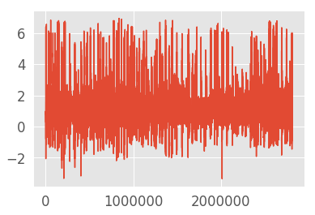


    acc_y
    -6.417827129364014
    4.949891567230225
    0.20133661876515005


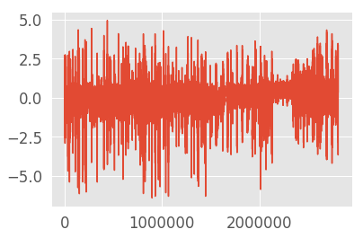


    acc_z
    -5.416336536407471
    4.539283275604248
    -0.061909986305492014


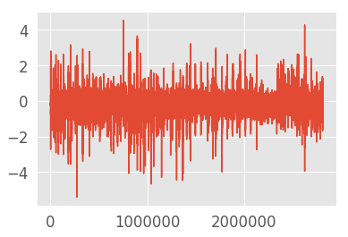


    gyr_x
    -770.8486328125
    856.3609008789062
    -0.41388714539642746


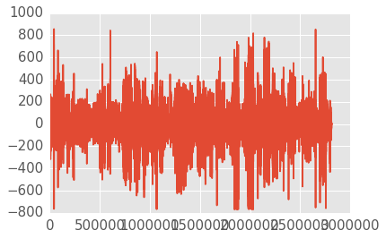


    gyr_y
    -775.4454345703125
    559.6139526367188
    -0.3517485338820081


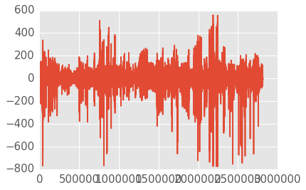


    gyr_z
    -808.1836547851562
    816.5776977539062
    -0.17479588110103636


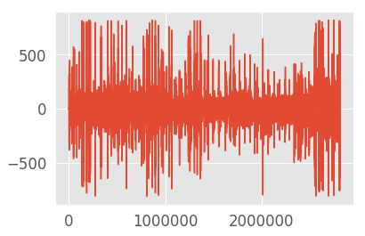


```python
## set up a plots dir

plot_dir = './plots/activity_vis/'

os.makedirs(plot_dir, exist_ok=True)
    
## two functions below to plot your data, and save them to disk
def plot_activity(activity, df,i=0, j=100):
    data = df[df['activity'] == activity][['acc_x', 'acc_y', 'acc_z', 'gyr_x', 'gyr_y', 'gyr_z']][i:j]
    axis = data.plot(subplots=True, figsize=(16, 12), 
                     title=activity)
    for ax in axis:
        ax.legend(loc='lower left', bbox_to_anchor=(1.0, 0.5))
        
    if not os.path.isdir(plot_dir):
        os.makedirs(plot_dir)

    plt.savefig(plot_dir + str(activity) + '.pdf',bbox_inches='tight')
        
def plot_datasets(df,i=0,j=1000):
    plot_activity('Walking Forward', df,i,j)
    plot_activity('Walking Left', df,i,j)
    plot_activity('Walking Right', df,i,j)
    plot_activity('Walking Upstairs', df,i,j)
    plot_activity('Walking Downstairs', df,i,j)
    plot_activity('Running Forward', df,i,j)
    plot_activity('Jumping Up', df,i,j)
    plot_activity('Sitting', df,i,j)
    plot_activity('Standing', df,i,j)
    plot_activity('Sleeping', df,i,j)
    plot_activity('Elevator Up', df,i,j)
    plot_activity('Elevator Down', df,i,j)

plot_datasets(df)
```


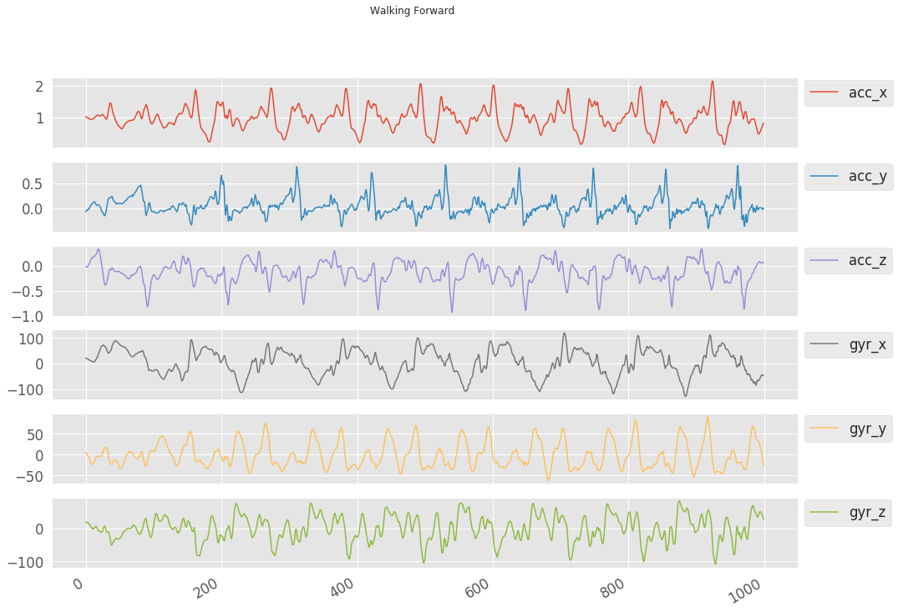


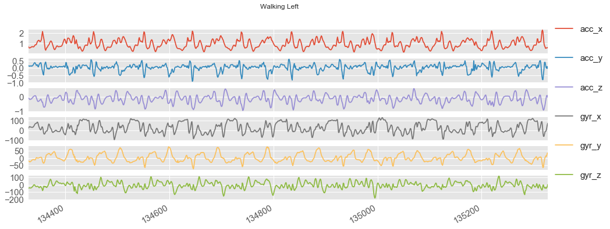


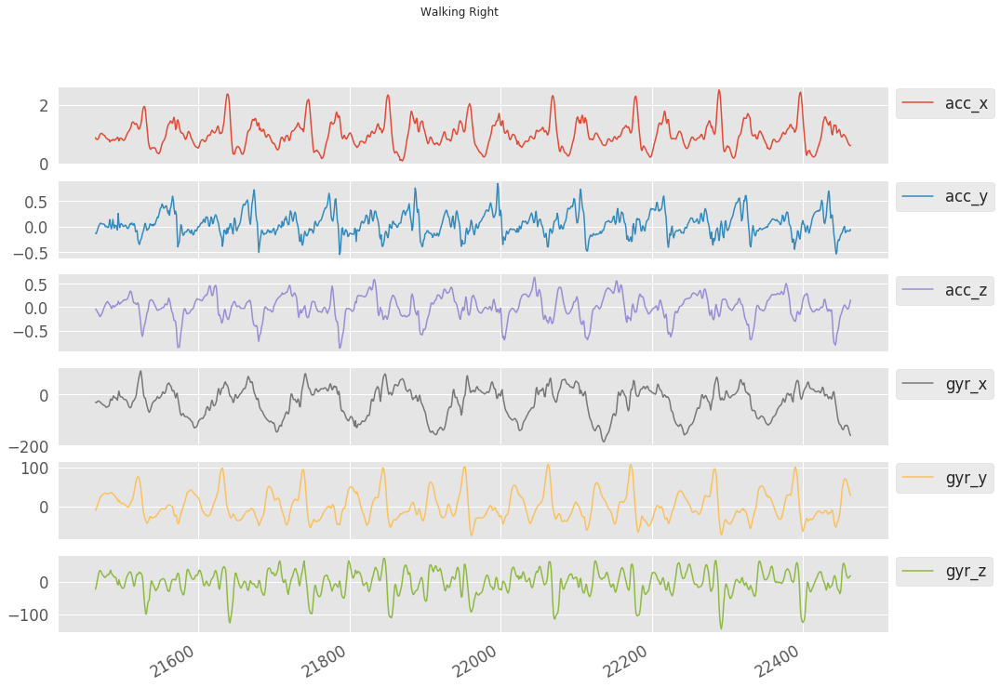


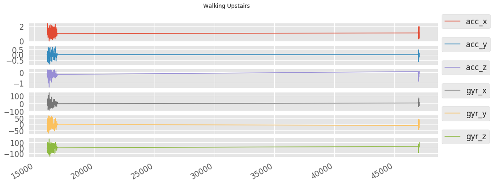


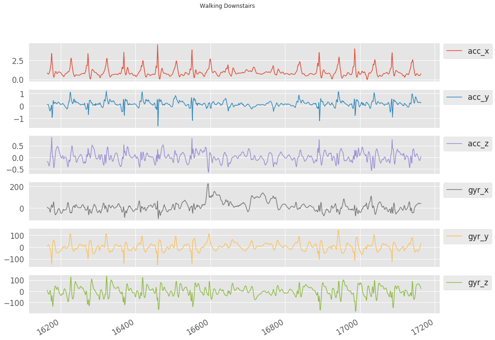


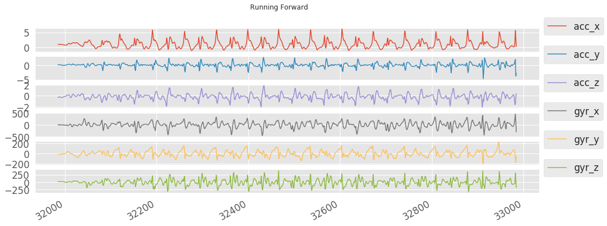


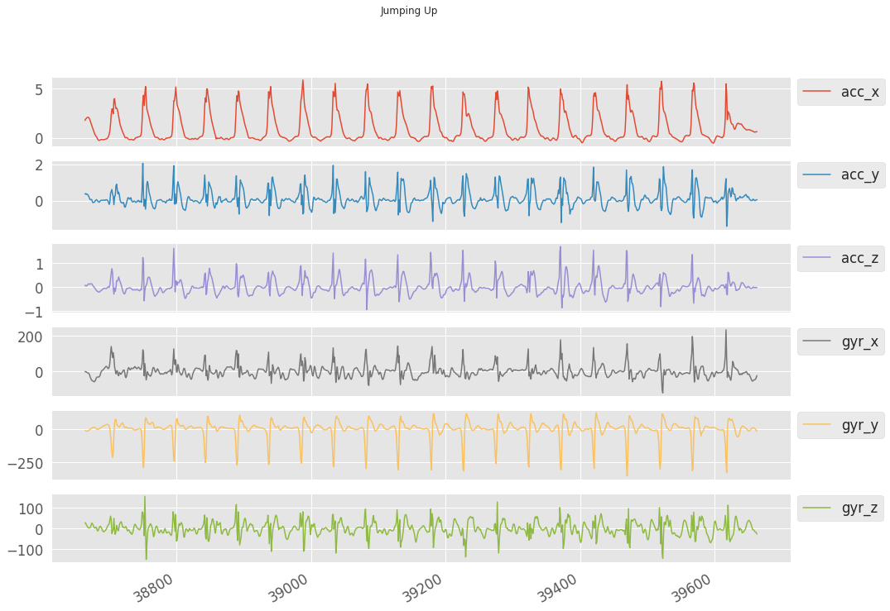


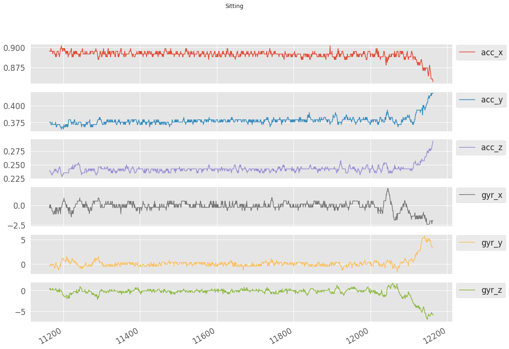


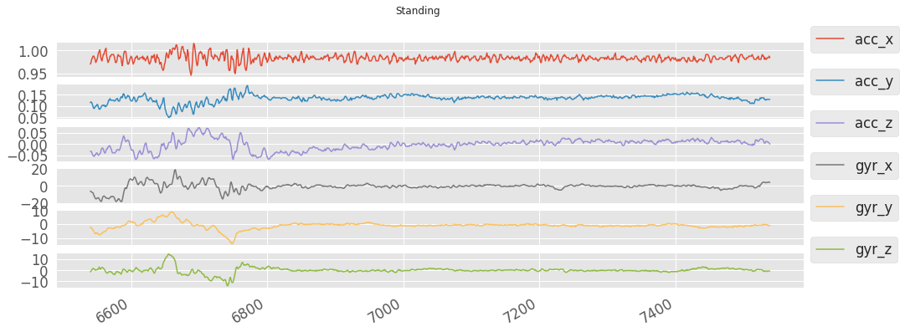


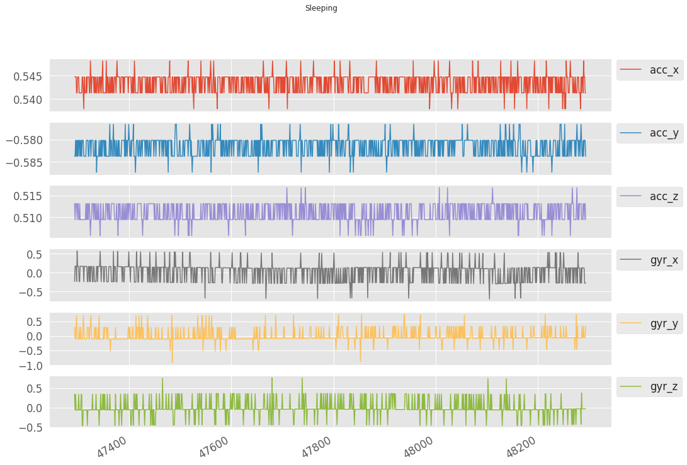


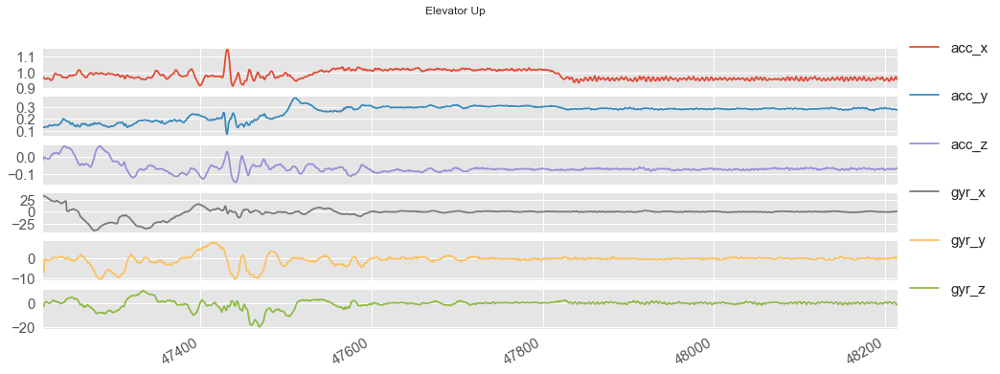


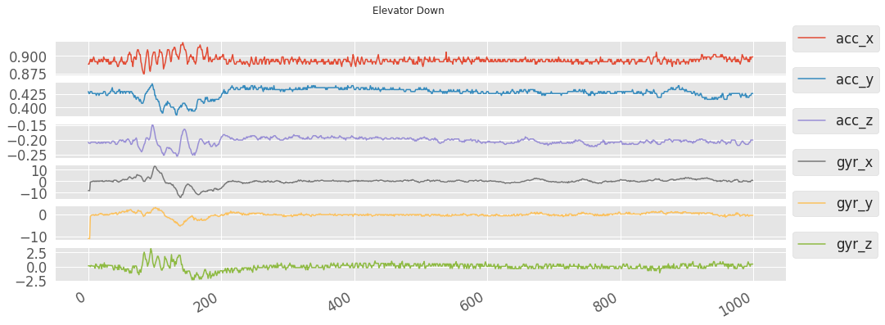


```python
## check class districtions, and save fig to disk
df['activity'].value_counts().plot(kind='bar', color=['r','g','b','k','y','m','c'], title='Plotting records by activity type', figsize=(10, 4),align='center');
plt.savefig(plot_dir + 'sample_dist.pdf', bbox_inches='tight')
```


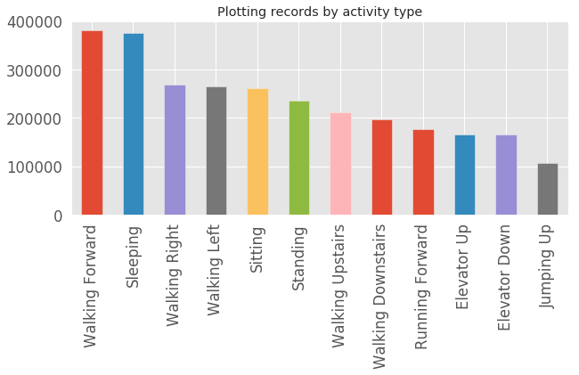


```python
## print the value counts for each activity
print(df['activity'].value_counts())
```

    Walking Forward       381400
    Sleeping              375000
    Walking Right         269700
    Walking Left          264600
    Sitting               261500
    Standing              236000
    Walking Upstairs      211800
    Walking Downstairs    197400
    Running Forward       176500
    Elevator Up           165491
    Elevator Down         164999
    Jumping Up            107100
    Name: activity, dtype: int64


```python
## UNCOMMENT below line for segmenting the signal in overlapping windows of 90 samples with 50% overlap
# segments, labels, subjects = segment_signal(df)

## COMMENT below segments + labels files if you want to segment afresh . open a file, where you stored the pickled data
segments = pickle.load(open('./data/segments_90_logo.p', 'rb'), encoding='latin1')
labels = pickle.load(open('./data/labels_90_logo.p','rb'), encoding='latin1')
subjects = pickle.load(open('./data/subjects_90_logo.p','rb'),encoding='latin1')

## dump information to that file (UNCOMMENT to save fresh segmentation!)
# pickle.dump(segments, open( './data/segments_90_logo.p','wb'))
# pickle.dump(labels, open( './data/labels_90_logo.p','wb'))
# pickle.dump(subjects, open( './data/subjects_90_logo.p','wb'))

# segments, labels, subjects = segment_signal(df)
groups = np.array(subjects)

logo = LeaveOneGroupOut()
logo.get_n_splits(segments, labels, groups)

## defining parameters for the input and network layers
## we are treating each segmeent or chunk as a 2D image (90 X 3)
numOfRows = segments.shape[1]
numOfColumns = segments.shape[2]

## reshaping the data for network input
reshapedSegments = segments.reshape(segments.shape[0], numOfRows, numOfColumns,1)
## (observations, timesteps, features (x,y,z), channels)

# categorically defining the classes of the activities
labels = np.asarray(pd.get_dummies(labels),dtype = np.int8)
```

### Config your ConvLSTM


```python
## ConvLSTM net hyperparameters

numChannels = 1
numFilters = 128 # number of filters in Conv2D layer
# kernal size of the Conv2D layer
kernalSize1 = 2
# max pooling window size
poolingWindowSz = 2
# number of filters in fully connected layers
numNueronsFCL1 = 128
numNueronsFCL2 = 128
# number of epochs
Epochs = 10
# batchsize
batchSize = 10
# number of total clases
numClasses = labels.shape[1]
# dropout ratio for dropout layer
dropOutRatio = 0.2

## number of total clases
numClasses = labels.shape[1]
print(labels.shape)
print(numClasses)

# k = []

# for i in range(len(labels)):
#     if labels[i][0] == 1: 
#         k.append(labels[i])
# print(len(k))

# print(labels.shape)
```

    (62476, 12)
    12


```python
print('segments shape:' + str(segments.shape))
print('labels shape:' + str(labels.shape))
print('\n')
print('Rows / Timesteps: ' + str(numOfRows))
print('Columns / features: ' + str(numOfColumns))

## key:
## Conv2D: (observations, timesteps, features (acc + gyro), channels)
## LSTM: (batch size, observations, timesteps, features (acc + gyro), channels)
```

    segments shape:(62476, 90, 6)
    labels shape:(62476, 12)
    
    
    Rows / Timesteps: 90
    Columns / features: 6


```python
def Conv2D_LSTM_Model():
    model = Sequential()
    print(model.name)

    # adding the first convLSTM layer with 32 filters and 5 by 5 kernal size, using the rectifier as the activation function
    model.add(ConvLSTM2D(numFilters, (kernalSize1,kernalSize1),input_shape=(None, numOfRows, numOfColumns, 1),activation='relu', padding='same',return_sequences=True))
    print(model.input_shape)
    print(model.output_shape)
    print(model.name)
    
    ## adding a maxpooling layer
    model.add(TimeDistributed(MaxPooling2D(pool_size=(poolingWindowSz,poolingWindowSz),padding='valid')))
    print(model.output_shape)

    ## adding a dropout layer for the regularization and avoiding over fitting
    model.add(Dropout(dropOutRatio))
    print(model.output_shape)
    
    ## flattening the output in order to apple dense layer
    model.add(TimeDistributed(Flatten()))
    print(model.output_shape)
    
    ## adding first fully connected layer with 256 outputs
    model.add(Dense(numNueronsFCL1, activation='relu'))
    print(model.output_shape)

    ## adding second fully connected layer 128 outputs
    model.add(Dense(numNueronsFCL2, activation='relu'))
    print(model.output_shape)

    ## flattening the output in order to apply the fully connected layer
    model.add(TimeDistributed(Flatten()))
    print(model.output_shape)

    ## adding softmax layer for the classification
    model.add(Dense(numClasses, activation='softmax'))
    print(model.output_shape)
    print(model.name)

    ## Compiling the model to generate a model
    adam = optimizers.Adam(lr = 0.001, decay=1e-6)
    model.compile(loss='categorical_crossentropy', optimizer=adam, metrics=['accuracy'])
    return model
```

### Train, evaluate & save your network


```python
## Leave One Group Out for train-test split, and train the network!

## NOTE: training with Epochs=2 and BatchSize=32 for illustrative purposes.  

## reset and initialize graph
tf.get_default_graph()

if not os.path.exists('./train_history'):
    os.makedirs('./train_history')
    
cvscores = []

for index, (train_index, test_index) in enumerate(logo.split(reshapedSegments, labels, groups)):

    print('Training on fold ' + str(index+1) + '/14...') ## 14 due to number of subjects in our dataset

    # print('TRAIN:', train_index, 'TEST:', test_index)
    trainX, testX = reshapedSegments[train_index], reshapedSegments[test_index]
    trainY, testY = labels[train_index], labels[test_index]
    # print(np.nan_to_num(trainX), np.nan_to_num(testX), trainY, testY)

    ## clear model, and create it
    model = None
    model = Conv2D_LSTM_Model()

    for layer in model.layers:
        print(layer.name)
    print(trainX.shape)

    ## fit the model
    history = model.fit(np.expand_dims(trainX,1),np.expand_dims(trainY,1), validation_data=(np.expand_dims(testX,1),np.expand_dims(testY,1)), epochs=Epochs,batch_size=batchSize,verbose=2)
    
    with open('train_history/train_history_dict_' + str(index), 'wb') as file_pi:
        pickle.dump(history.history, file_pi)

    ## evaluate the model
    score = model.evaluate(np.expand_dims(testX,1),np.expand_dims(testY,1),verbose=2)
    print('%s: %.2f%%' % (model.metrics_names[1], score[1]*100))
    print('Baseline ConvLSTM Error: %.2f%%' %(100-score[1]*100))
    cvscores.append(score[1] * 100)

print('%.2f%% (+/- %.2f%%)' % (np.mean(cvscores), np.std(cvscores)))

## Save your model!
model.save('model_had_lstm_logo.h5')
model.save_weights('model_weights_had_lstm_logo.h5')
np.save('groundTruth_had_lstm_logo.npy',np.expand_dims(testY,1))
np.save('testData_had_lstm_logo.npy',np.expand_dims(testX,1))

## write to JSON, in case you wanrt to work with that data format later when inspecting your model
with open('./data/model_had_logo.json', 'w') as json_file:
    json_file.write(model.to_json())

## write cvscores to file
with open('train_history/cvscores_convlstm_logo.txt', 'w') as cvs_file:
    cvs_file.write('%.2f%% (+/- %.2f%%)' % (np.mean(cvscores), np.std(cvscores)))
```

    Training on fold 1/14...
    sequential_1
    (None, None, 90, 6, 1)
    (None, None, 90, 6, 128)
    sequential_1
    (None, None, 45, 3, 128)
    (None, None, 45, 3, 128)
    (None, None, 17280)
    (None, None, 128)
    (None, None, 128)
    (None, None, 128)
    (None, None, 12)
    sequential_1
    conv_lst_m2d_1
    time_distributed_1
    dropout_1
    time_distributed_2
    dense_1
    dense_2
    time_distributed_3
    dense_3
    (58134, 90, 6, 1)
    Train on 58134 samples, validate on 4342 samples
    Epoch 1/2
     - 63s - loss: 0.6747 - acc: 0.7545 - val_loss: 0.7456 - val_acc: 0.7096
    Epoch 2/2
     - 61s - loss: 0.4439 - acc: 0.8320 - val_loss: 0.7153 - val_acc: 0.7446
    acc: 74.46%
    Baseline ConvLSTM Error: 25.54%
    Training on fold 2/14...
    sequential_2
    (None, None, 90, 6, 1)
    (None, None, 90, 6, 128)
    sequential_2
    (None, None, 45, 3, 128)
    (None, None, 45, 3, 128)
    (None, None, 17280)
    (None, None, 128)
    (None, None, 128)
    (None, None, 128)
    (None, None, 12)
    sequential_2
    conv_lst_m2d_2
    time_distributed_4
    dropout_2
    time_distributed_5
    dense_4
    dense_5
    time_distributed_6
    dense_6
    (56936, 90, 6, 1)
    Train on 56936 samples, validate on 5540 samples
    Epoch 1/2
     - 62s - loss: 0.7109 - acc: 0.7441 - val_loss: 0.6002 - val_acc: 0.7836
    Epoch 2/2
     - 60s - loss: 0.4563 - acc: 0.8248 - val_loss: 0.6338 - val_acc: 0.7720
    acc: 77.20%
    Baseline ConvLSTM Error: 22.80%
    Training on fold 3/14...
    sequential_3
    (None, None, 90, 6, 1)
    (None, None, 90, 6, 128)
    sequential_3
    (None, None, 45, 3, 128)
    (None, None, 45, 3, 128)
    (None, None, 17280)
    (None, None, 128)
    (None, None, 128)
    (None, None, 128)
    (None, None, 12)
    sequential_3
    conv_lst_m2d_3
    time_distributed_7
    dropout_3
    time_distributed_8
    dense_7
    dense_8
    time_distributed_9
    dense_9
    (56630, 90, 6, 1)
    Train on 56630 samples, validate on 5846 samples
    Epoch 1/2
     - 62s - loss: 0.6655 - acc: 0.7564 - val_loss: 1.0505 - val_acc: 0.6257
    Epoch 2/2
     - 61s - loss: 0.4238 - acc: 0.8358 - val_loss: 1.1900 - val_acc: 0.5835
    acc: 58.35%
    Baseline ConvLSTM Error: 41.65%
    Training on fold 4/14...
    sequential_4
    (None, None, 90, 6, 1)
    (None, None, 90, 6, 128)
    sequential_4
    (None, None, 45, 3, 128)
    (None, None, 45, 3, 128)
    (None, None, 17280)
    (None, None, 128)
    (None, None, 128)
    (None, None, 128)
    (None, None, 12)
    sequential_4
    conv_lst_m2d_4
    time_distributed_10
    dropout_4
    time_distributed_11
    dense_10
    dense_11
    time_distributed_12
    dense_12
    (56494, 90, 6, 1)
    Train on 56494 samples, validate on 5982 samples
    Epoch 1/2
     - 62s - loss: 0.6788 - acc: 0.7518 - val_loss: 1.1870 - val_acc: 0.5911
    Epoch 2/2
     - 60s - loss: 0.4283 - acc: 0.8360 - val_loss: 1.0022 - val_acc: 0.6561
    acc: 65.61%
    Baseline ConvLSTM Error: 34.39%
    Training on fold 5/14...
    sequential_5
    (None, None, 90, 6, 1)
    (None, None, 90, 6, 128)
    sequential_5
    (None, None, 45, 3, 128)
    (None, None, 45, 3, 128)
    (None, None, 17280)
    (None, None, 128)
    (None, None, 128)
    (None, None, 128)
    (None, None, 12)
    sequential_5
    conv_lst_m2d_5
    time_distributed_13
    dropout_5
    time_distributed_14
    dense_13
    dense_14
    time_distributed_15
    dense_15
    (56778, 90, 6, 1)
    Train on 56778 samples, validate on 5698 samples
    Epoch 1/2
     - 62s - loss: 0.6843 - acc: 0.7515 - val_loss: 1.2464 - val_acc: 0.6016
    Epoch 2/2
     - 61s - loss: 0.4354 - acc: 0.8323 - val_loss: 1.0443 - val_acc: 0.6504
    acc: 65.04%
    Baseline ConvLSTM Error: 34.96%
    Training on fold 6/14...
    sequential_6
    (None, None, 90, 6, 1)
    (None, None, 90, 6, 128)
    sequential_6
    (None, None, 45, 3, 128)
    (None, None, 45, 3, 128)
    (None, None, 17280)
    (None, None, 128)
    (None, None, 128)
    (None, None, 128)
    (None, None, 12)
    sequential_6
    conv_lst_m2d_6
    time_distributed_16
    dropout_6
    time_distributed_17
    dense_16
    dense_17
    time_distributed_18
    dense_18
    (57808, 90, 6, 1)
    Train on 57808 samples, validate on 4668 samples
    Epoch 1/2
     - 63s - loss: 0.6587 - acc: 0.7621 - val_loss: 1.6921 - val_acc: 0.4801
    Epoch 2/2
     - 62s - loss: 0.4156 - acc: 0.8415 - val_loss: 1.6553 - val_acc: 0.4677
    acc: 46.77%
    Baseline ConvLSTM Error: 53.23%
    Training on fold 7/14...
    sequential_7
    (None, None, 90, 6, 1)
    (None, None, 90, 6, 128)
    sequential_7
    (None, None, 45, 3, 128)
    (None, None, 45, 3, 128)
    (None, None, 17280)
    (None, None, 128)
    (None, None, 128)
    (None, None, 128)
    (None, None, 12)
    sequential_7
    conv_lst_m2d_7
    time_distributed_19
    dropout_7
    time_distributed_20
    dense_19
    dense_20
    time_distributed_21
    dense_21
    (58651, 90, 6, 1)
    Train on 58651 samples, validate on 3825 samples
    Epoch 1/2
     - 64s - loss: 0.6840 - acc: 0.7529 - val_loss: 1.0710 - val_acc: 0.6711
    Epoch 2/2
     - 62s - loss: 0.4384 - acc: 0.8336 - val_loss: 1.2846 - val_acc: 0.7061
    acc: 70.61%
    Baseline ConvLSTM Error: 29.39%
    Training on fold 8/14...
    sequential_8
    (None, None, 90, 6, 1)
    (None, None, 90, 6, 128)
    sequential_8
    (None, None, 45, 3, 128)
    (None, None, 45, 3, 128)
    (None, None, 17280)
    (None, None, 128)
    (None, None, 128)
    (None, None, 128)
    (None, None, 12)
    sequential_8
    conv_lst_m2d_8
    time_distributed_22
    dropout_8
    time_distributed_23
    dense_22
    dense_23
    time_distributed_24
    dense_24
    (59451, 90, 6, 1)
    Train on 59451 samples, validate on 3025 samples
    Epoch 1/2
     - 65s - loss: 0.6806 - acc: 0.7517 - val_loss: 0.4183 - val_acc: 0.8248
    Epoch 2/2
     - 63s - loss: 0.4450 - acc: 0.8314 - val_loss: 0.5148 - val_acc: 0.7931
    acc: 79.31%
    Baseline ConvLSTM Error: 20.69%
    Training on fold 9/14...
    sequential_9
    (None, None, 90, 6, 1)
    (None, None, 90, 6, 128)
    sequential_9
    (None, None, 45, 3, 128)
    (None, None, 45, 3, 128)
    (None, None, 17280)
    (None, None, 128)
    (None, None, 128)
    (None, None, 128)
    (None, None, 12)
    sequential_9
    conv_lst_m2d_9
    time_distributed_25
    dropout_9
    time_distributed_26
    dense_25
    dense_26
    time_distributed_27
    dense_27
    (58944, 90, 6, 1)
    Train on 58944 samples, validate on 3532 samples
    Epoch 1/2
     - 65s - loss: 0.6868 - acc: 0.7518 - val_loss: 0.5938 - val_acc: 0.7794
    Epoch 2/2
     - 63s - loss: 0.4293 - acc: 0.8377 - val_loss: 0.7266 - val_acc: 0.7650
    acc: 76.50%
    Baseline ConvLSTM Error: 23.50%
    Training on fold 10/14...
    sequential_10
    (None, None, 90, 6, 1)
    (None, None, 90, 6, 128)
    sequential_10
    (None, None, 45, 3, 128)
    (None, None, 45, 3, 128)
    (None, None, 17280)
    (None, None, 128)
    (None, None, 128)
    (None, None, 128)
    (None, None, 12)
    sequential_10
    conv_lst_m2d_10
    time_distributed_28
    dropout_10
    time_distributed_29
    dense_28
    dense_29
    time_distributed_30
    dense_30
    (59367, 90, 6, 1)
    Train on 59367 samples, validate on 3109 samples
    Epoch 1/2
     - 65s - loss: 0.7131 - acc: 0.7432 - val_loss: 0.5084 - val_acc: 0.7970
    Epoch 2/2
     - 63s - loss: 0.4491 - acc: 0.8306 - val_loss: 0.6141 - val_acc: 0.7810
    acc: 78.10%
    Baseline ConvLSTM Error: 21.90%
    Training on fold 11/14...
    sequential_11
    (None, None, 90, 6, 1)
    (None, None, 90, 6, 128)
    sequential_11
    (None, None, 45, 3, 128)
    (None, None, 45, 3, 128)
    (None, None, 17280)
    (None, None, 128)
    (None, None, 128)
    (None, None, 128)
    (None, None, 12)
    sequential_11
    conv_lst_m2d_11
    time_distributed_31
    dropout_11
    time_distributed_32
    dense_31
    dense_32
    time_distributed_33
    dense_33
    (58948, 90, 6, 1)
    Train on 58948 samples, validate on 3528 samples
    Epoch 1/2
     - 65s - loss: 0.6745 - acc: 0.7529 - val_loss: 0.6964 - val_acc: 0.7228
    Epoch 2/2
     - 63s - loss: 0.4398 - acc: 0.8300 - val_loss: 0.9583 - val_acc: 0.7010
    acc: 70.10%
    Baseline ConvLSTM Error: 29.90%
    Training on fold 12/14...
    sequential_12
    (None, None, 90, 6, 1)
    (None, None, 90, 6, 128)
    sequential_12
    (None, None, 45, 3, 128)
    (None, None, 45, 3, 128)
    (None, None, 17280)
    (None, None, 128)
    (None, None, 128)
    (None, None, 128)
    (None, None, 12)
    sequential_12
    conv_lst_m2d_12
    time_distributed_34
    dropout_12
    time_distributed_35
    dense_34
    dense_35
    time_distributed_36
    dense_36
    (59485, 90, 6, 1)
    Train on 59485 samples, validate on 2991 samples
    Epoch 1/2
     - 66s - loss: 0.6985 - acc: 0.7447 - val_loss: 0.5887 - val_acc: 0.7733
    Epoch 2/2
     - 63s - loss: 0.4520 - acc: 0.8295 - val_loss: 0.5621 - val_acc: 0.7997
    acc: 79.97%
    Baseline ConvLSTM Error: 20.03%
    Training on fold 13/14...
    sequential_13
    (None, None, 90, 6, 1)
    (None, None, 90, 6, 128)
    sequential_13
    (None, None, 45, 3, 128)
    (None, None, 45, 3, 128)
    (None, None, 17280)
    (None, None, 128)
    (None, None, 128)
    (None, None, 128)
    (None, None, 12)
    sequential_13
    conv_lst_m2d_13
    time_distributed_37
    dropout_13
    time_distributed_38
    dense_37
    dense_38
    time_distributed_39
    dense_39
    (57880, 90, 6, 1)
    Train on 57880 samples, validate on 4596 samples
    Epoch 1/2
     - 65s - loss: 0.6517 - acc: 0.7622 - val_loss: 1.2508 - val_acc: 0.6586
    Epoch 2/2
     - 62s - loss: 0.4320 - acc: 0.8344 - val_loss: 1.2255 - val_acc: 0.6732
    acc: 67.32%
    Baseline ConvLSTM Error: 32.68%
    Training on fold 14/14...
    sequential_14
    (None, None, 90, 6, 1)
    (None, None, 90, 6, 128)
    sequential_14
    (None, None, 45, 3, 128)
    (None, None, 45, 3, 128)
    (None, None, 17280)
    (None, None, 128)
    (None, None, 128)
    (None, None, 128)
    (None, None, 12)
    sequential_14
    conv_lst_m2d_14
    time_distributed_40
    dropout_14
    time_distributed_41
    dense_40
    dense_41
    time_distributed_42
    dense_42
    (56682, 90, 6, 1)
    Train on 56682 samples, validate on 5794 samples
    Epoch 1/2
     - 64s - loss: 0.6974 - acc: 0.7432 - val_loss: 0.4632 - val_acc: 0.8293
    Epoch 2/2
     - 62s - loss: 0.4450 - acc: 0.8306 - val_loss: 0.4020 - val_acc: 0.8366
    acc: 83.66%
    Baseline ConvLSTM Error: 16.34%
    70.93% (+/- 9.51%)


```python
## shape of data to feed frozen model later in Android code
# print(testX[[1]].shape)
```

### Evaluate model, and plot confusion matrix + acc/loss graphs


```python
## the acc of our combined 'logo' models is 71.74%!
with open('./train_history/cvscores_convlstm_logo.txt', 'r') as cvs_scores:
    cvs = cvs_scores.read()
print(cvs)
```

    70.93% (+/- 9.51%)


```python
# %%pixie_debugger
# -*- coding: utf-8 -*-
'''
Evaluate a pretrained model saved as *.h5 using 'testData_X.npy'
and 'groundTruth_X.npy'. Error reported is the cross entropy loss in percentage. Also generates a png file for the confusion matrix.
Based on work by Muhammad Shahnawaz.

NOTE: keep in mind we are only looking at Model 14 given our 'logo' approach! 
'''

if not os.path.exists('./plots'):
    os.makedirs('./plots')

## define a function for plotting the confusion matrix
## takes cmNormalized
os.environ['QT_PLUGIN_PATH'] = ''
def plot_cm(cM, labels,title):
    
    plt.close()
    ## normalizing the confusionMatrix for showing the probabilities
    cmNormalized = np.around((cM/cM.astype(np.float).sum(axis=1)[:,None])*100,2)
    ## creating a figure object
    fig = plt.figure(figsize=(15,15))
    ## plotting the confusion matrix
    plt.imshow(cmNormalized,interpolation='bilinear',cmap = plt.cm.Purples)
    ## creating a color bar and setting the limits
    plt.colorbar()
    plt.clim(0,100)
    ## assiging the title, x and y labels
    plt.xlabel('Predicted Values')
    plt.ylabel('Ground Truth')
    plt.title(title + '\n%age confidence')
    ## defining the ticks for the x and y axis
    plt.xticks(range(len(labels)),labels,rotation = 60)
    plt.yticks(range(len(labels)),labels)
    ## number of occurences in the boxes
    width, height = cM.shape
    print('Accuracy for each class is given below.')
    for predicted in range(width):
        for real in range(height):
            color = 'black'
            if(predicted == real):
                color = 'white'
                print(labels[predicted].ljust(12)+ ':', cmNormalized[predicted,real], '%')
            plt.gca().annotate(
                    '{:d}'.format(int(cmNormalized[predicted,real])),xy=(real, predicted),
                    horizontalalignment = 'center',verticalalignment = 'center',color = color)

    ## making sure that the figure is not clipped
    plt.tight_layout()
    plt.grid('off')
    ## save the figure
    fig.savefig(title +'.png')
    
## loading the pretrained model
model = load_model('./data/model_had_lstm_logo.h5')

## load weights into new model
model.load_weights('./data/model_weights_had_lstm_logo.h5')
print('Loaded model from disk')

## loading the testData and groundTruth data
test_x = np.load('./data/testData_had_lstm_logo.npy')
groundTruth = np.load('./data/groundTruth_had_lstm_logo.npy')

## evaluate loaded model on test data
model.compile(loss='categorical_crossentropy', optimizer='adam', metrics=['accuracy'])
score = model.evaluate(test_x,groundTruth,verbose=2)

## print out values for metrics
print('%s: %.2f%%' % (model.metrics_names[1], score[1]*100))
print('Baseline Error: %.2f%%' %(100-score[1]*100))

## Creating and plotting a confusion matrix

## defining the 12 class labels
labels = ['WalkForward','WalkLeft','WalkRight','WalkUp','WalkDown','RunForward', 'JumpUp', 'Sit', 'Stand', 'Sleep', 'ElevatorUp', 'ElevatorDown']

## predicting the classes
predictions = model.predict(test_x,verbose=2)

## getting the class predicted and class in ground truth for creation of confusion matrix
predictedClass = np.zeros((predictions.shape[0]))
groundTruthClass = np.zeros((groundTruth.shape[0]))

for instance in range (groundTruth.shape[0]):
    predictedClass[instance] = np.argmax(predictions[instance,:])
    groundTruthClass[instance] = np.argmax(groundTruth[instance,:])

cm = metrics.confusion_matrix(groundTruthClass,predictedClass)

print(cm)

## plotting the confusion matrix
plot_cm(cm, labels,'Confusion Matrix (90 n_steps, LoGo)')

print(model.summary())

```

    Loaded model from disk
    acc: 78.81%
    Baseline Error: 21.19%
    [[ 57 174   0   1  64   0  47   0   0   1   0   0]
     [ 54 213   1   0  24   0  47   1   2   0   1   1]
     [  0   0 163  14   0   0   0   3   1   0   0   2]
     [  0   0   1 322   0   0   1   1   2   0   0   4]
     [ 41  57   0   0 127   0 131   0   0   0   0   0]
     [  0   0   0   0   0 555   0   0   0   0   1   0]
     [  3   0   6   0  21   0 186   4  75   0   3  13]
     [  0   0  63   1   0   0   1 464  54  66   0  48]
     [  0   0   0   0   0   0   2   3 871  28  39   1]
     [  0   0   0   0   0   0   2   4  51 439   4   0]
     [  0   0   0   0   0   0   3   0  21   0 435   2]
     [  0   0   0   0   0   0   2   3  21   0   7 734]]
    Accuracy for each class is given below.
    WalkForward : 16.57 %
    WalkLeft    : 61.92 %
    WalkRight   : 89.07 %
    WalkUp      : 97.28 %
    WalkDown    : 35.67 %
    RunForward  : 99.82 %
    JumpUp      : 59.81 %
    Sit         : 66.57 %
    Stand       : 92.27 %
    Sleep       : 87.8 %
    ElevatorUp  : 94.36 %
    ElevatorDown: 95.7 %
    _________________________________________________________________
    Layer (type)                 Output Shape              Param #   
    =================================================================
    conv_lst_m2d_14 (ConvLSTM2D) (None, None, 90, 6, 128)  264704    
    _________________________________________________________________
    time_distributed_40 (TimeDis (None, None, 45, 3, 128)  0         
    _________________________________________________________________
    dropout_14 (Dropout)         (None, None, 45, 3, 128)  0         
    _________________________________________________________________
    time_distributed_41 (TimeDis (None, None, 17280)       0         
    _________________________________________________________________
    dense_40 (Dense)             (None, None, 128)         2211968   
    _________________________________________________________________
    dense_41 (Dense)             (None, None, 128)         16512     
    _________________________________________________________________
    time_distributed_42 (TimeDis (None, None, 128)         0         
    _________________________________________________________________
    dense_42 (Dense)             (None, None, 12)          1548      
    =================================================================
    Total params: 2,494,732
    Trainable params: 2,494,732
    Non-trainable params: 0
    _________________________________________________________________
    None


```python
## plot acc and loss plot of last stored model weights in history variable

## load model history (models 1-14). Below we load the last 'logo' model 
history = pickle.load(open('./train_history/train_history_dict_0','rb'))

print(history.keys())

## plot train+val accuracy
plt.plot(history['acc'])
plt.plot(history['val_acc'])
plt.title('model accuracy')
plt.ylabel('accuracy')
plt.xlabel('epoch')
plt.legend(['train', 'validation'], loc='upper left')
plt.show()
plt.savefig('./plots/acc_plot_logo.pdf', bbox_inches='tight')

## plot train+val loss
plt.plot(history['loss'])
plt.plot(history['val_loss'])
plt.title('model loss')
plt.ylabel('loss')
plt.xlabel('epoch')
plt.legend(['train', 'validation'], loc='upper left')
plt.show()
plt.savefig('./plots/loss_plot_logo.pdf', bbox_inches='tight')
```

    ['acc', 'loss', 'val_acc', 'val_loss']


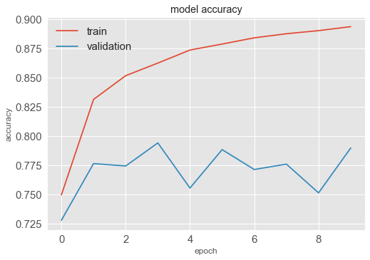


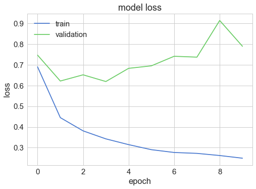


    <matplotlib.figure.Figure at 0x1286c4450>


```python
# history.history['loss']
# print(history.model.evaluate(testX,testY,verbose=3))
```

### Freeze and inspect Keras model graphs


```python
if not os.path.exists('./tensorflow_pb_models'):
    os.makedirs('./tensorflow_pb_models')
```


```python
## function to find out input and output names of frozen graphs
def print_graph_nodes(filename):
    g = tf.GraphDef()
    g.ParseFromString(open(filename, 'rb').read())
    print()
    print(filename)
    print('=======================INPUT=========================')
    print([n for n in g.node if n.name.find('input') != -1])
    print('=======================OUTPUT========================')
    print([n for n in g.node if n.name.find('output') != -1])
    print('===================KERAS_LEARNING=====================')
    print([n for n in g.node if n.name.find('keras_learning_phase') != -1])
    print('======================================================')
    print()
```


```python
## Freeze graphs: Method 1 
## NOTE: all frozen models are based on TrainSplit of 80%/20%, and not on LeaveOneGroupOut model (since we take the last one)

K.clear_session()

## this was created with @warptime's help. Thank you!

saved_model_path = './data/model_had_lstm_logo.h5'

model = load_model(saved_model_path)
nb_classes = 1 ## The number of output nodes in the model
prefix_output_node_names_of_final_network = 'output_node'

K.set_learning_phase(0)

pred = [None]*nb_classes
pred_node_names = [None]*nb_classes
for i in range(nb_classes):
    pred_node_names[i] = prefix_output_node_names_of_final_network+str(i)
    pred[i] = tf.identity(model.output[i], name=pred_node_names[i])
print('output nodes names are: ', pred_node_names)

sess = K.get_session()
output_fld = 'tensorflow_pb_models/'
if not os.path.isdir(output_fld):
    os.mkdir(output_fld)
output_graph_name = 'model_had_lstm_logo' + '.pb'
output_graph_suffix = '_inference'

constant_graph = graph_util.convert_variables_to_constants(sess, sess.graph.as_graph_def(), pred_node_names)
graph_io.write_graph(constant_graph, output_fld, output_graph_name, as_text=False)
print('saved the constant graph (ready for inference) at: ', osp.join(output_fld, output_graph_name))
```

    output nodes names are:  ['output_node0']
    INFO:tensorflow:Froze 10 variables.
    INFO:tensorflow:Converted 10 variables to const ops.
    saved the constant graph (ready for inference) at:  tensorflow_pb_models/model_had_lstm_logo.pb


```python
## Method 1 inspect output

print_graph_nodes('./tensorflow_pb_models/model_had_lstm_logo.pb')
# print_graph_nodes('./graph_test/output_graph.pb')
```

    
    ./tensorflow_pb_models/model_had_lstm_logo.pb
    =======================INPUT=========================
    [name: "keras_learning_phase/input"
    op: "Const"
    attr {
      key: "dtype"
      value {
        type: DT_BOOL
      }
    }
    attr {
      key: "value"
      value {
        tensor {
          dtype: DT_BOOL
          tensor_shape {
          }
          bool_val: false
        }
      }
    }
    , name: "conv_lst_m2d_14_input"
    op: "Placeholder"
    attr {
      key: "dtype"
      value {
        type: DT_FLOAT
      }
    }
    attr {
      key: "shape"
      value {
        shape {
          dim {
            size: -1
          }
          dim {
            size: -1
          }
          dim {
            size: 90
          }
          dim {
            size: 6
          }
          dim {
            size: 1
          }
        }
      }
    }
    ]
    =======================OUTPUT========================
    [name: "output_node0"
    op: "Identity"
    input: "strided_slice"
    attr {
      key: "T"
      value {
        type: DT_FLOAT
      }
    }
    ]
    ===================KERAS_LEARNING=====================
    [name: "keras_learning_phase/input"
    op: "Const"
    attr {
      key: "dtype"
      value {
        type: DT_BOOL
      }
    }
    attr {
      key: "value"
      value {
        tensor {
          dtype: DT_BOOL
          tensor_shape {
          }
          bool_val: false
        }
      }
    }
    , name: "keras_learning_phase"
    op: "PlaceholderWithDefault"
    input: "keras_learning_phase/input"
    attr {
      key: "dtype"
      value {
        type: DT_BOOL
      }
    }
    attr {
      key: "shape"
      value {
        shape {
        }
      }
    }
    ]
    ======================================================
    


```python
## Freeze graphs: Method 2

K.clear_session()

def freeze_session(session, keep_var_names=None, output_names=None, clear_devices=True):
    '''
    Freezes the state of a session into a pruned computation graph.

    Creates a new computation graph where variable nodes are replaced by
    constants taking their current value in the session. The new graph will be
    pruned so subgraphs that are not necessary to compute the requested
    outputs are removed.
    @param session The TensorFlow session to be frozen.
    @param keep_var_names A list of variable names that should not be frozen,
                          or None to freeze all the variables in the graph.
    @param output_names Names of the relevant graph outputs.
    @param clear_devices Remove the device directives from the graph for better portability.
    @return The frozen graph definition.
    '''
    
    from tensorflow.python.framework.graph_util import convert_variables_to_constants
    graph = session.graph
    with graph.as_default():
        freeze_var_names = list(set(v.op.name for v in tf.global_variables()).difference(keep_var_names or []))
        output_names = output_names or []
        output_names += [v.op.name for v in tf.global_variables()]
        input_graph_def = graph.as_graph_def()
        if clear_devices:
            for node in input_graph_def.node:
                node.device = ''
        frozen_graph = convert_variables_to_constants(session, input_graph_def,
                                                      output_names, freeze_var_names)
        return frozen_graph

## create, compile and train model
K.set_learning_phase(0)

# model = 'model_ucd.h5'
model = load_model('./tensorflow_pb_models/model_ucd.h5')

# tf.reset_default_graph()
frozen_graph = freeze_session(K.get_session(), output_names=[out.op.name for out in model.outputs])
tf.train.write_graph(frozen_graph, './tensorflow_pb_models/', 'ucd_model_test2.pb', as_text=False)
```


```python
## method 2 inspect output
print_graph_nodes('./tensorflow_pb_models/ucd_model_test2.pb')
```


```python
## freeze graphs: Method 3 - using freeze_graph.py

K.clear_session()

K.set_learning_phase(0)
model = load_model('model_hcd_test.h5')
print(model.output.op.name)
saver = tf.train.Saver()
saver.save(K.get_session(), '/tmp/keras_model_test.ckpt')
```


```python
!python -W ignore /Users/aelali/anaconda/lib/python2.7/site-packages/tensorflow/python/tools/freeze_graph.py --input_meta_graph=/tmp/keras_model_test.ckpt.meta \
--input_checkpoint=/tmp/keras_model_test.ckpt --output_graph=./tensorflow_model/ucd_keras_frozen3_TEST.pb --output_node_names='OUTPUT/truediv' --input_binary=true
```


```python
## method 3 inspect output
print_graph_nodes('./tensorflow_pb_models/ucd_keras_frozen3_test.pb')
```


```python
## freeze graphs: Method 4

model = load_model('./tensorflow_pb_models/model_hcd_test.h5')
# model.load_weights('model_weights_ucd.h5')
 
## all new operations will be in test mode from now on
K.set_learning_phase(0)
 
## serialize the model and get its weights, for quick re-building
config = model.get_config()
weights = model.get_weights()
 
## re-build a model where the learning phase is now hard-coded to 0
new_model = Sequential.from_config(config)
new_model.set_weights(weights)
 
temp_dir = 'graph_test'
checkpoint_prefix = os.path.join(temp_dir, 'saved_checkpoint')
checkpoint_state_name = 'checkpoint_state'
input_graph_name = 'input_graph.pb'
output_graph_name = 'output_graph.pb'
 
## temporary save graph to disk without weights included
saver = tf.train.Saver()
checkpoint_path = saver.save(K.get_session(), checkpoint_prefix, global_step=0, latest_filename=checkpoint_state_name)
tf.train.write_graph(K.get_session().graph, temp_dir, input_graph_name)
 
input_graph_path = os.path.join(temp_dir, input_graph_name)
input_saver_def_path = ''
input_binary = False
output_node_names = 'OUTPUT/truediv' # model dependent (e.g., Softmax)
restore_op_name = 'save/restore_all'
filename_tensor_name = 'save/Const:0'
output_graph_path = os.path.join(temp_dir, output_graph_name)
clear_devices = False
 
## embed weights inside the graph and save to disk
freeze_graph.freeze_graph(input_graph_path, input_saver_def_path,
                          input_binary, checkpoint_path,
                          output_node_names, restore_op_name,
                          filename_tensor_name, output_graph_path,
                          clear_devices, '')
```

### Inspect graphs with TensorBoard 


```python
## visualize using tensorboard
import webbrowser

tf.logging.set_verbosity(tf.logging.ERROR)
os.environ['TF_CPP_MIN_LOG_LEVEL'] = '2'

## convert the model to tensorboard viz
!python -W ignore /Users/aelali/anaconda/lib/python2.7/site-packages/tensorflow/python/tools/import_pb_to_tensorboard.py --model_dir ~/Desktop/HAR-CNN-Keras/tensorflow_pb_models/model_ucd.h5.pb --log_dir /tmp/tensorflow_logdir 

## UNCOMMENT to run tensorboard on stated logdir
# !tensorboard --logdir /tmp/tensorflow_logdir

## go to tensorboard in your browser
# url = 'http://' + 'localhost:6006/'
# webbrowser.open(url)


```


```python
# !pip install pixiedust
# import pixiedust
# %%pixie_debugger
```

### Test if your frozen model works as intended


```python
## define a function to load the frozen graph

def load_graph(frozen_graph_filename):
    ## load the protobuf file from the disk and parse it to retrieve the unserialized graph_def
    with tf.gfile.GFile(frozen_graph_filename, 'rb') as f:
        graph_def = tf.GraphDef()
        graph_def.ParseFromString(f.read())

    ## import the graph_def into a new Graph and returns it 
    with tf.Graph().as_default() as graph:
        ## graph var will prefix every op/nodes in your graph
        ## since we load everything in a new graph, this is not needed
        tf.import_graph_def(graph_def, name='prefix')
    return graph
```


```python
## load the graph using the 'load_graph' function
graph = load_graph('/Users/aelali/Desktop/HAR-CNN-Keras/tensorflow_pb_models/model_ucd.h5.pb')

## verify that we can access the list of operations in the graph
for op in graph.get_operations():
    print(op.name)    
```


```python
## now test if the frozen model performs predictions as intended

## get the input and output nodes 
x = graph.get_tensor_by_name('prefix/conv2d_1_input:0')
y = graph.get_tensor_by_name('prefix/dense_3/Softmax:0')

## launch tf session
with tf.Session(graph=graph) as sess:
    ## note: we don't need to initialize/restore anything
    ## there are no vars in this graph, only hardcoded constants 
    y_out = sess.run(y, feed_dict={
        x: testX[[100]] # < 45
    })
    
    l = np.round(testY[[100]])
    print('label: ' + str(l))
    z = (np.round(y_out)).astype(int)
    print('prediction: ' + str(z))
    
    print('prediction correct? ' + str(np.array_equal(l,z)))
```

### Check mismatch between sensor readings of dataset and Android sensors


```python
## USC-HAD dataset inspect

len_sample = len(df)

# print(df[df['activity'] == 'Sitting']['acc_x'])
usc_sit_df_acc_x = df[df['activity'] == 'Sitting']['acc_x'][0:len_sample]
usc_sit_df_acc_y = df[df['activity'] == 'Sitting']['acc_y'][0:len_sample]
usc_sit_df_acc_z = df[df['activity'] == 'Sitting']['acc_z'][0:len_sample]
usc_sit_df_gyr_x = df[df['activity'] == 'Sitting']['gyr_x'][0:len_sample]
usc_sit_df_gyr_y = df[df['activity'] == 'Sitting']['gyr_y'][0:len_sample]
usc_sit_df_gyr_z = df[df['activity'] == 'Sitting']['gyr_z'][0:len_sample]


print('sitting mean usc-had acc_x: '+ str(np.mean(usc_sit_df_acc_x)))
print('sitting std usc-had acc_x: '+ str(np.std(usc_sit_df_acc_x)))

print('sitting mean usc-had acc_y: '+ str(np.mean(usc_sit_df_acc_y)))
print('sitting std usc-had acc_y: '+ str(np.std(usc_sit_df_acc_y)))

print('sitting mean usc-had acc_z: '+ str(np.mean(usc_sit_df_acc_z)))
print('sitting std usc-had acc_z: '+ str(np.std(usc_sit_df_acc_z)))

print('sitting mean usc-had gyr_x: '+ str(np.mean(usc_sit_df_acc_z)))
print('sitting std usc-had gyr_x: '+ str(np.std(usc_sit_df_acc_z)))

print('sitting mean usc-had gyr_y: '+ str(np.mean(usc_sit_df_acc_z)))
print('sitting std usc-had gyr_y: '+ str(np.std(usc_sit_df_gyr_y)))

print('sitting mean usc-had gyr_z: '+ str(np.mean(usc_sit_df_gyr_z)))
print('sitting std usc-had gyr_z: '+ str(np.std(usc_sit_df_gyr_z)))


# print 'usc-had dataset acc_x sample for sitting activity: '+ str(np.mean(sit_df_acc_x))
plt.plot(usc_sit_df_acc_x)
plt.show()
plt.plot(usc_sit_df_acc_y)
plt.show()
plt.plot(usc_sit_df_acc_z)
plt.show()
plt.plot(usc_sit_df_gyr_x)
plt.show()
plt.plot(usc_sit_df_gyr_y)
plt.show()
plt.plot(usc_sit_df_gyr_z)
plt.show()
```

    sitting mean usc-had acc_x: 0.8275517870451022
    sitting std usc-had acc_x: 0.08702539053000118
    sitting mean usc-had acc_y: 0.47151391545812116
    sitting std usc-had acc_y: 0.1771941735702898
    sitting mean usc-had acc_z: 0.19264190885658336
    sitting std usc-had acc_z: 0.17058384939588664
    sitting mean usc-had gyr_x: 0.19264190885658336
    sitting std usc-had gyr_x: 0.17058384939588664
    sitting mean usc-had gyr_y: 0.19264190885658336
    sitting std usc-had gyr_y: 3.505542665706356
    sitting mean usc-had gyr_z: 0.09090915439847408
    sitting std usc-had gyr_z: 4.136471407581966


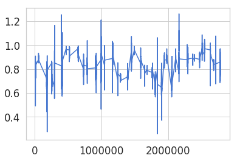


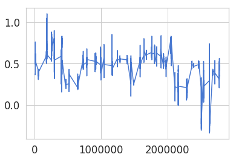


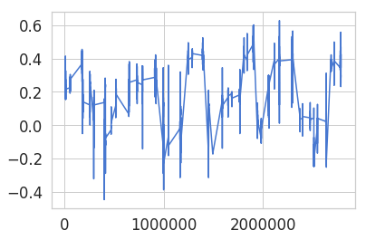


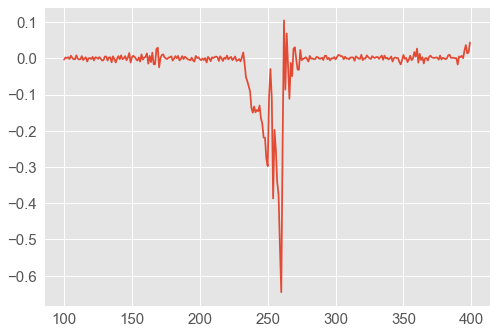


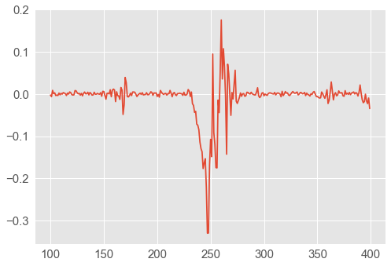


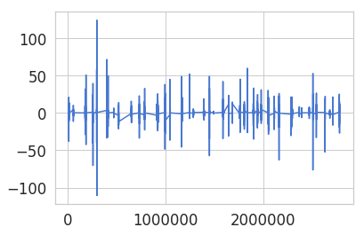


```python
## Android sensor reading samples inspect

acc_sit_android = pd.read_csv('./data/android_sitting_acc.csv')[100:400]
gyr_sit_android = pd.read_csv('./data/android_sitting_gyr.csv')[100:400]

sit_acc_x = acc_sit_android['X']
sit_acc_y = acc_sit_android['Y']
sit_acc_z = acc_sit_android['Z']
sit_gyr_x = gyr_sit_android['X']
sit_gyr_y = gyr_sit_android['Y']
sit_gyr_z = gyr_sit_android['Z']

print('sitting android acc_x size: '+ str(len(sit_acc_x)))

print('sitting mean android acc_x: '+ str(np.mean(sit_acc_x)))
print('sitting std android acc_x: '+ str(np.std(sit_acc_x)))

print('sitting mean android acc_y: '+ str(np.mean(sit_acc_y)))
print('sitting std android acc_y: '+ str(np.std(sit_acc_y)))

print('sitting mean android acc_z: '+ str(np.mean(sit_acc_z)))
print('sitting std android acc_z: '+ str(np.std(sit_acc_z)))

print('sitting mean android gyr_x: '+ str(np.mean(sit_gyr_x)))
print('sitting std android gyr_x: '+ str(np.std(sit_gyr_x)))

print('sitting mean android gyr_y: '+ str(np.mean(sit_gyr_y)))
print('sitting std android gyr_y: '+ str(np.std(sit_gyr_y)))

print('sitting mean android gyr_z: '+ str(np.mean(sit_gyr_z)))
print('sitting std android gyr_z: '+ str(np.std(sit_gyr_z)))


plt.plot(sit_acc_x)
plt.show()
plt.plot(sit_acc_y)
plt.show()
plt.plot(sit_acc_z)
plt.show()
plt.plot(sit_gyr_x)
plt.show()
plt.plot(sit_gyr_y)
plt.show()
plt.plot(sit_gyr_z)
plt.show()
```

    sitting android acc_x size: 300
    sitting mean android acc_x: 5.795021454333334
    sitting std android acc_x: 0.1546386070887035
    sitting mean android acc_y: 3.5278160356666666
    sitting std android acc_y: 0.35885386975185224
    sitting mean android acc_z: 7.550522920333333
    sitting std android acc_z: 0.2383939497187787
    sitting mean android gyr_x: -0.019029214404346663
    sitting std android gyr_x: 0.07544860409278752
    sitting mean android gyr_y: -0.008958773748733334
    sitting std android gyr_y: 0.04664604581057123
    sitting mean android gyr_z: -0.020935697682131
    sitting std android gyr_z: 0.07335605288544335


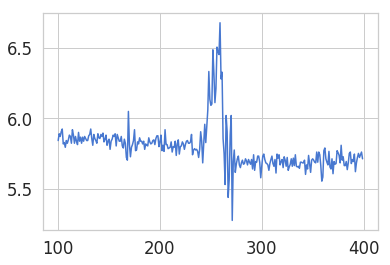


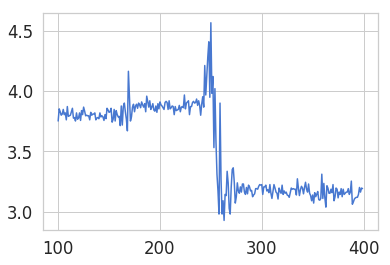


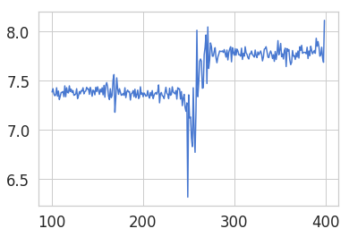


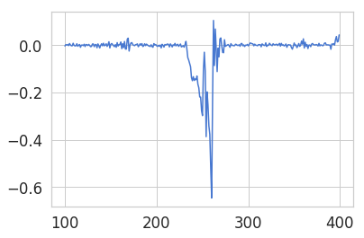


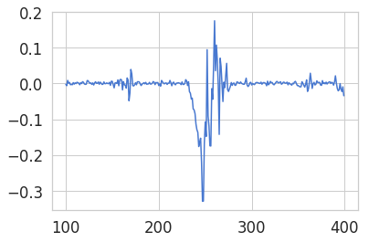


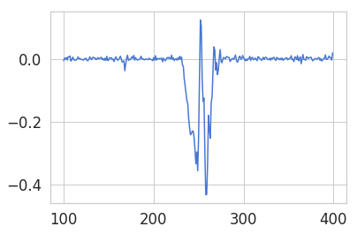

